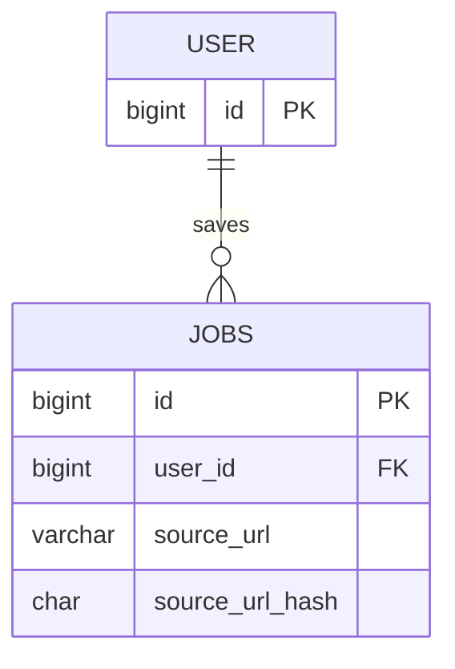

# Database

`automatedjobextraction` **does not own a schema**. There is no automated-extraction table, entity, or repository in this package. Parse never calls `save` / `persist`.

The only database interaction on this path is a **read-only duplicate pre-check** on the `jobs` table owned by the `jobs` module. That query is executed inside `JobExtractionServiceImpl` after this module has produced labeled text and called `ManualJobExtractionGateway`.

## Why MySQL is involved

Duplicate detection must match what `POST /api/v1/jobs` will enforce (`uk_job_user_source_url_hash`). The check uses the same canonical URL hash the jobs module stores.

Unlike manual parse, this check runs **after** page fetch on a cache miss. A `409` still means “already in this user’s notebook”; it does not mean the page was never retrieved.

## Entity used (read-only)

`JobEntity` / table `jobs`. Fields this flow cares about:

| Column | Role for parse |
| --- | --- |
| `user_id` | Duplicate scope. Only the **current** user's rows. |
| `source_url_hash` | SHA-256 hex (64 chars) of the **canonical** `source_url`. |
| `source_url` | Not queried by parse. Hash is the lookup key. |

Uniqueness:

```text
UNIQUE uk_job_user_source_url_hash (user_id, source_url_hash)
```

Two different users may store the same hash. The same user may not.



Other `jobs` columns (title, skills, descriptions, and so on) are unused by this module.

`auth.User` is loaded as the security principal (JWT filter / `CurrentUserService`), not queried by an automated-extraction repository.

## Query

```text
JobRepository.existsByUserIdAndSourceUrlHash(currentUser.getId(), urlHash)
```

`urlHash` is `UrlNormalizationUtil.sha256Hex(normalizedUrl)` after `normalizeStrict` (run again inside manual extraction on the canonical URL this module already produced).

If the method returns true, parse throws `DuplicateJobException` with `This post was already added to your records.` → HTTP **409**. The AI is not called. Fetch/pipeline have already run unless the extracted-text cache hit.

## Transactions

`AutomatedJobExtractionServiceImpl.extractFromUrl` is **not** `@Transactional`. Neither is `JobExtractionServiceImpl.extractJobInfo`.

Spring Data still runs `existsBy...` in a short repository transaction. Fetch and AI stay outside that transaction.

There are no automated-extraction-specific isolation or locking hints.

## Lifecycle

Parse does not create, update, expire, or delete rows. After the client saves via `jobs`, the next parse of the same canonical URL for that user hits this exists-check and returns 409 even if extracted text is still in Redis/memory.

## What not to add here

Do not treat extracted-text cache strings in Redis as a database. See [REDIS-INFRASTRUCTURE.md](REDIS-INFRASTRUCTURE.md).
