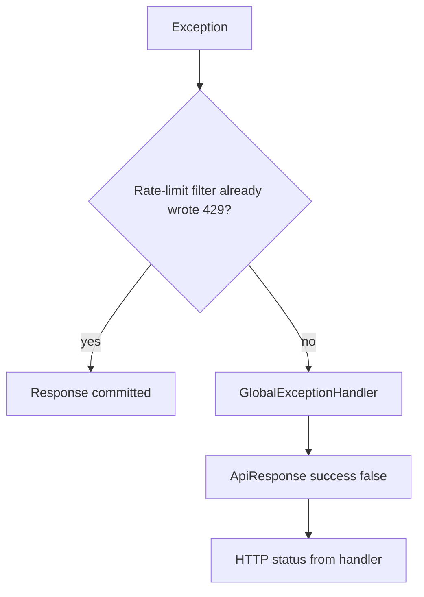

# Error handling

Parse errors become the shared `ApiResponse` JSON. This module has no `@RestControllerAdvice` of its own. Mapping is in `com.developer.copilot.common.exception.GlobalExceptionHandler`, except the rate-limit **filter**, which writes `429` directly.

## Path from exception to HTTP



Controller success path does not catch exceptions; they propagate.

## Error envelope

Always:

- `success`: `false`
- `message`: client-safe string
- `data`: `null`
- `timestamp`: `LocalDateTime.now()`

Rate-limit responses also set header `Retry-After` (seconds). CORS exposes that header.

## Exceptions this flow uses

### Defined in `automatedjobextraction`

| Exception | HTTP | Message |
| --- | --- | --- |
| `InvalidAutomatedJobUrlException` | 400 | `INVALID JOB URL` (constant; never includes host or reason) |
| `AutomatedJobPageFetchException` | 502 | `Unable to access the job posting. Please try again later.` |
| `AutomatedJobExtractionUnavailableException` | 503 | `The job page could not be retrieved. Please try again shortly.` (circuit or bulkhead) |
| `ratelimit.exception.RateLimitExceededException` | 429 | `Too many requests. Please try again later.` + `Retry-After` |

The filter normally prevents `RateLimitExceededException` by writing the body itself with the same message. The handler exists for `consumeOrThrow`.

### Thrown by this service or the gateway, defined elsewhere

| Exception | HTTP | Typical message |
| --- | --- | --- |
| `InvalidJobUrlException` | 400 | `Job URL must be a valid absolute http or https link.` (empty after trim: `Job URL must not be empty.` — Bean Validation usually catches blanks first) |
| `EmailNotVerifiedException` | 403 | `Please verify your email before using this feature.` |
| `DuplicateJobException` | 409 | `This post was already added to your records.` |
| `AiServiceException` | 502 | Provider-facing text from `AiServiceImpl.formatFriendlyErrorMessage` or `AI did not return parsable job information. Please try again.` |
| `JobExtractionAiUnavailableException` | 503 | `The AI service is temporarily unavailable. Please try again shortly.` (circuit) or `The AI service is busy. Please try again shortly.` (bulkhead) |
| `InvalidCredentialsException` | 401 | `User is not authenticated.` |

Fetch `502` and AI `502` share a status but not a message. Fetch `503` and AI `503` likewise.

### Spring / shared

| Condition | HTTP | Message |
| --- | --- | --- |
| `MethodArgumentNotValidException` | 400 | `field: constraint message` joined by commas |
| `HttpMessageNotReadableException` | 400 | `Request body is missing or malformed JSON.` |
| `HttpMediaTypeNotSupportedException` | 415 | `Unsupported media type.` |
| `HttpRequestMethodNotSupportedException` | 405 | `Method not allowed.` |
| No / invalid JWT (entry point) | 401 | `Unauthorized.` |
| Any other `Exception` | 500 | `Something went wrong.` |

`IllegalArgumentException` from SSRF is caught in the service and converted to `InvalidAutomatedJobUrlException` before it can become a 500. `URI.create` failures on the canonical URL become `InvalidAutomatedJobUrlException` in `JobPageFetcher.parseUri`.

## How specific cases are produced

**400 URL format:** `normalizeStrict` throws `InvalidJobUrlException`. Metrics: `recordInvalidUrl`. Message does not include the submitted URL.

**400 INVALID JOB URL:** SSRF, DNS failure, redirect to a blocked hop, 4xx from the job site (including 401/403/404/410/451), too many redirects, missing `Location`, non-http(s) redirect, captcha/challenge HTML without job markers, empty body, pipeline quality reject, listing page. Metrics: `recordInvalidUrl` when the service catches it.

**409 duplicate:** `existsByUserIdAndSourceUrlHash` is true inside the gateway. AI is not called. Fetch may already have happened.

**502 fetch:** Timeout, I/O, oversized body, 5xx from the job site, other non-2xx that is not treated as 4xx. Metrics: `recordFetchFailure`. Counts toward `JobPageFetchGuard`.

**502 AI:** `AiService.extractJobInfo` throws `AiServiceException`. Guard counts these toward the **AI** circuit.

**503 fetch guard:** Circuit still open (30s after 3 fetch failures) or semaphore exhausted (8 concurrent).

**503 AI guard:** Circuit still open (30s after 3 AI failures) or semaphore exhausted (5 concurrent).

**403 email:** Service check before URL work (and again in the gateway).

**429:** Filter after a denied `RateLimitResult`. Body matches the exception type's message.

## Examples (from tests / handlers)

Invalid job URL:

```json
{
  "success": false,
  "message": "INVALID JOB URL",
  "data": null,
  "timestamp": "2026-01-15T10:30:00"
}
```

Unhandled:

```json
{
  "success": false,
  "message": "Something went wrong.",
  "data": null,
  "timestamp": "2026-01-15T10:30:00"
}
```

## Logging

- Controller logs inbound `sourceUrl` **length**, not the URL.
- Cache-hit / success logs use `userId` and `urlHash`.
- `GlobalExceptionHandler` logs unhandled exceptions at error.
- Redis fallbacks log a warning with `ex.getMessage()`.
- Workday CXS skip logs at debug without host details (`Workday CXS enrichment skipped`).
- Strategy parse errors log at debug with the strategy class name, not page HTML.

Do not expect stack traces in JSON.
