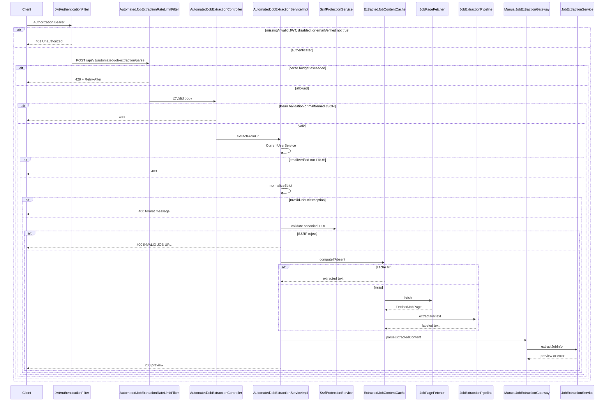
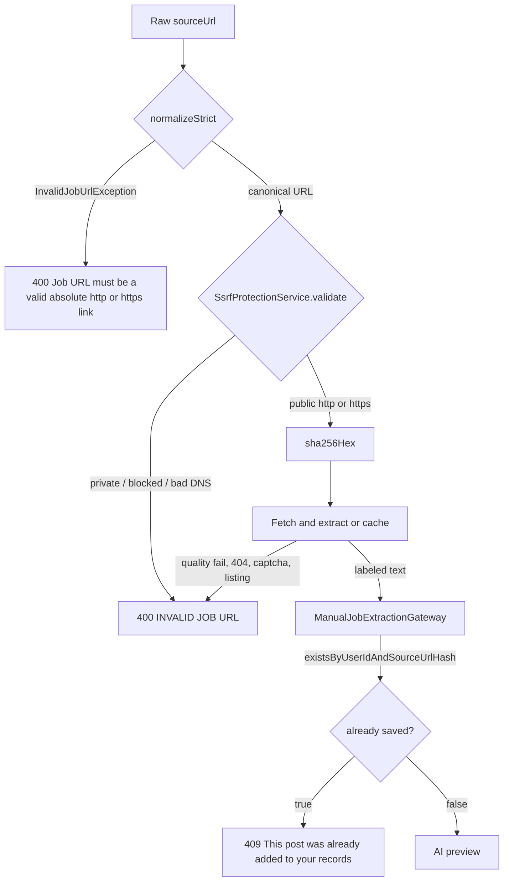
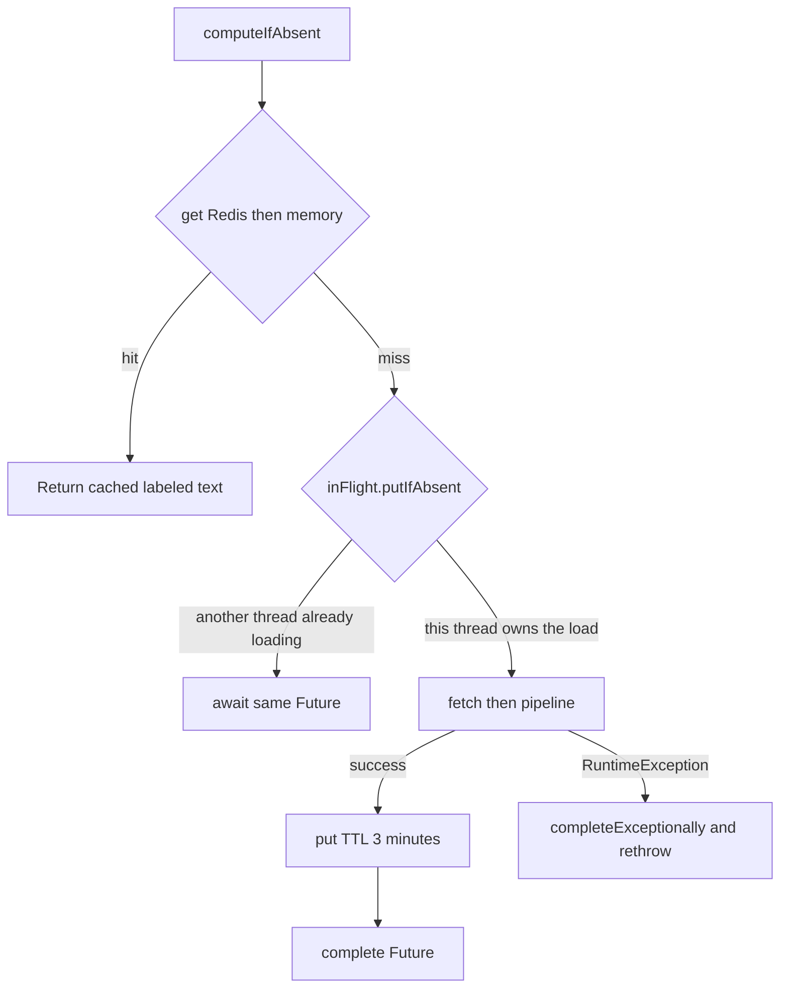
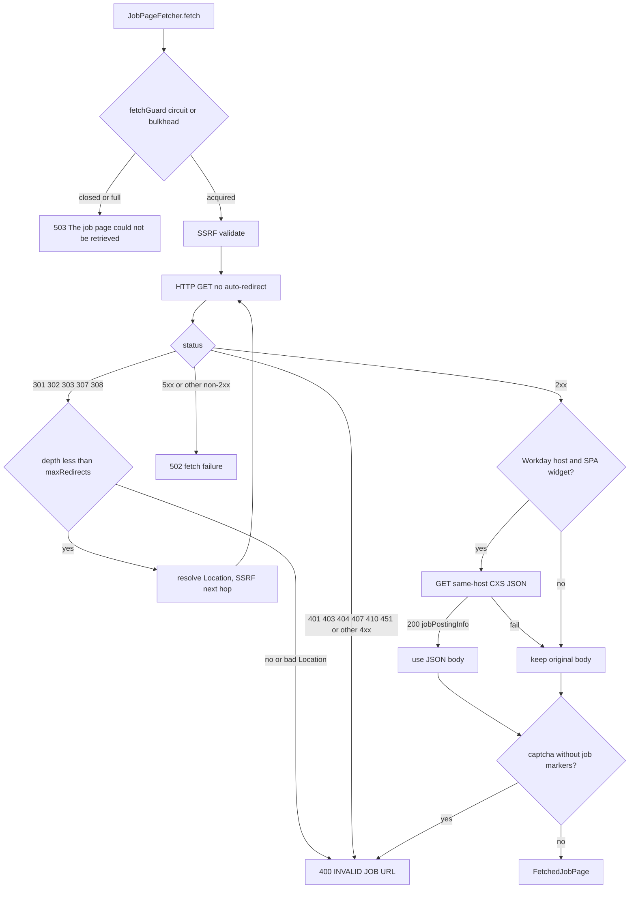
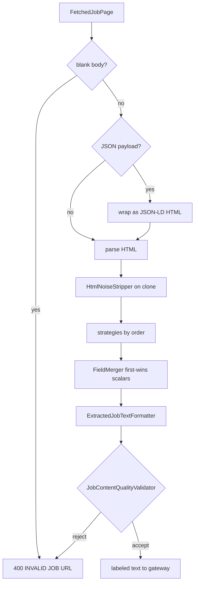
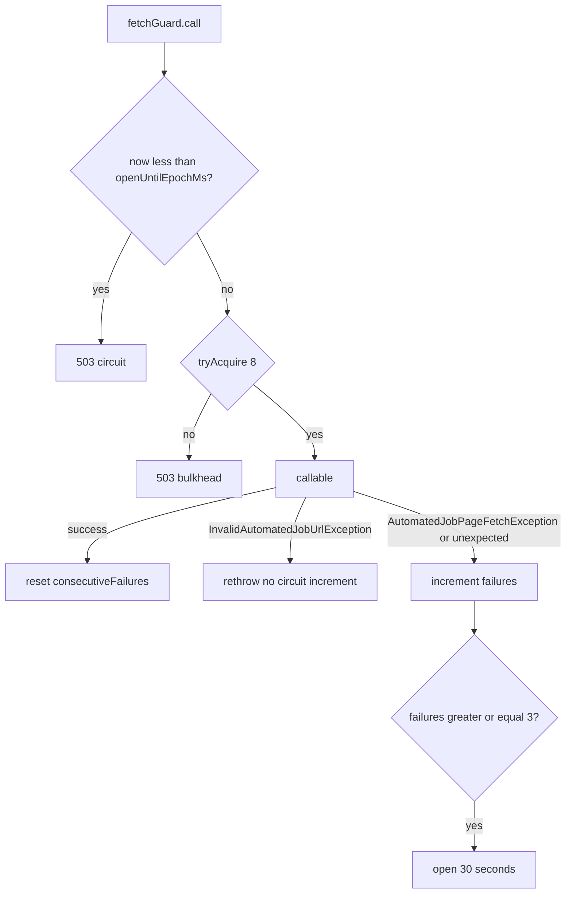
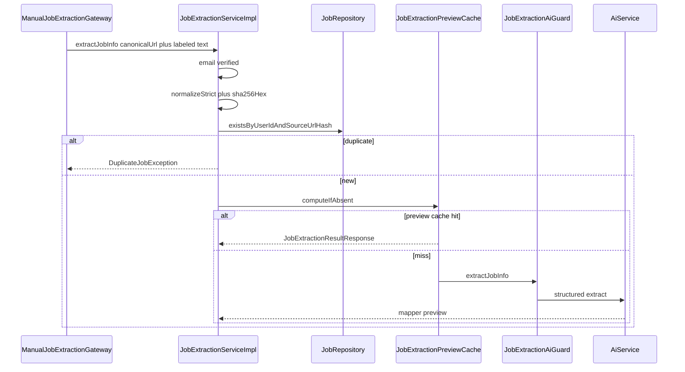

# Flows

Workflows actually implemented by `automatedjobextraction`. Each diagram matches `AutomatedJobExtractionServiceImpl`, the rate-limit filter, SSRF, fetch, extraction pipeline, extracted-text cache, and `ManualJobExtractionGateway`.

## Parse request lifecycle

End-to-end path for `POST /api/v1/automated-job-extraction/parse`.

Notes:

- `200` with `requiresManualReview: true` is still success.
- Duplicate `409` is produced **inside** the gateway, **after** a successful fetch and extract on a cache miss. The automated service does not query `JobRepository` itself.
- Fetch and AI are outside any service `@Transactional`.
- Try-it-out against a live model can take the fetch timeouts plus the AI timeout (AI default 60 seconds).

## URL, SSRF, and fetch vs invalid-job decision

Paid extraction is skipped when the URL is unusable as a format, as an SSRF target, or as a job posting.

Another user may already have the same hash. That does not produce `409` for the caller. See [PREVIEW-AND-SAVE.md](AUTOMATEDJOBEXTRACTION-SERVICE-SPECIFIC-DOCS/PREVIEW-AND-SAVE.md).

`javascript:` and missing hosts fail at `normalizeStrict` (format message). `http://localhost/...` is a valid absolute URL and fails at SSRF (`INVALID JOB URL`). Tests lock this split in.

## Extracted-text cache and in-flight coalescing

`computeIfAbsent(userId, urlHash, loader)`:

Implications:

- Same user + same canonical URL within 3 minutes → one outbound fetch.
- Different users → different cache keys.
- Cache key does **not** include live HTML. A second parse for the same URL in the TTL window returns the first extracted text even if the career site changed.
- The gateway still runs on cache hits, so AI preview cache and duplicate check still apply. Tests assert fetch once and gateway twice on a second call.
- Duplicate check therefore still runs on every request. Saving via `POST /api/v1/jobs` after a preview makes the next parse a `409` without a second fetch if the text cache is still warm.

Redis get/put failures log a warning and fall back to memory on that instance.

## Page fetch, redirects, and Workday CXS

`InvalidAutomatedJobUrlException` from fetch does not open the fetch circuit. Timeouts, oversized bodies, and 5xx do.

Details: [SSRF-AND-PAGE-FETCH.md](AUTOMATEDJOBEXTRACTION-SERVICE-SPECIFIC-DOCS/SSRF-AND-PAGE-FETCH.md).

## Extraction pipeline

A strategy that throws is skipped (`debug` log); the pipeline continues. See [EXTRACTION-PIPELINE.md](AUTOMATEDJOBEXTRACTION-SERVICE-SPECIFIC-DOCS/EXTRACTION-PIPELINE.md).

## Fetch guard: circuit and bulkhead

Wraps only the outbound fetch callable inside `JobPageFetcher.fetch`.

A success resets the consecutive-failure counter. `AutomatedJobExtractionUnavailableException` itself does not count as a new fetch failure.

The **AI** circuit (`JobExtractionAiGuard`: 5 concurrent, 3 failures / 30s) still applies later inside manual extraction. A caller can pass the fetch guard and still get AI `503`.

## Gateway / manual parse (after labeled text exists)

`originalDescription` on the preview is the **labeled extracted text**, not the original HTML. That is what the gateway puts in `rawJobText`.

## Rate-limit filter

See [RATE-LIMITING.md](AUTOMATEDJOBEXTRACTION-SERVICE-SPECIFIC-DOCS/RATE-LIMITING.md). POST only; IP then user; `429` written by the filter before the controller.
