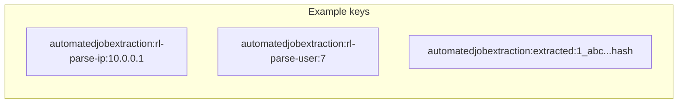

# Redis and related infrastructure

`automatedjobextraction` uses Redis **only when** `app.automatedjobextraction.redis.enabled=true`. Boot's Data Redis auto-configuration is excluded on `CopilotApplication`; this module creates its own Lettuce connection factory.

When Redis is off (the default), or a Redis call throws, the same features run **in process**:

| Feature | Redis | Fallback |
| --- | --- | --- |
| Parse rate limits | INCR + TTL counters | Sliding window in a `ConcurrentHashMap` |
| Extracted-text cache | String GET/SET with TTL | `ConcurrentHashMap` of values + expiry |

This is **not** a cache of the `jobs` table. It is also **not** the manual-extraction preview JSON cache (`jobextraction:preview:...`). That cache still exists downstream when the gateway runs, under `app.jobextraction.redis.*`.

## Why it exists

URL parse is expensive (outbound HTTP plus later model latency). The module needs:

1. A **parse budget** so one IP or stolen JWT cannot flood career sites and the AI provider.
2. A **short extracted-text cache** so a double-click / two tabs for the same user and URL does not start two fetches.

Redis makes those limits and cache entries visible to every instance. In-memory mode is for local runs, tests, and Redis outages.

## Beans and wiring

Created only inside `AutomatedJobExtractionRedisConfig.Enabled` (`havingValue = "true"`):

- `AutomatedJobExtractionRedisKeyBuilder` — prefix from `app.automatedjobextraction.redis.key-prefix` (default `automatedjobextraction`)
- `LettuceConnectionFactory` — standalone host/port/database/password, command timeout `timeoutMs`
- `StringRedisTemplate`
- `AutomatedJobExtractionRedisRepository` — thin `opsForValue` wrapper (not a Spring Data repository)
- `AutomatedJobExtractionRedisService` / `AutomatedJobExtractionRedisServiceImpl`

`ExtractedJobContentCache` injects `AutomatedJobExtractionRedisService` with `@Autowired(required = false)`. Rate limiting uses `ObjectProvider.getIfAvailable()`.

`factory.setValidateConnection(false)` — startup does not ping Redis as a hard dependency beyond creating the factory.

## Key layout

Builder: `{prefix}:{namespace}:{identity}`

- Blank prefix → `automatedjobextraction`
- Namespace and identity: trim, lower-case, **colons replaced with `_`** so IPv6 does not collide with the delimiter
- Blank identity → `unknown`

| Use | Namespace passed to the service | Identity |
| --- | --- | --- |
| IP rate limit | `rl-parse-ip` | Client IP |
| User rate limit | `rl-parse-user` | Numeric user id as string |
| Extracted text | `extracted` | `{userId}_{urlHash}` |

Rate-limit code prefixes the bucket with `rl-`: `consume("parse-ip", ip)` → namespace `rl-parse-ip`.

IPv6 example from key-builder tests: identity `2001:db8::1` → `2001_db8__1` (colons become underscores). The live rate-limit namespace uses a **hyphen** (`rl-parse-ip`); hyphens are not rewritten.

## Rate-limit counters

`AutomatedJobExtractionRedisRepository.increment`:

- `INCR` the key
- If the new value is **1**, `EXPIRE` for the window (60 seconds for parse)

This is a **fixed window** per key, not a sliding window. The in-memory path **is** a sliding window of timestamps.

Over limit: `ttlSeconds` (Redis `TTL`) becomes `Retry-After`, or the configured window if TTL is missing.

Redis exceptions: log warning, then in-memory `consumeMemory`.

## Extracted-text cache

- TTL: **3 minutes** (`ExtractedJobContentCache.TTL`)
- Value: plain labeled text (not JSON)
- Redis identity: `userId + "_" + urlHash` (same as memory)
- `put` writes Redis and **returns** on success (does not also write memory unless Redis fails)
- `get` Redis failure → try memory
- `put` Redis failure → write memory
- `put` of null/blank is a no-op

**In-flight map** (always in memory on that JVM): `CompletableFuture` per identity so concurrent misses share one loader. Failures complete the future exceptionally; the entry is removed in `finally`.

Cache does not include page HTML in the key. See [FLOW.md](FLOW.md).

## Configuration

Prefix `app.automatedjobextraction.redis`:

| Property | Default | Purpose |
| --- | --- | --- |
| `enabled` | `false` | Create Redis beans |
| `host` | `localhost` | Standalone host |
| `port` | `6379` | Port |
| `password` | unset | Set only if non-blank |
| `database` | `0` | Redis DB index |
| `timeout-ms` | `2000` | Lettuce command timeout |
| `key-prefix` | `automatedjobextraction` | First key segment |

Documented in `application.properties.example`. Live `application.properties` may omit the block; Java defaults still apply (`enabled=false`).

## Failure behavior

| Situation | Rate limit | Extracted-text cache |
| --- | --- | --- |
| Redis disabled | Memory sliding window (per instance) | Memory map (per instance) |
| Redis throws | Memory fallback for that consume | Memory get/put fallback |
| Fetch / quality errors | Unrelated | Failed loads are **not** cached (`loader` throws before `put`) |

Multi-instance **without** Redis: each task has its own 5/min budget and its own 3-minute cache. Enable Redis for shared behavior.

## Related request control

Parse-per-minute is `app.automatedjobextraction.parse-per-minute` (default 5), not a Redis property. Redis only stores the counters when enabled.

`JobPageFetchGuard` does not use Redis. Downstream `JobExtractionAiGuard` and `JobExtractionPreviewCache` use **manual** extraction Redis when `app.jobextraction.redis.enabled=true`, a separate connection and prefix.
