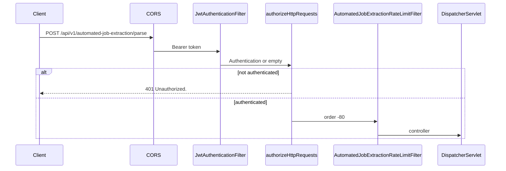

# Security

Security behavior that actually applies to `automatedjobextraction`. Protections that are not implemented are not claimed.

## Position in the filter chain

Parse requests go through the **application** security chain first, then this module's rate-limit filter.

`AuthRateLimitFilter` sits in the same security chain but only limits selected `/api/v1/auth/**` POSTs. It does not budget automated job extraction.

`AutomatedJobExtractionRateLimitFilter` is a servlet `FilterRegistrationBean` at order `-80`, after `springSecurityFilterChain` (default `-100`). It is not added inside the security chain, so the same POST is not counted twice.

## Authentication

`/api/v1/automated-job-extraction/**` is **not** in the `permitAll` list. `SecurityConfig` requires `authenticated()` for this prefix (alongside `/api/v1/job-extraction/**`). Other authenticated APIs additionally reject `CLIENT_BROWSER_EXTENSION`.

`JwtAuthenticationFilter`:

1. Reads `Authorization` starting with `Bearer `.
2. Extracts user id from the JWT.
3. Loads `User` by id.
4. Authenticates only if `enabled == true`, `emailVerified == true`, and the token is valid for that user.
5. Otherwise leaves the context unauthenticated. Invalid JWT is logged at debug and does not throw to the client as a 500.

Unauthenticated callers receive `JsonAuthenticationEntryPoint`: HTTP **401**, `success: false`, message **`Unauthorized.`**

Disabled accounts and unverified emails therefore get **401** at the filter, not 403. Tests in `AutomatedJobExtractionSecurityTest` lock this in (service never called).

`CurrentUserService.getCurrentUser()` throws `InvalidCredentialsException` (`401` via `GlobalExceptionHandler`) if the principal is missing or not `CustomUserDetails`. That is a backstop if the controller ran without a user.

## Authorization and email verification

There is no method-level `@PreAuthorize` and no role gate specific to parse. Any authenticated user may call it, including a **browser-extension** JWT.

**Service-layer check:** `AutomatedJobExtractionServiceImpl` throws `EmailNotVerifiedException` unless `Boolean.TRUE.equals(currentUser.getEmailVerified())`. `null` counts as unverified. `GlobalExceptionHandler` maps that to **403** with `Please verify your email before using this feature.` The gateway’s `JobExtractionServiceImpl` repeats the same check.

Because the JWT filter already requires `emailVerified`, the 403 path is defense in depth. Clients should treat **both 401 and 403** as "cannot use parse" for unverified accounts.

## Endpoint access rules

| Path | Rule |
| --- | --- |
| `POST /api/v1/automated-job-extraction/parse` | Authenticated JWT user (web **or** extension) |
| Other methods on that path | `405` after authentication (or `401` without a token) |
| `/v3/api-docs/automated-job-extraction` | `permitAll` only when **not** `prod`/`production`. Production tests assert these URLs are not HTTP 200. |

This module does not use the internal API key (`X-Internal-Api-Key` / `/api/v1/internal/**`).

## SSRF and outbound fetch

This is the main extra security surface versus manual parse. The server **does** GET the user-supplied URL.

`SsrfProtectionService.validate` runs on the canonical URL **before** cache/fetch, and again on the fetch URI and **every redirect hop**. Failures are always `InvalidAutomatedJobUrlException` (`400` `INVALID JOB URL`). The implementation does not put the host, IP, or DNS error into the JSON.

Blocked (non-exhaustive; see [SSRF-AND-PAGE-FETCH.md](AUTOMATEDJOBEXTRACTION-SERVICE-SPECIFIC-DOCS/SSRF-AND-PAGE-FETCH.md)):

- Scheme other than `http`/`https`
- User-info in the URL (`user:pass@host`)
- Literal IPv4/IPv6/decimal/numeric hosts
- Hosts `localhost`, cloud metadata names, `kubernetes`, …
- Suffixes `.local`, `.internal`, `.corp`, `.onion`, …
- Any DNS answer that is loopback, link-local, site-local, multicast, CGNAT `100.64.0.0/10`, `169.254.0.0/16`, unique-local IPv6, and related off-limits ranges
- Unknown host

JDK `HttpClient` is built with `Redirect.NEVER` so a 302 to `http://127.0.0.1` cannot be followed before SSRF. Tests cover redirect-to-localhost.

Response bodies larger than `maxResponseBytes` throw a generic fetch failure (`502`), not a dump of the body.

## Request origin (CORS)

Shared `CorsConfigurationSource`: configured origins only (wildcard `*` is dropped when credentials are allowed). The browser-extension origin may be added from `app.extension.id`. Allowed methods include POST. Exposed headers include `Retry-After` so browsers can read the rate-limit header. This module does not define its own CORS policy.

## Rate limiting and abuse prevention

See [RATE-LIMITING.md](AUTOMATEDJOBEXTRACTION-SERVICE-SPECIFIC-DOCS/RATE-LIMITING.md). Summary:

- POST only, prefix `/api/v1/automated-job-extraction`.
- Default **5** per minute per IP and per user (stricter than manual parse’s default 8).
- Generic 429 message (does not say whether IP or user bucket fired).
- `X-Forwarded-For` first hop is trusted as client IP when present. Misconfigured proxies can skew IP buckets.

Fetch bulkhead/circuit and AI bulkhead/circuit are additional in-process limits, not HTTP rate limits.

## Credential and secret handling

- JWTs are validated by `auth`; this module does not log token values.
- Controller logs inbound `sourceUrl` **length**, not the URL.
- Success/cache-hit logs use `userId` and URL **hash**.
- Redis password (`app.automatedjobextraction.redis.password`) is optional and only applied when non-blank. Do not commit real passwords.
- AI API keys belong to `spring.ai.openai.api-key`, used inside `ai`, not read by this package.
- Invalid-job errors use a **fixed** message. Tests assert `http` is not echoed for `INVALID JOB URL`, and `javascript:` is not echoed for format failures.
- Unexpected exceptions → `500` `Something went wrong.` Tests assert host:port fragments from a thrown `RuntimeException` are not in `message`.

## Output handling

Clipping, control-character strip, and `javascript:` / `data:` URI blanking happen in `JobExtractionMapper` (manual module) after the AI call. HTML in extracted/AI strings is **not** stripped there. Clients must escape when rendering.

`access_token`, `token`, and `auth` query parameters are stripped during URL canonicalization so they are not stored on the later jobs row if the client saves `data.sourceUrl`.

## Session and CSRF

The API is **stateless** (`SessionCreationPolicy.STATELESS`). CSRF is disabled. There is no automated-extraction cookie session.

## Production-oriented behavior present in code

- `AutomatedJobExtractionOpenApiConfig` is `@Profile("!prod & !production")`.
- Unhandled errors return `Something went wrong.` without exception details.
- Extracted-text cache is per-user; one user cannot read another’s cached extract.
- Metrics logs include user id and URL hash, not the raw URL, on success/cache-hit lines.

## What is not implemented

- No CAPTCHA solver, headless browser, or JavaScript execution for challenge pages. Challenge HTML without job markers is `INVALID JOB URL`.
- No WAF or bot score in this module.
- Fetch circuit/bulkhead is per process, not a cluster-wide outbound budget.
- Rate-limit Redis failure falls back to **in-memory** limits (weaker across instances).
- Duplicate check runs after fetch on a cache miss; a known-duplicate URL still causes an outbound GET unless extracted text is already cached.
