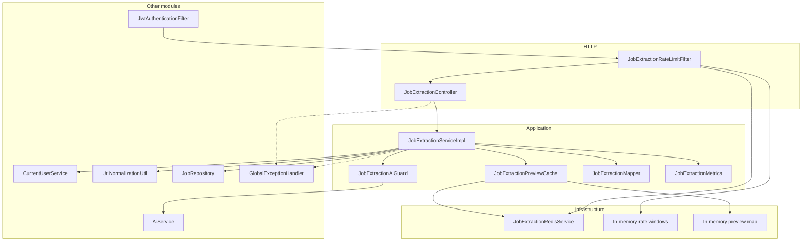
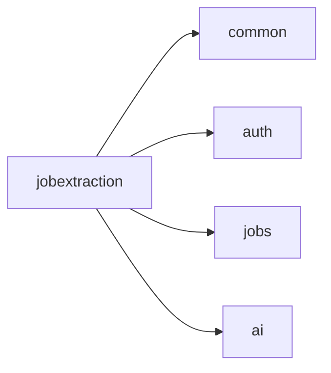

# Architecture

How the `jobextraction` module is layered, which components exist, and which way dependencies point. Class-level detail is limited to what a new developer needs to navigate the package.

## Architectural role

This module is a **stateless preview API**. It sits between the client and three other modules:

- `auth` / `common.security` — who is calling
- `jobs` — whether that user already saved this posting
- `ai` — structured extraction of the paste

There is no `jobextraction` persistence layer. The only durable data it reads is `jobs.source_url_hash` for the current user.

The AI call is **not** wrapped in `@Transactional`. The duplicate check is a single Spring Data method (a short repository transaction). Holding a JDBC connection for the model timeout (up to about 60 seconds) is intentionally avoided.

## Package map

```
jobextraction/
├── controller/          HTTP entry
├── dto/request|response Request and preview response
├── service/             Orchestration
├── mapper/              AI DTO → preview DTO
├── cache/               Preview cache (Redis or memory)
├── resilience/          Circuit + bulkhead around the model
├── metrics/             Log-line counters
├── util/                Field length constants
├── exception/           Email / AI-unavailable
├── ratelimit/           Filter, properties, Redis or memory counters
├── redis/               Keys, repository, service (beans only if Redis enabled)
└── config/              OpenAPI group + Redis beans
```

## Layers



Request direction is always **inward**: controller → service → collaborators. Other modules do not depend on `jobextraction` types except `GlobalExceptionHandler`, which maps this module's exceptions.

## Component groups

### HTTP and DTOs

`JobExtractionController` exposes a single POST. It wraps the service result in the shared `ApiResponse` envelope (`success`, `message`, `data`, `timestamp`).

`JobExtractionRequest` is the inbound body: `sourceUrl` and `rawJobText`. URL **format** is not a Bean Validation `@Pattern`; malformed schemes such as `javascript:` pass `@NotBlank`/`@Size` and fail later in `UrlNormalizationUtil`.

`JobExtractionResultResponse` is shaped like `jobs.dto.JobRequest` plus `requiresManualReview`. `sourceUrl` and `originalDescription` are filled by this service (canonical URL and the user's paste), not by the model.

### Orchestration

`JobExtractionService` / `JobExtractionServiceImpl`:

1. `CurrentUserService.getCurrentUser()`
2. Email verified (`Boolean.TRUE`)
3. `normalizeStrict` + `sha256Hex`
4. `existsByUserIdAndSourceUrlHash`
5. `previewCache.computeIfAbsent` → `aiGuard.call` → `aiService.extractJobInfo` → mapper

### Mapping and limits

`JobExtractionLimits` mirrors `JobRequest` / `JobLimits` sizes so a later save does not fail on `@Size`. `JobExtractionMapper` clips, sanitizes, and sets `requiresManualReview` when title or company is blank or was truncated.

### Cache

`JobExtractionPreviewCache` is keyed by `userId + "_" + urlHash` (not by pasted text). TTL is 3 minutes. If Redis is missing or throws, it uses a `ConcurrentHashMap`. Concurrent callers for the same key share one in-flight `CompletableFuture` so two tabs do not start two model calls.

### Resilience

`JobExtractionAiGuard` is in-process (no Resilience4j):

- Bulkhead: semaphore of 5
- Circuit: 3 consecutive `AiServiceException` (or unexpected) failures → open for 30 seconds
- Open circuit or failed `tryAcquire` → `JobExtractionAiUnavailableException` (`503`)

A success resets the consecutive-failure counter. `JobExtractionAiUnavailableException` itself does not count as a new failure for opening the circuit.

### Rate limiting

`JobExtractionRateLimitFilter` is registered on `/api/v1/job-extraction` and `/api/v1/job-extraction/*` at order `-80` (after `springSecurityFilterChain` at `-100`). It is **not** inside the security chain, so a request is not counted twice.

Only **POST** under that prefix is limited. Limit `<= 0` disables the filter. Identity: client IP (`X-Forwarded-For` first hop, else `remoteAddr`) and, when a `CustomUserDetails` principal exists, user id.

### Redis

Beans are created only when `app.jobextraction.redis.enabled=true`. Boot's Data Redis auto-configuration is excluded on the application class; this module builds its own Lettuce factory. See [REDIS-INFRASTRUCTURE.md](REDIS-INFRASTRUCTURE.md).

### Metrics and OpenAPI

`JobExtractionMetrics` increments in-memory counters and logs a line (`jobextraction metric=...`). There is no Actuator meter for these.

`JobExtractionOpenApiConfig` registers the `job-extraction` Springdoc group only when the active profile is not `prod` or `production`.

### Exceptions

This module defines `EmailNotVerifiedException` and `JobExtractionAiUnavailableException`. It also throws `InvalidJobUrlException` (common) and `DuplicateJobException` (jobs). Mapping lives in `GlobalExceptionHandler`. The rate-limit filter usually writes `429` itself; `RateLimitExceededException` is mapped if thrown from `consumeOrThrow`.

## Dependency direction



`jobextraction` may import:

- `common` — `ApiResponse`, `CurrentUserService`, `UrlNormalizationUtil`, `InvalidJobUrlException`, `GlobalExceptionHandler`
- `auth` — `User`, `CustomUserDetails` (rate-limit principal)
- `jobs` — `JobRepository`, `DuplicateJobException`, `JobLimits` (via `JobExtractionLimits`)
- `ai` — `AiService`, `JobExtractionAiRequest` / `JobExtractionAiResponse`, `AiServiceException`

Other services should not depend on `jobextraction` for business logic.

## Important boundaries

| Boundary | Rule in this implementation |
| --- | --- |
| Persistence | No writes. Duplicate check is read-only. |
| AI | Only `extractJobInfo`. Prompts and ChatClient live in `ai`. |
| Cache isolation | Preview is never shared across users. Same URL, different user → two AI calls. |
| Cache identity | `urlHash` only — a new paste for the same URL within TTL returns the first preview. |
| Security | Filter chain authenticates; this module does not parse JWTs. |
