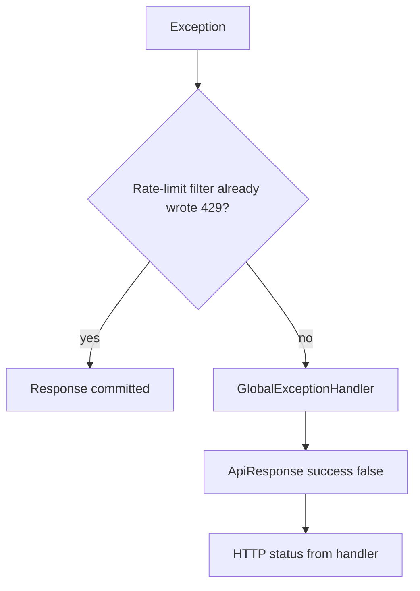

# Error handling

Parse errors become the shared `ApiResponse` JSON. This module has no `@RestControllerAdvice` of its own. Mapping is in `com.developer.copilot.common.exception.GlobalExceptionHandler`, except the rate-limit **filter**, which writes `429` directly.

## Path from exception to HTTP



Controller success path does not catch exceptions; they propagate.

## Error envelope

Always:

- `success`: `false`
- `message`: client-safe string
- `data`: `null`
- `timestamp`: `LocalDateTime.now()`

Rate-limit responses also set header `Retry-After` (seconds). CORS exposes that header.

## Exceptions this flow uses

### Defined in `jobextraction`

| Exception | HTTP | Message |
| --- | --- | --- |
| `EmailNotVerifiedException` | 403 | `Please verify your email before using this feature.` |
| `JobExtractionAiUnavailableException` | 503 | `The AI service is temporarily unavailable. Please try again shortly.` (circuit) or `The AI service is busy. Please try again shortly.` (bulkhead) |
| `ratelimit.exception.RateLimitExceededException` | 429 | `Too many requests. Please try again later.` + `Retry-After` |

The filter normally prevents `RateLimitExceededException` by writing the body itself with the same message. The handler exists for `consumeOrThrow`.

### Thrown by this service, defined elsewhere

| Exception | HTTP | Typical message |
| --- | --- | --- |
| `InvalidJobUrlException` | 400 | `Job URL must be a valid absolute http or https link.` (empty after trim: `Job URL must not be empty.` — Bean Validation usually catches blanks first) |
| `DuplicateJobException` | 409 | `This post was already added to your records.` |
| `AiServiceException` | 502 | Provider-facing text from `AiServiceImpl.formatFriendlyErrorMessage` or `AI did not return parsable job information. Please try again.` |
| `InvalidCredentialsException` | 401 | `User is not authenticated.` |

### Spring / shared

| Condition | HTTP | Message |
| --- | --- | --- |
| `MethodArgumentNotValidException` | 400 | `field: constraint message` joined by commas |
| `HttpMessageNotReadableException` | 400 | `Request body is missing or malformed JSON.` |
| `HttpMediaTypeNotSupportedException` | 415 | `Unsupported media type.` |
| `HttpRequestMethodNotSupportedException` | 405 | `Method not allowed.` |
| No / invalid JWT (entry point) | 401 | `Unauthorized.` |
| Any other `Exception` | 500 | `Something went wrong.` |

`IllegalArgumentException` is **500** unless the message starts with a small allow-list of prefixes used by other modules (chat turns, HMAC, username size, page index). Job extraction does not rely on those prefixes.

## How specific cases are produced

**400 URL:** `normalizeStrict` throws `InvalidJobUrlException`. Metrics: `recordBadUrl`. Message does not include the submitted URL.

**409 duplicate:** `existsByUserIdAndSourceUrlHash` is true. Metrics: `recordDuplicate`. AI is not called.

**502 AI:** `AiService.extractJobInfo` throws `AiServiceException` (timeout, auth, quota, null structured entity, unexpected provider errors). Guard counts these toward the circuit. Metrics: `recordAiFailure`. Guard may wrap unexpected checked exceptions as `AiServiceException` with `An unexpected error occurred while communicating with the AI model. Please try again.`

**503 AI guard:** Circuit still open (30s after 3 failures) or semaphore exhausted (5 concurrent). Metrics: `recordAiFailure` when the service catches `JobExtractionAiUnavailableException` from the loader (same catch as `AiServiceException`).

**403 email:** Service check before URL work.

**429:** Filter after a denied `RateLimitResult`. Body matches the exception type's message.

## Examples (from tests / handlers)

Email not verified:

```json
{
  "success": false,
  "message": "Please verify your email before using this feature.",
  "data": null,
  "timestamp": "2026-01-15T10:30:00"
}
```

Unhandled:

```json
{
  "success": false,
  "message": "Something went wrong.",
  "data": null,
  "timestamp": "2026-01-15T10:30:00"
}
```

## Logging

- Controller logs inbound `sourceUrl` **length**, not the URL.
- Duplicate / cache-hit / success logs use `userId` and `urlHash`.
- `GlobalExceptionHandler` logs unhandled exceptions at error.
- Redis fallbacks log a warning with `ex.getMessage()`.

Do not expect stack traces in JSON.
