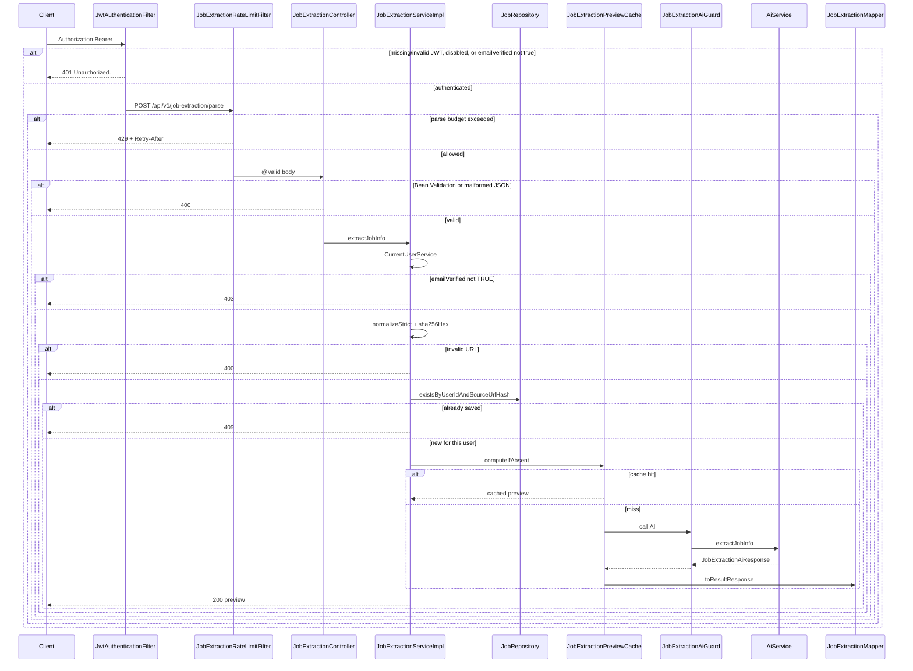
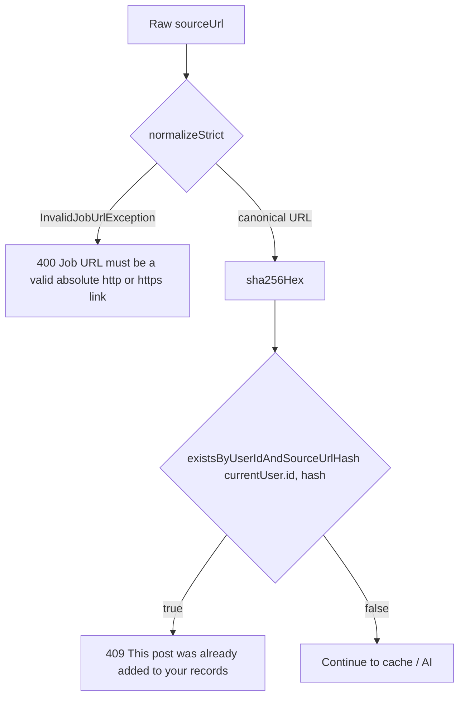
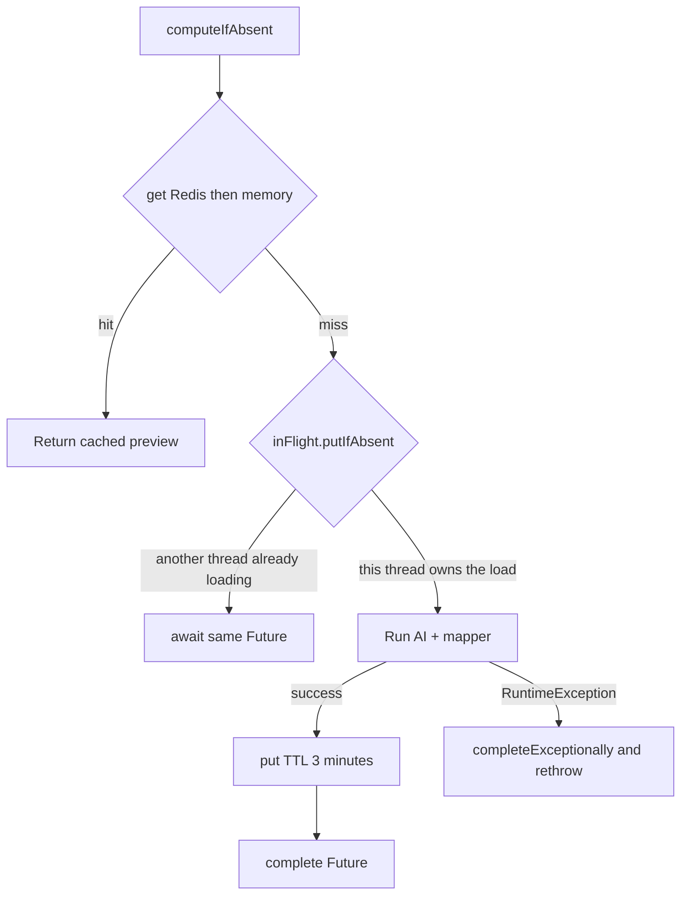
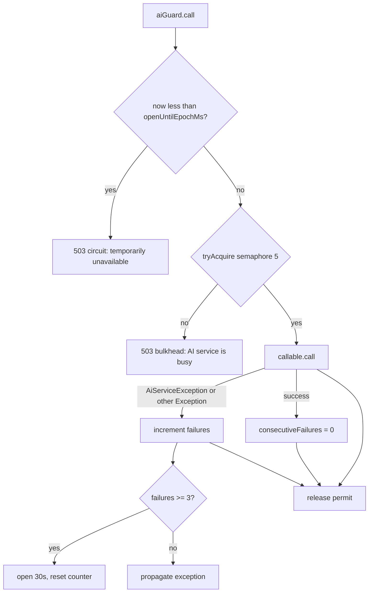
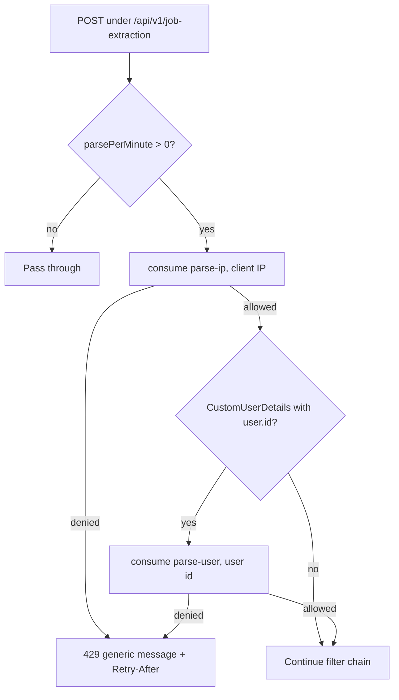
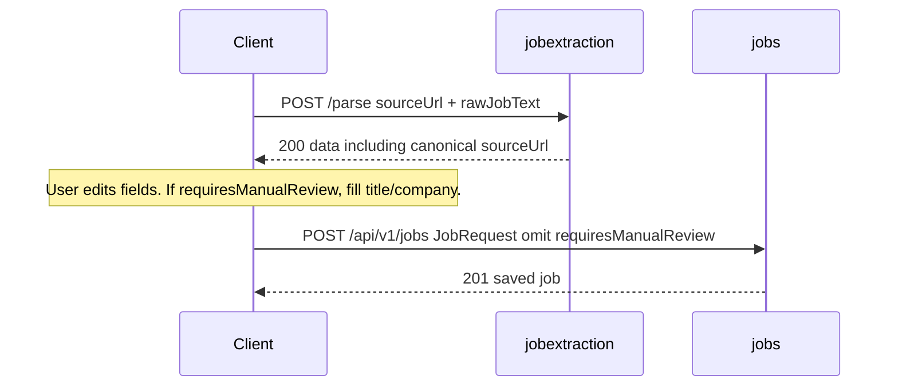
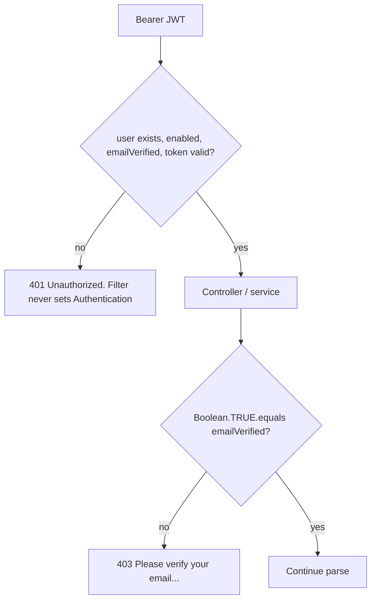

# Flows

Workflows actually implemented by `jobextraction`. Each diagram matches `JobExtractionServiceImpl`, the rate-limit filter, the preview cache, and `JobExtractionAiGuard`.

## Parse request lifecycle

End-to-end path for `POST /api/v1/job-extraction/parse`.

Notes:

- `200` with `requiresManualReview: true` is still success. The client should highlight title/company before save.
- The AI invocation is outside any service `@Transactional`.
- Try-it-out against a live model can take up to the AI timeout (default 60 seconds).

## URL, hash, and duplicate decision

Paid extraction is skipped when the URL is unusable or this user already has the posting.

Another user may already have the same hash. That does not produce `409` for the caller. See [URL-AND-DEDUPLICATION.md](JOBEXTRACTION-SERVICE-SPECIFIC-DOCS/URL-AND-DEDUPLICATION.md).

## Preview cache and in-flight coalescing

`computeIfAbsent(userId, urlHash, loader)`:

Implications:

- Same user + same canonical URL within 3 minutes → one AI call.
- Different users → different cache keys.
- Cache key does **not** include `rawJobText`. A second paste for the same URL in the TTL window returns the first preview (and the first `originalDescription`).
- Duplicate check still runs on every request, including cache hits. Saving via `POST /api/v1/jobs` after a preview makes the next parse a `409`.

Redis get/put failures log a warning and fall back to memory on that instance.

## AI guard: circuit and bulkhead

Wraps only the `aiService.extractJobInfo` call.

- `JobExtractionAiUnavailableException` from an inner call is rethrown without counting as a new circuit failure.
- After three `AiServiceException`s, the **fourth** call fails fast with `503` and does not hit the provider.
- Guard state is **per JVM**. Multiple ECS tasks each have their own circuit and semaphore.

Provider timeouts and parse failures surface as `AiServiceException` → `502`. See [AI-EXTRACTION.md](JOBEXTRACTION-SERVICE-SPECIFIC-DOCS/AI-EXTRACTION.md).

## Rate-limit flow

Runs after JWT so a stolen token is limited by user id, not only by IP.

GET (there is no GET API) and other URL prefixes are not limited by this filter. Same JSON body for IP and user exhaustion. Details: [RATE-LIMITING.md](JOBEXTRACTION-SERVICE-SPECIFIC-DOCS/RATE-LIMITING.md).

## Client save flow (outside this module)

This service stops at preview. The intended product sequence:

Field mapping: [PREVIEW-AND-SAVE.md](JOBEXTRACTION-SERVICE-SPECIFIC-DOCS/PREVIEW-AND-SAVE.md).

## Authentication vs email verification

In production filter behavior, unverified users normally never reach the service (`401`). The `403` path is implemented and tested at the service/controller-advice layer. Do not document `403` as the only unverified-email outcome.
