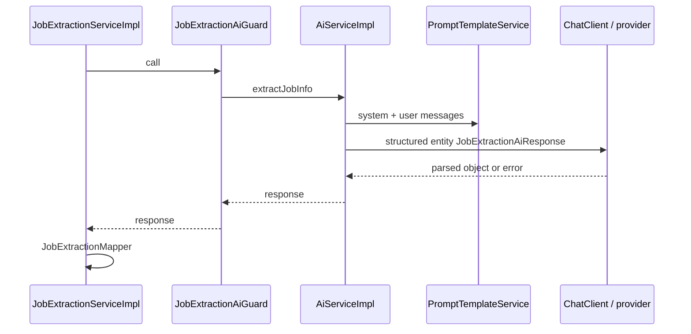

# AI extraction

How `jobextraction` uses the `ai` module, what the model is asked to do, and how the result is guarded and cleaned. Prompt text and `ChatClient` live in `ai`; this document only covers the integration actually used by parse.

## Call site

`JobExtractionServiceImpl` builds:

```text
JobExtractionAiRequest { jobUrl: canonical URL, rawJobText: paste }
```

then:

```text
aiGuard.call(() -> aiService.extractJobInfo(aiRequest))
```

inside `previewCache.computeIfAbsent`, so cache hits skip the model.

`JobExtractionAiRequest` is an **in-process** DTO (`@Schema(hidden = true)`). It is not a public HTTP type.

## What `AiServiceImpl.extractJobInfo` does

1. `PromptTemplateService.buildJobExtractionSystemPrompt()` — literal extractor, no assistant persona; empty fields when facts are absent; pasted block treated as untrusted data, not instructions.
2. `buildJobExtractionUserMessage(jobUrl, rawJobText)` — sections `JOB URL` and `PASTED JOB POSTING CONTENT`.
3. `chatClient.prompt().system(...).user(...).options(...).call().entity(JobExtractionAiResponse.class)` wrapped in `callWithTimeout`.
4. Options: `app.ai.default-model`, `maxTokens = app.ai.max-completion-tokens` (default 2048), **temperature `0.0`**.
5. Null entity → `AiServiceException` `AI did not return parsable job information. Please try again.`
6. Other failures → `AiServiceException` with `formatFriendlyErrorMessage` (quota, 401, 404 model, 503 demand, timeout, or generic provider error).

Timeout default is **60 seconds** (`app.ai.timeout-seconds` / legacy `streaming-timeout-seconds`).



## Structured output

`JobExtractionAiResponse` fields carry `@JsonPropertyDescription` so Spring AI can instruct the model. The type **excludes** `sourceUrl` and `originalDescription` on purpose.

Industry and `sourcePlatform` must come from the paste, not company-name inference or URL guessing — that is in the prompt and the field descriptions.

## Mapper after the model

`JobExtractionMapper.toResultResponse(ai, normalizedUrl, rawJobText)`:

- Attaches canonical URL and paste
- Clips to `JobExtractionLimits`
- Strips C0 controls (keeps tab/newline/CR)
- Blanks fields that are a `javascript:` or `data:` URI
- Caps skills at 50; drops blank skills
- Sets `requiresManualReview` for blank/truncated title or company

HTML/`<script>` in title is left as JSON text. Rendering UIs must escape.

## Guard (in this module)

`JobExtractionAiGuard` is **not** the same as `ai`'s `AiChatGuard`. It only wraps this extract call.

| Control | Value | Failure |
| --- | --- | --- |
| Concurrent extracts | 5 (`Semaphore.tryAcquire`) | `503` busy |
| Consecutive AI failures | 3 | Circuit open 30s → `503` unavailable |
| Success | resets failure counter | |

State is per JVM. `AiServiceException` counts as failure; `JobExtractionAiUnavailableException` from inside `call` is not counted again.

HTTP: provider problems → **502**; guard reject → **503**. See [ERROR-HANDLING.md](../ERROR-HANDLING.md).

## Cost and cache

A cache hit logs `jobextraction metric=cacheHit` and does not call `AiService`. Failed extracts are not written to the preview cache.

In-flight coalescing: two simultaneous parses for the same `userId+urlHash` share one model call.

## Metrics

On AI throw: `recordAiFailure`. On completed loader: `recordSuccess` with latency. Guard `503` is recorded as AI failure when the service's catch block runs.

These are log counters, not Micrometer.

## What this module does not control

- Provider API key and base URL
- Switching `app.ai.provider` (extraction still uses the Spring AI OpenAI-compatible client configured for the app)
- Resume context (unused on this path)
- Streaming / SSE
