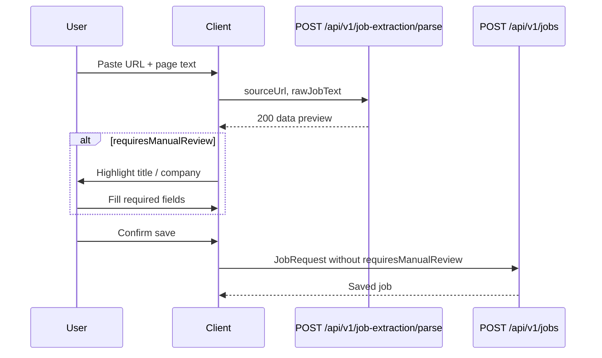

# Preview then save

The product is **two HTTP calls**. `jobextraction` only implements the first.

## Why two steps

Extraction is probabilistic (empty title, truncated company, leftover page noise). The service therefore returns a preview the user can edit. Persistence stays in `POST /api/v1/jobs`, which already enforces uniqueness, `@NotBlank` title/company, and URL rules.

Parse **never** writes rows. A `200` is not a saved job.

## Sequence

If parse returns `409`, skip extraction UI: this user already has that canonical URL.

## Field map

`JobExtractionResultResponse` is aligned with `JobRequest` so the client can bind the preview into the same form.

| Preview `data.*` | Save as `JobRequest.*` | Notes |
| --- | --- | --- |
| `sourceUrl` | `sourceUrl` | Canonical. Do not resubmit the raw paste URL (tracking params would be stripped again, but the preview is the intended value). |
| `originalDescription` | `originalDescription` | The paste from parse. |
| `description` | `description` | Optional on save (`@Size` only). |
| `title` | `title` | Required on save (`@NotBlank`). |
| `company` | `company` | Required on save. |
| `location` | `location` | |
| `employmentType` | `employmentType` | |
| `workMode` | `workMode` | |
| `experience` | `experience` | |
| `salary` | `salary` | |
| `education` | `education` | |
| `department` | `department` | |
| `industry` | `industry` | |
| `sourcePlatform` | `sourcePlatform` | |
| `skills` | `skills` | Always an array on preview. |
| `requiresManualReview` | **omit** | Not a `JobRequest` field. |

Lengths after mapping match `JobExtractionLimits` / `JobRequest` `@Size` (title 255, workMode 50, description 50000, skills 50×255, URL 2000, …).

## `requiresManualReview`

Computed in `JobExtractionMapper`, not by the model:

- title blank or company blank (null or whitespace), or
- title or company **truncated** to 255 characters

Empty location, salary, skills, and so on do **not** set the flag. A 200 with the flag true is still a successful preview.

`JobRequest` will reject blank title/company on save. The flag tells the UI which fields to force.

## What the backend already trusts

The model does **not** return `sourceUrl` or `originalDescription`. The mapper copies:

- canonical URL from `normalizeStrict`
- `rawJobText` from the request

That avoids the model echoing a different link or dropping the paste.

## Client pitfalls this code assumes you avoid

- Saving the **raw** request URL instead of `data.sourceUrl` (tracking params, `www.`, unsorted query).
- Sending `requiresManualReview` as if jobs validated it (unknown JSON is typically ignored; it is not a substitute for title/company).
- Treating parse `200` as “already in the notebook.”
- Expecting parse to fetch the URL. There is no HTTP client to the job site.

## Related 409s

Parse 409: exists-check before AI. Jobs create 409: same unique key if two saves race. Message on parse is `This post was already added to your records.`
