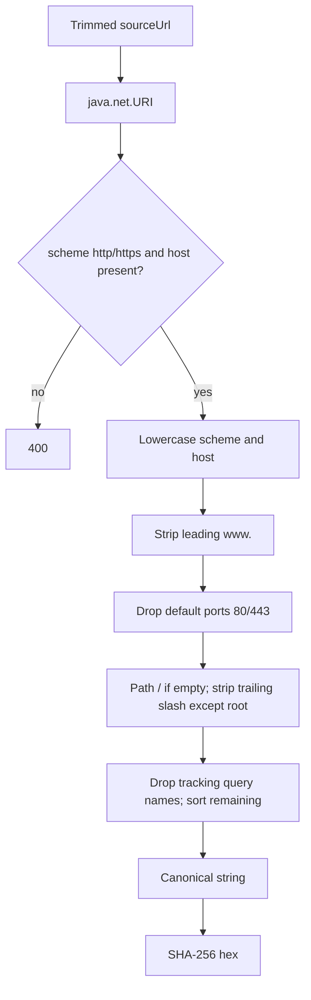

# URL canonicalization and deduplication

Parse must decide “is this the same posting this user already saved?” using the same rules `jobs` will use on create. That is `UrlNormalizationUtil` plus `source_url_hash`.

## Strict normalize

`JobExtractionServiceImpl` calls `normalizeStrict` (not `normalizeLenient`). Anything that is not an absolute `http` or `https` URL becomes `InvalidJobUrlException` → **400** with:

`Job URL must be a valid absolute http or https link.`

The message does not include the input (so `javascript:` and HTML are not reflected back).



Fragments (`#...`) are not appended (URI builder in this util does not keep the fragment).

## Tracking parameters stripped (exact names, case-insensitive)

Includes `utm_*` (and any key prefix `utm_`), `fbclid`, `gclid`, `share_id` / `shareid` / `share`, `ref`, `src`, `trk`, `token`, `access_token`, `auth`, and the rest of `TRACKING_PARAM_NAMES` in `UrlNormalizationUtil`.

Unknown keys such as `jobId` are **kept**. Query order is normalized (`?b=1&a=1` and `?a=1&b=1` share a hash).

Tests: `https://www.stripe.com/jobs/senior-engineer?utm_source=linkedin` → `https://stripe.com/jobs/senior-engineer`.

## Hash

`sha256Hex(canonicalUrl)` — UTF-8 SHA-256, lowercase hex. Stored on `jobs.source_url_hash` (64 characters) because MySQL cannot uniquely index `VARCHAR(2000)` the same way.

Parse never writes the hash; it only queries it.

## Duplicate pre-check

```text
jobRepository.existsByUserIdAndSourceUrlHash(currentUser.getId(), urlHash)
```

| Situation | Parse result |
| --- | --- |
| This user already has that hash | `409` `This post was already added to your records.` AI not called |
| Another user has that hash | Parse continues |
| This user has a different URL | Parse continues |

Uniqueness on save: `uk_job_user_source_url_hash (user_id, source_url_hash)`.

## Order relative to AI and cache

Duplicate check runs **before** `previewCache.computeIfAbsent`. After the user saves the preview, a later parse of the same URL 409s even if Redis still holds JSON.

Invalid URLs are rejected **before** the exists-query and **before** AI (`recordBadUrl`).

## Client contract

Return `data.sourceUrl` as the canonical form. Saving that value keeps parse-time and save-time hashes aligned.

Do not use the raw request URL for uniqueness in the UI; tracking params would make two copies look different until the server stripped them.

## `normalizeLenient`

Jobs update paths may use lenient normalize. **Parse does not.** Garbage strings that are not unsafe schemes are not accepted on extract; they 400.
