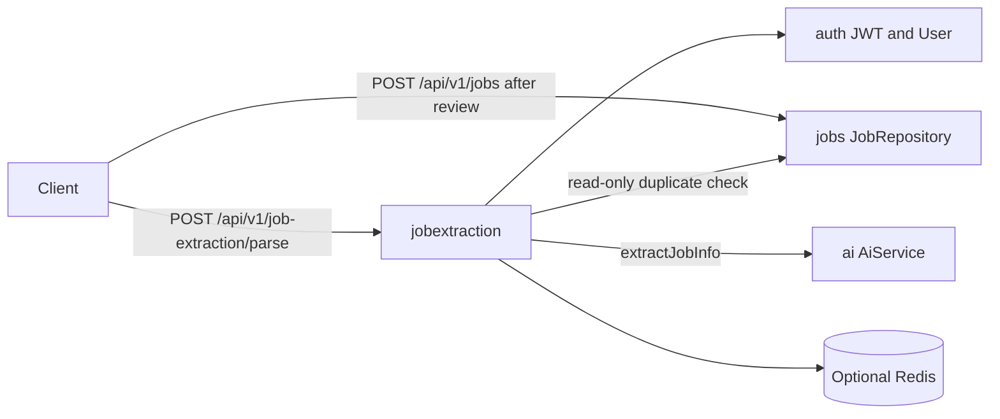

# Job Extraction Service

This is the starting point for the `jobextraction` module. Read it first, then follow the links at the bottom for APIs, security, data, and workflows.

## What this service is

`jobextraction` is the **preview step** before a job posting is saved. A signed-in, email-verified user pastes a job URL and the page text. This service:

1. Canonicalizes the URL (absolute `http`/`https` only; tracking query parameters stripped).
2. Rejects the request if **this user** already saved that canonical URL.
3. Sends the pasted text to the AI module for structured extraction.
4. Returns clipped, review-ready fields that match `POST /api/v1/jobs`.

It never inserts or updates a row. Persistence belongs to the `jobs` module. A `200` response is a preview, not a saved job.

## Why it exists

Pasting a messy career-site page into a form is slow and error-prone. This service turns that paste into structured fields (title, company, skills, and so on) so the client can show an editable review screen. The user then calls `POST /api/v1/jobs` to save.

## Responsibilities

- Authenticate the caller through the shared JWT filter (this module does not issue tokens).
- Require a verified email at the service layer (`403` if that check is reached).
- Validate and canonicalize the source URL before any AI call.
- Pre-check duplicates against the current user's `jobs` rows using the SHA-256 of the canonical URL.
- Call `AiService.extractJobInfo` behind an in-process circuit breaker and bulkhead.
- Cache the preview briefly per user and URL hash so a double-click does not pay for two model calls.
- Clip and sanitize AI strings so they fit `JobRequest` size limits.
- Rate-limit `POST /api/v1/job-extraction/**` per IP and per user.

## What this service does not do

- It does not write to MySQL.
- It does not own a `jobextraction` table.
- It does not crawl or fetch the job URL. The client must send `rawJobText`.
- It does not guess industry or source platform from the company name or URL. Those rules live in the AI extraction prompt.
- It does not replace `POST /api/v1/jobs`. Saving is a separate, explicit step.

## Major capabilities

| Capability | Behavior |
| --- | --- |
| Parse preview | `POST /api/v1/job-extraction/parse` returns structured fields plus `requiresManualReview`. |
| URL canonicalization | Shared `UrlNormalizationUtil.normalizeStrict` — tracking params stripped, host lowercased, `www.` dropped, query keys sorted. |
| Duplicate pre-check | `JobRepository.existsByUserIdAndSourceUrlHash` — scoped to the current user only. |
| AI structured extract | Temperature `0.0`, Spring AI `.entity(JobExtractionAiResponse.class)`. |
| Preview cache | 3-minute TTL, keyed by `userId + urlHash`. Redis when enabled; otherwise in-memory. |
| AI guard | At most 5 concurrent model calls; 3 consecutive AI failures open the circuit for 30 seconds. |
| Rate limits | Default 8 parse requests per minute per IP and per authenticated user. |

## Service boundaries

`jobextraction` depends on `auth` (current user), `jobs` (read-only duplicate check), `ai` (extraction), and `common` (URL util, `CurrentUserService`, `ApiResponse`, global exception handling). It does not implement those other services.

## Main components

- **Controller** — `JobExtractionController` at `/api/v1/job-extraction`.
- **Service** — `JobExtractionServiceImpl` orchestrates user, URL, duplicate check, cache, AI, and mapping.
- **Mapper** — `JobExtractionMapper` clips fields, blanks `javascript:` / `data:` URIs, strips C0 control characters, and computes `requiresManualReview`.
- **Cache** — `JobExtractionPreviewCache`.
- **Resilience** — `JobExtractionAiGuard`.
- **Rate limiting** — `JobExtractionRateLimitFilter` after the Spring Security chain.
- **Redis** — optional, owned by this module when `app.jobextraction.redis.enabled=true`.

## Important request flow (summary)

1. CORS, JWT, and `authenticated()` authorization.
2. Parse rate limit (POST only).
3. Bean Validation on `sourceUrl` and `rawJobText`.
4. Load current user; reject unverified email.
5. Strict URL normalize; SHA-256 hash.
6. Duplicate check; `409` if already saved.
7. Cache lookup or AI extract + map.
8. `200` with `ApiResponse<JobExtractionResultResponse>`.

See [FLOW.md](FLOW.md) for diagrams.

## Security responsibilities

The parse endpoint is not public. A valid Bearer JWT is required. Disabled or unverified accounts are not authenticated by `JwtAuthenticationFilter` (`401 Unauthorized.`). If an authenticated principal with `emailVerified != true` reached the service, it would return `403`. OpenAPI for this group is not registered on `prod` / `production` profiles.

Details: [SECURITY.md](SECURITY.md).

## Infrastructure

- **MySQL** — read-only query on the `jobs` table. No `jobextraction` schema.
- **Redis** — optional distributed rate-limit counters and preview JSON. Off by default; in-memory fallback for a single instance.
- **AI provider** — through the `ai` module (timeout, model, and API key are `app.ai.*` / `spring.ai.openai.*`).

## Documentation index

| Document | Contents |
| --- | --- |
| [ARCHITECTURE.md](ARCHITECTURE.md) | Layers, components, and dependency direction |
| [FLOW.md](FLOW.md) | Parse, cache, duplicate, and AI-guard workflows |
| [ENDPOINTS.md](ENDPOINTS.md) | `POST /api/v1/job-extraction/parse` |
| [SECURITY.md](SECURITY.md) | JWT, email verification, rate limits, output sanitization |
| [DATABASE.md](DATABASE.md) | Read-only use of `jobs` |
| [REDIS-INFRASTRUCTURE.md](REDIS-INFRASTRUCTURE.md) | Redis keys, TTL, in-memory fallback |
| [ERROR-HANDLING.md](ERROR-HANDLING.md) | Exceptions and HTTP mappings |
| [VALIDATION.md](VALIDATION.md) | Input, URL, business, and mapper rules |
| [CONFIGURATION.md](CONFIGURATION.md) | `app.jobextraction.*` and related properties |
| [TESTING.md](TESTING.md) | Test layout and what to extend |
| [DEPENDENCIES.md](DEPENDENCIES.md) | Internal and library dependencies |

Service-specific:

| Document | Contents |
| --- | --- |
| [PREVIEW-AND-SAVE.md](JOBEXTRACTION-SERVICE-SPECIFIC-DOCS/PREVIEW-AND-SAVE.md) | Two-step product: parse then `POST /api/v1/jobs` |
| [AI-EXTRACTION.md](JOBEXTRACTION-SERVICE-SPECIFIC-DOCS/AI-EXTRACTION.md) | Model call, prompts, clipping, circuit/bulkhead |
| [URL-AND-DEDUPLICATION.md](JOBEXTRACTION-SERVICE-SPECIFIC-DOCS/URL-AND-DEDUPLICATION.md) | Canonical URL and per-user duplicate check |
| [RATE-LIMITING.md](JOBEXTRACTION-SERVICE-SPECIFIC-DOCS/RATE-LIMITING.md) | Per-IP and per-user parse budget |
