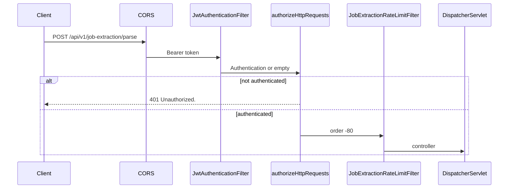

# Security

Security behavior that actually applies to `jobextraction`. Protections that are not implemented are not claimed.

## Position in the filter chain

Parse requests go through the **application** security chain first, then this module's rate-limit filter.

`AuthRateLimitFilter` sits in the same security chain but only limits selected `/api/v1/auth/**` POSTs. It does not budget job extraction.

`JobExtractionRateLimitFilter` is a servlet `FilterRegistrationBean` at order `-80`, after `springSecurityFilterChain` (default `-100`). It is not added inside the security chain, so the same POST is not counted twice.

## Authentication

`/api/v1/job-extraction/**` is **not** in the `permitAll` list. `SecurityConfig` requires `authenticated()` for any request that is not an auth public path, `/error`, or (non-production) swagger.

`JwtAuthenticationFilter`:

1. Reads `Authorization` starting with `Bearer `.
2. Extracts user id from the JWT.
3. Loads `User` by id.
4. Authenticates only if `enabled == true`, `emailVerified == true`, and the token is valid for that user.
5. Otherwise leaves the context unauthenticated. Invalid JWT is logged at debug and does not throw to the client as a 500.

Unauthenticated callers receive `JsonAuthenticationEntryPoint`: HTTP **401**, `success: false`, message **`Unauthorized.`**

Disabled accounts and unverified emails therefore get **401** at the filter, not 403. Tests in `JobExtractionSecurityTest` lock this in.

`CurrentUserService.getCurrentUser()` throws `InvalidCredentialsException` (`401` via `GlobalExceptionHandler`) if the principal is missing or not `CustomUserDetails`. That is a backstop if the controller ran without a user.

## Authorization and email verification

There is no method-level `@PreAuthorize` and no role gate specific to parse. Any authenticated user may call it.

**Service-layer check:** `JobExtractionServiceImpl` throws `EmailNotVerifiedException` unless `Boolean.TRUE.equals(currentUser.getEmailVerified())`. `null` counts as unverified. `GlobalExceptionHandler` maps that to **403** with `Please verify your email before using this feature.`

Because the JWT filter already requires `emailVerified`, the 403 path is defense in depth. Clients should treat **both 401 and 403** as "cannot use parse" for unverified accounts, matching OpenAPI notes on the controller.

## Endpoint access rules

| Path | Rule |
| --- | --- |
| `POST /api/v1/job-extraction/parse` | Authenticated JWT user |
| Other methods on that path | `405` after authentication (or `401` without a token) |
| `/v3/api-docs/job-extraction` | `permitAll` only when **not** `prod`/`production`. Production tests assert these URLs are not HTTP 200. |

This module does not use the internal API key (`X-Internal-Api-Key` / `/api/v1/internal/**`).

## Request origin (CORS)

Shared `CorsConfigurationSource`: configured origins only (wildcard `*` is dropped when credentials are allowed). Allowed methods include POST. Exposed headers include `Retry-After` so browsers can read the rate-limit header. `jobextraction` does not define its own CORS policy.

## Rate limiting and abuse prevention

See [RATE-LIMITING.md](JOBEXTRACTION-SERVICE-SPECIFIC-DOCS/RATE-LIMITING.md). Summary:

- POST only, prefix `/api/v1/job-extraction`.
- Default 8 per minute per IP and per user.
- Generic 429 message (does not say whether IP or user bucket fired).
- `X-Forwarded-For` first hop is trusted as client IP when present. Misconfigured proxies can skew IP buckets.

## Credential and secret handling

- JWTs are validated by `auth`; this module does not log token values.
- Redis password (`app.jobextraction.redis.password`) is optional and only applied when non-blank. Do not commit real passwords.
- AI API keys belong to `spring.ai.openai.api-key`, used inside `ai`, not read by this package.
- Invalid URL errors use a **fixed** message. Tests assert `javascript:` and `<script>` are not echoed in `message`.

## Output handling (AI text)

The mapper:

- Strips C0 control characters except tab, newline, CR.
- Replaces a field whose trimmed value starts with `javascript:` or `data:` with `""` (case-insensitive). That reduces risk if a UI turns text into `href`.
- Does **not** strip HTML or `<script>`. Those remain JSON strings. Clients must escape when rendering.
- `originalDescription` is the user's paste and is not URI-blanked.

`access_token`, `token`, and `auth` query parameters are stripped during URL canonicalization so they are not stored on the later jobs row if the client saves `data.sourceUrl`.

## Session and CSRF

The API is **stateless** (`SessionCreationPolicy.STATELESS`). CSRF is disabled. There is no job-extraction cookie session.

## Production-oriented behavior present in code

- `JobExtractionOpenApiConfig` is `@Profile("!prod & !production")`.
- `application-prod.properties` and `application-production.properties` set `springdoc.api-docs.enabled=false` and `springdoc.swagger-ui.enabled=false`.
- Unhandled errors return `Something went wrong.` without exception details.
- Preview cache is per-user; one user cannot read another's cached parse.
- Metrics logs include user id and URL **hash**, not the raw URL, on success/duplicate/cache-hit lines.

## What is not implemented

- No CAPTCHA, WAF, or bot score in this module.
- No per-field HTML sanitizer for title/description.
- No SSRF protection beyond "we never fetch the URL."
- Circuit/bulkhead is per process, not a cluster-wide AI budget.
- Rate-limit Redis failure falls back to **in-memory** limits (weaker across instances).
