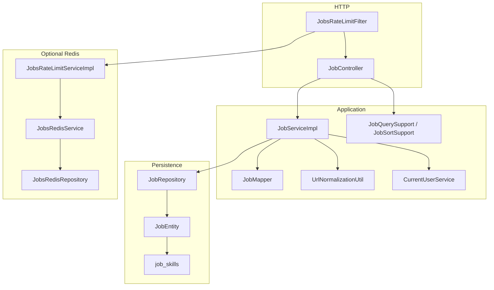
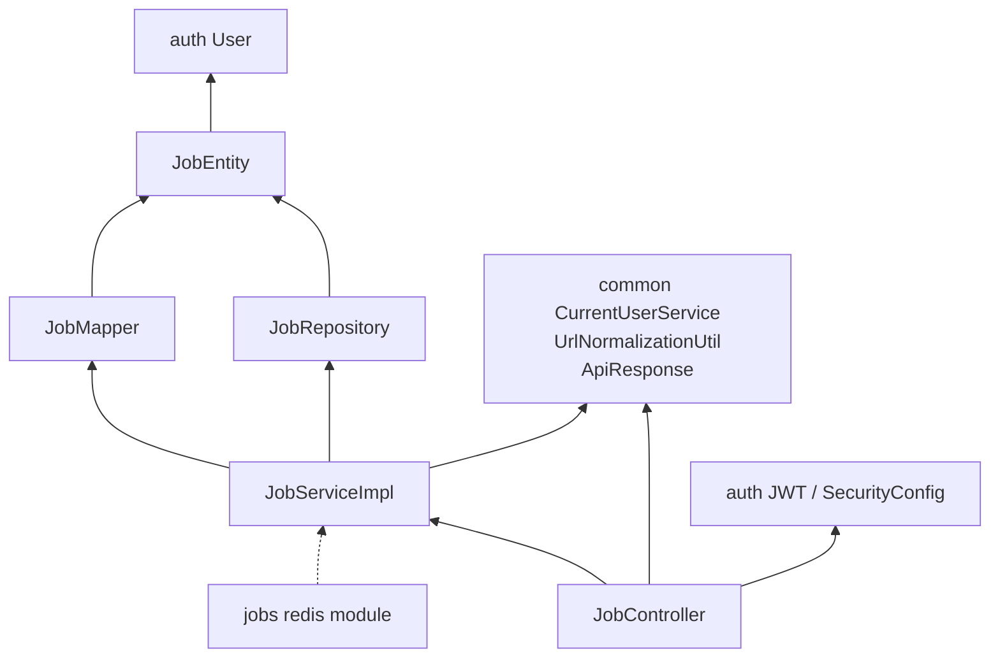

# Jobs Architecture

The jobs service is a vertical slice inside the Copilot Spring Boot application: one REST controller, one application service, JPA persistence, and a servlet filter for rate limits. It does not run as a separate process.

## Layered structure

Request processing order: Spring Security (JWT) → `JobsRateLimitFilter` → `JobController` → `JobServiceImpl` → `JobRepository`. Exceptions are turned into `ApiResponse` JSON by the shared `GlobalExceptionHandler`. Rate-limit denials are usually written **by the filter** (not the handler) as `429` with `Retry-After`.

## HTTP layer

`JobController` is mapped to `/api/v1/jobs`. It is `@Validated` and documents a Bearer JWT requirement. It does not look up the user itself; it delegates to `JobService`.

Controller-owned work:

- Bean validation on request bodies (`@Valid`)
- Paging, page size, search length, and sort whitelist via `JobQuerySupport` and `JobSortSupport` on `GET /api/v1/jobs`
- Wrapping results in `ApiResponse` with a fixed success message per operation
- HTTP `201` on create; `200` on other successes

OpenAPI grouping (`JobsOpenApiConfig`) is registered only when the active profile is **not** `prod` or `production`.

## Application layer

`JobServiceImpl` is the single owner of jobs business rules:

- Resolve the current `User` through `CurrentUserService`
- Load a job with `findByIdAndUserId` so foreign ids look like missing rows
- Apply source URLs only through `applySourceUrl` (normalize, hash, duplicate check)
- Translate unique-constraint races into `DuplicateJobException`
- Reject blank title, company, or original description on the general `PATCH` path

`JobMapper` copies fields between DTOs and `JobEntity`. It **never** writes `sourceUrl` or `sourceUrlHash`; those stay in the service so every create/update path shares the same normalization and uniqueness logic.

`JobLimits` holds compile-time numeric caps (page size, page index, search length, description length) used by both bean validation and query helpers.

## Persistence layer

`JobRepository` extends `JpaRepository<JobEntity, Long>`. List and search methods use `@EntityGraph(attributePaths = "skills")` so list rows include skills without an extra query per job.

All jobs queries used by this service are scoped by `userId`. There is no “get job by id regardless of owner” method on the repository for the controller path.

`JobEntity` extends shared `BaseEntity` (`createdAt` / `updatedAt` via JPA auditing). Skills are an `@ElementCollection` in table `job_skills`, not a separate entity.

## Rate limiting and Redis

`JobsRateLimitConfig` registers `JobsRateLimitFilter` on `/api/v1/jobs` and `/api/v1/jobs/*` at order `-80`, after the security filter chain (typical order `-100`). The filter is **not** part of the Spring Security chain, so a request is not counted twice.

`JobsRateLimitServiceImpl` increments Redis counters when `JobsRedisService` exists; otherwise it uses an in-memory sliding window. Redis beans are created only when `app.jobs.redis.enabled=true`. Boot’s Data Redis auto-configuration is excluded at the application level, so enabling jobs Redis does not require a global Redis connection.

Details: [JOBS-SERVICE-SPECIFIC-DOCS/RATE-LIMITING.md](JOBS-SERVICE-SPECIFIC-DOCS/RATE-LIMITING.md) and [REDIS-INFRASTRUCTURE.md](REDIS-INFRASTRUCTURE.md).

## Security components (shared, used by jobs)

Jobs does not define its own `SecurityFilterChain`. It relies on auth `SecurityConfig`:

- Stateless sessions, CSRF disabled
- `/api/v1/jobs/**` falls under `.anyRequest().authenticated()`
- `JwtAuthenticationFilter` populates `CustomUserDetails` when the token is valid and the user is enabled and email-verified
- Unauthenticated callers get JSON `401` `"Unauthorized."` from `JsonAuthenticationEntryPoint`

`CurrentUserService` reads that principal. If it is missing or not a `CustomUserDetails`, it throws `InvalidCredentialsException` (`401` `"User is not authenticated."`).

## Error handling

Jobs defines three runtime exceptions (`JobNotFoundException`, `DuplicateJobException`, `JobValidationException`) plus a jobs-specific `RateLimitExceededException`. Invalid URLs throw shared `InvalidJobUrlException`. Mapping to HTTP status codes is in `GlobalExceptionHandler`. See [ERROR-HANDLING.md](ERROR-HANDLING.md).

## Dependency direction

Jobs **depends on** auth (`User`, JWT, security) and common (user lookup, URL util, response envelope, exception handler). Auth and common do not depend on jobs controllers.

Other services depend **downward** on `JobRepository` / `JobEntity` / jobs exceptions for read or pre-check use. That does not make those services part of the jobs HTTP API.

## What is not in this architecture

- No jobs-owned JWT or session store
- No cache of job list or `GET /{id}` responses
- No scheduled jobs or background workers in the `jobs` package
- No role-based distinction (for example admin vs user) on jobs endpoints — any authenticated user operates only on their own rows
