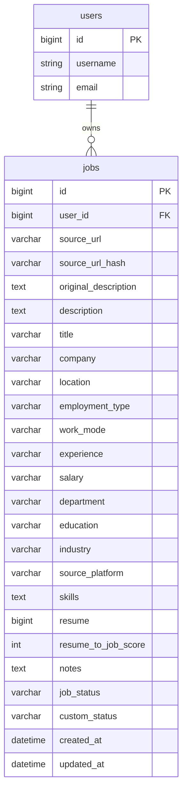

# Jobs Database

Jobs persists to MySQL through JPA. Schema updates in the example configuration use `spring.jpa.hibernate.ddl-auto=update`. There is no jobs-specific Flyway/Liquibase changelog in this project.

## Tables and relationships

`users` is owned by the auth module. Jobs only stores `user_id`.

## `JobEntity` (`jobs`)

Purpose: one saved posting for one user.

| Concern | Implementation |
|---|---|
| Identity | `Long id`, `GenerationType.IDENTITY` |
| Owner | `@ManyToOne(LAZY)` `User`, column `user_id`, `nullable = false` |
| Source URL | `sourceUrl`, length 2000, mandatory. Canonical form after normalization |
| Dedupe key | `sourceUrlHash`, length 64, mandatory. SHA-256 hex of the canonical URL |
| Original text | `originalDescription`, `TEXT`, mandatory. What the user pasted |
| Cleaned text | `description`, `TEXT`, optional |
| Core fields | `title` and `company` mandatory (`nullable = false`) |
| Optional strings | location, employmentType, workMode, experience, salary, department, education, industry, sourcePlatform |
| Skills | `skills`, `TEXT`, comma-separated string, empty string when none are set |
| Bound resume | `resume` (`Long`), stores `resumes.id`. No FK so deleting a resume cannot block job rows |
| Match score | `resumeToJobScore`, integer 0–100, default `0` |
| Notes | `notes`, `TEXT`, empty string on create. Never part of AI scoring |
| Status | `jobStatus` enum string, default `APPLIED`; `customStatus` used only for `CUSTOM` |
| Audit | `createdAt` / `updatedAt` from `BaseEntity` and `@EnableJpaAuditing` |
| Uniqueness | `@UniqueConstraint` name `uk_job_user_source_url_hash` on `(user_id, source_url_hash)` |

JPA default string length is 255 unless a column sets otherwise. That matches bean-validation max lengths on title/company (255) and the shorter optional fields.

`source_url_hash` exists because InnoDB cannot place a practical unique index on `VARCHAR(2000)`. Equality of postings is “same user + same hash”, not raw pasted URL.

Lifecycle:

- **Insert** — create path sets owner, fields, canonical URL, hash, then `save`
- **Update** — dirty fields + optional URL re-hash; `updatedAt` changes via auditing
- **Delete** — `jobRepository.delete(job)` removes the jobs row. Skills live on that row, so they are deleted with it.

There is no soft delete and no expiry column.

## `jobs.skills`

A `TEXT` column on `jobs` storing all skills as one comma-separated string, for example `Java, Spring Boot, Microservices, MySQL, AWS, Docker`. There is no `job_skills` table and no JPA relationship. The value is loaded with the job row; list queries do not need an entity graph.

HTTP and persistence use the same string. Null on create/PUT becomes `""`. On general `PATCH`, omitted `skills` **leaves** the value; an explicit empty string clears it. Bean validation caps the whole field at 15_000 characters (`JobLimits.MAX_SKILLS_LENGTH`).

`JobSkillsCollectionMigrator` copies leftover `job_skills` rows into this column on startup (joined with `", "`) and then drops `job_skills`. It only writes when `jobs.skills` is null or empty, so it is safe to run more than once until the old table is gone.

## Repository operations

| Method | Use |
|---|---|
| `findByIdAndUserId` | All get/update/delete-by-id paths |
| `findAllByUserId` | List without search |
| `searchJobsByUserId` | List with prepared search string |
| `existsByUserIdAndSourceUrlHash` | Duplicate check on create |
| `existsByUserIdAndSourceUrlHashAndIdNot` | Duplicate check on update |

Search JPQL: `LOWER(field) LIKE LOWER(CONCAT('%', :search, '%')) ESCAPE '\'` on title, company, location, industry, `sourcePlatform`. Bind parameters prevent SQL injection; escaping prevents wildcard abuse.

## Transactions

| Methods | Annotation |
|---|---|
| `getAllJobs`, `getJobById` | `@Transactional(readOnly = true)` |
| create, update, patch, delete, all field updates | `@Transactional` |

`saveJob` catches `DataIntegrityViolationException`. If the cause text contains `uk_job_user_source_url_hash` (case-insensitive), it becomes `DuplicateJobException`. Any other integrity failure is rethrown; the global handler then returns a generic `409` without SQL detail.

## Integrations that touch these tables

- **Job extraction** — `existsByUserIdAndSourceUrlHash` only (no insert through jobs service)
- **AI / chat assistant** — `findByIdAndUserId` to load text for prompts
- **Chat sessions** — separate `chat_sessions.job_id` with `ON DELETE CASCADE` in the chat-assistant entity. Deleting a job can delete that chat session at the database

Jobs does not map chat tables and does not write them.
