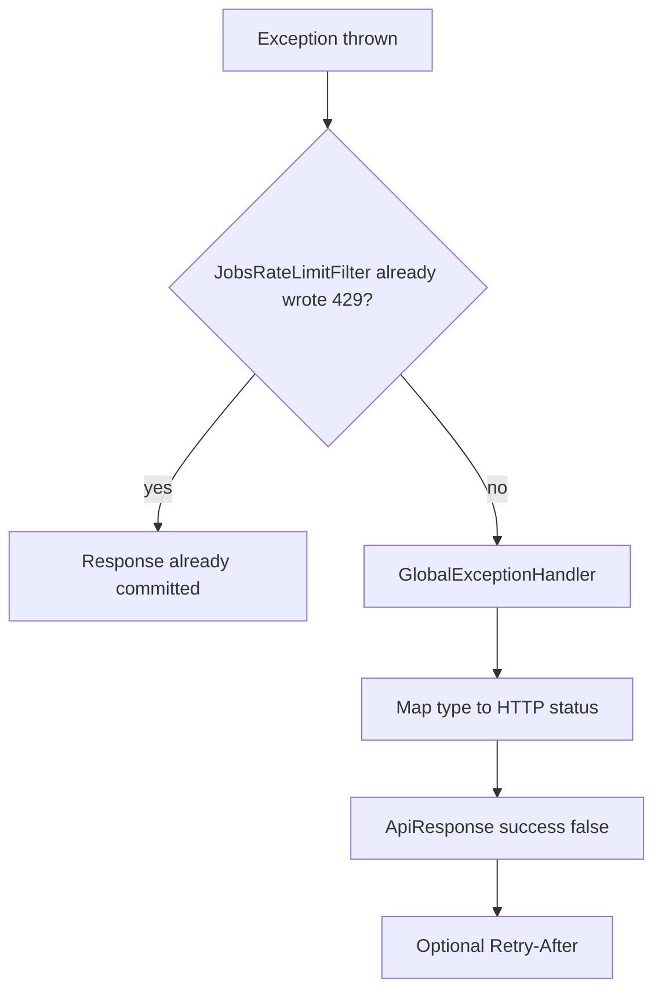

# Jobs Error Handling

Jobs uses the shared `ApiResponse` envelope and `GlobalExceptionHandler`. The jobs filter may write a `429` **without** going through the handler.

## Envelope

```json
{
  "success": false,
  "message": "Job not found with id: 42",
  "data": null,
  "timestamp": "2026-01-15T10:30:00"
}
```

`message` is intended to be shown to a client. SQL exception text is not returned for integrity failures.

## How an exception becomes a response



Controller methods do not catch jobs exceptions. Unchecked exceptions propagate to `@RestControllerAdvice`.

## Jobs-specific exceptions

| Exception | Typical throw site | HTTP | Message |
|---|---|---|---|
| `JobNotFoundException` | `findByIdAndUserId` empty | 404 | `Job not found with id: {id}` |
| `DuplicateJobException` | Pre-check or unique constraint `uk_job_user_source_url_hash` | 409 | `This post was already added to your records.` |
| `JobValidationException` | Blank PATCH mandatory fields, blank source URL in `applySourceUrl`, paging/search/sort | 400 | Exception message (for example `size must be between 1 and 50.`) |
| `jobs.ratelimit.exception.RateLimitExceededException` | `consumeOrThrow` (available on the limiter; the HTTP filter usually does not throw) | 429 | `Too many requests. Please try again later.` + `Retry-After` |

The servlet filter’s over-limit path sets status 429, `Retry-After`, and the same generic message without throwing.

## Shared exceptions used by jobs

| Exception | HTTP | When |
|---|---|---|
| `InvalidJobUrlException` | 400 | `normalizeStrict` rejects the URL (`Job URL must not be empty.` or `Job URL must be a valid absolute http or https link.`) |
| `InvalidCredentialsException` | 401 | `CurrentUserService` has no usable principal (`User is not authenticated.`) |
| `MethodArgumentNotValidException` | 400 | Bean validation on DTOs; message is `field: defaultMessage` joined by commas |
| `HttpMessageNotReadableException` | 400 | Missing or malformed JSON |
| `ConstraintViolationException` | 400 | Constraint violations (joined messages) |
| `MethodArgumentTypeMismatchException` | 400 | `Invalid request parameter.` (path variable name is `id`, not `jobId`) |
| `DataIntegrityViolationException` | 409 | Generic `The request conflicts with existing data. Please retry.` if not mapped first in `saveJob` |
| `HttpRequestMethodNotSupportedException` | 405 | `Method not allowed.` |
| `HttpMediaTypeNotSupportedException` | 415 | `Unsupported media type.` |
| `Exception` | 500 | `Something went wrong.` (logged) |

`saveJob` converts the duplicate URL constraint into `DuplicateJobException` **before** the generic integrity handler. Unrelated constraints still reach the generic `409`.

## Security-related errors

| Cause | HTTP | Message |
|---|---|---|
| Missing/invalid JWT, user disabled or email not verified | 401 | `Unauthorized.` (entry point; not the exception handler) |
| Rate limit (filter) | 429 | Generic too-many-requests + `Retry-After` |

Jobs does not emit `403` for “not your job”.

## Validation vs business vs URL

- **Input (bean):** `@NotBlank`, `@Size`, `@NotNull` → 400 with field-prefixed messages
- **Query:** `JobValidationException` for page/size/search/sort
- **URL:** `InvalidJobUrlException` for scheme/parse; `JobValidationException` if the service sees a blank URL after the DTO allowed it (general PATCH)
- **Uniqueness:** `DuplicateJobException` → 409

## Rate-limit handler vs filter

`GlobalExceptionHandler.handleJobsRateLimitExceeded` exists and is covered by `JobsExceptionMappingTest`. Production HTTP limiting for `/api/v1/jobs/**` is implemented in `JobsRateLimitFilter.writeTooManyRequests`. Both use the same client-facing message.

## Examples (from tests and handlers)

Duplicate create:

```json
{
  "success": false,
  "message": "This post was already added to your records.",
  "data": null,
  "timestamp": "2026-01-15T10:30:00"
}
```

Not found:

```json
{
  "success": false,
  "message": "Job not found with id: 42",
  "data": null,
  "timestamp": "2026-01-15T10:30:00"
}
```
