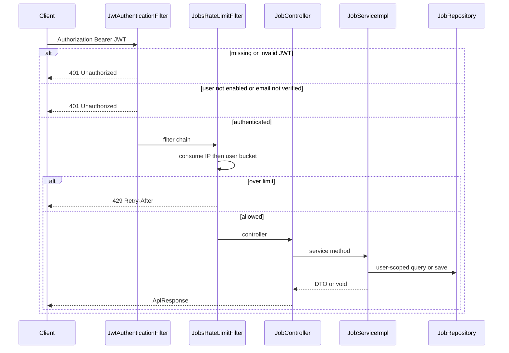
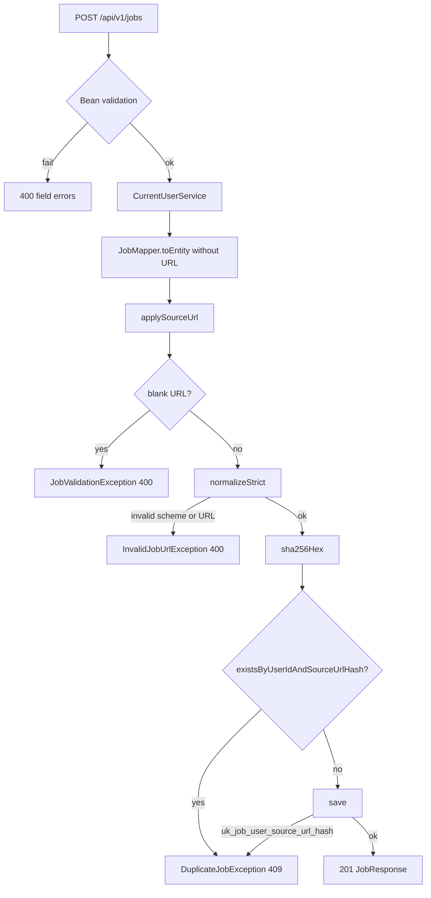
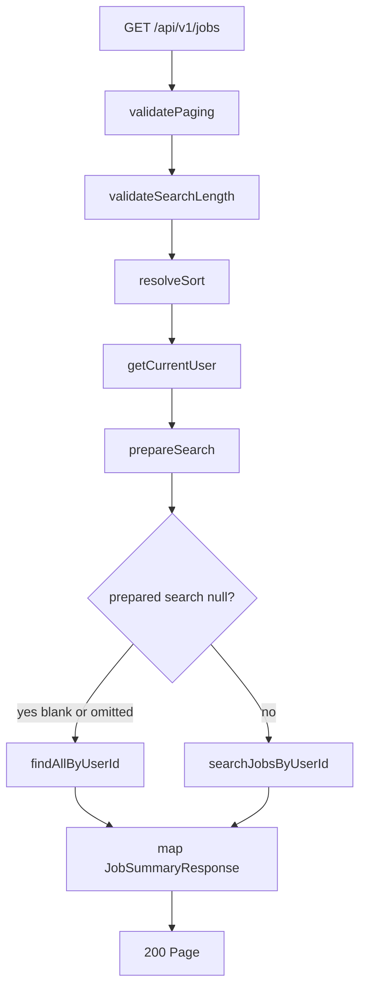
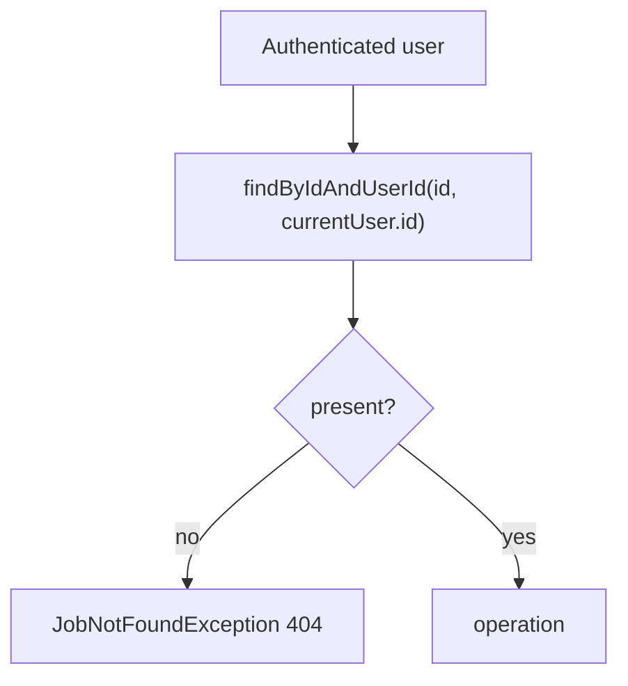
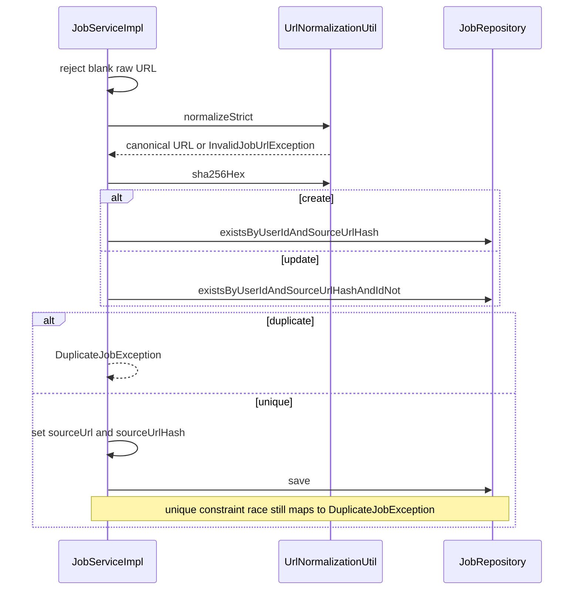
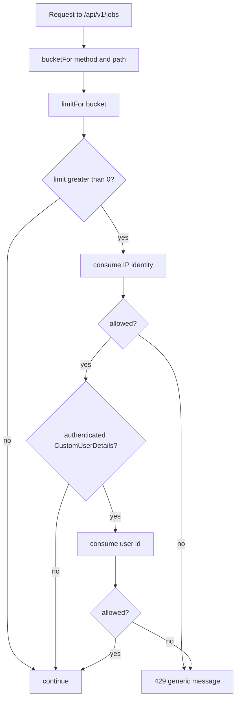

# Jobs Flows

This document covers the workflows that are non-trivial in the current implementation. Trivial field assignment after a successful ownership lookup is omitted.

## Request lifecycle

Every `/api/v1/jobs/**` call follows the same outer path before controller logic.

Bean validation runs when the controller method is invoked (`@Valid`). Failures never reach the service. Query-parameter checks for list (`page`, `size`, `search`, `sortBy`) run in the controller before `getAllJobs`.

## Create job

Normalization strips tracking query parameters, lowercases the host, drops a leading `www.`, drops a trailing slash (except `/`), and sorts remaining query keys. The stored `sourceUrl` is this canonical string; the hash is what uniqueness uses. See [SOURCE-URL-AND-DEDUPLICATION.md](JOBS-SERVICE-SPECIFIC-DOCS/SOURCE-URL-AND-DEDUPLICATION.md).

Null `skills` on create become an empty list. HTML in title (or other text fields) is stored as given; the service does not sanitize markup.

## List and search

`prepareSearch` trims, re-checks length, and escapes `\`, `%`, and `_` so LIKE wildcards cannot match everything. Search compares the escaped term against title, company, location, industry, and `sourcePlatform` (case-insensitive). Descriptions and source URL are **not** search fields.

A blank or missing `search` uses `findAllByUserId`, not the search query.

Rate-limit nuance: a collection `GET` **with any query string** (including only `page`/`size`/`sortBy`) uses the **search** bucket; a collection `GET` with no query string uses the **list** bucket. See [RATE-LIMITING.md](JOBS-SERVICE-SPECIFIC-DOCS/RATE-LIMITING.md).

## Get, update, patch, delete by id

All of these start with the same ownership lookup.

Foreign ids and unknown ids take the same branch. The repository method `findById` is not used on this path, so a caller cannot load another user’s row and then fail later with a different status.

### Full replace (`PUT`)

Mapper copies every form field (omitted optional JSON properties become `null` on the entity) and clears skills when `skills` is omitted or empty. Then `applySourceUrl` runs with `excludeJobId = job.id` so keeping the same URL is not a duplicate of itself. Changing to another job’s canonical URL for the same user is `409`.

### Partial update (`PATCH`)

1. If `title`, `company`, or `originalDescription` is present and blank → `JobValidationException`.
2. Mapper applies only non-null fields. Omitted `skills` leaves the existing list; `"skills": []` replaces with empty.
3. If `sourceUrl` is present, `applySourceUrl` runs (blank URL → validation error; invalid URL → `InvalidJobUrlException`; duplicate → `409`).

### Field routes

Each field PATCH loads the owned job, sets one property (or replaces the skills collection), and saves. Source-URL field updates use `applySourceUrl`. Empty string on optional fields is stored as the cleared value.

### Delete

`jobRepository.delete(job)` after the ownership lookup. The `job_skills` rows go away with the element collection. Chat sessions that reference the job are configured in the chat-assistant module with `ON DELETE CASCADE`; that cascade is not implemented inside the jobs package, but deleting a job can remove related chat data at the database level.

## Source URL apply (shared)

Every path that mutates `sourceUrl` uses this sequence. `excludeJobId` is `null` on create and the job’s id on update.

The uniqueness check before save is a fast-fail. Concurrent double-create is still caught by `uk_job_user_source_url_hash` in `saveJob`.

## Rate-limit flow

Unauthenticated jobs requests normally never reach this filter with a principal; security already returned `401`. If there is no user id, only the IP bucket is consumed.

Both IP and user denials use the same body: `"Too many requests. Please try again later."`

## Downstream reads (not jobs HTTP)

These are not jobs endpoints. They matter because they reuse ownership-safe repository methods:

- Job extraction calls `existsByUserIdAndSourceUrlHash` before calling the AI, and throws the same `DuplicateJobException` message if the user already saved that posting.
- AI and chat assistant load a job with `findByIdAndUserId` and map misses to `JobNotFoundException`.
