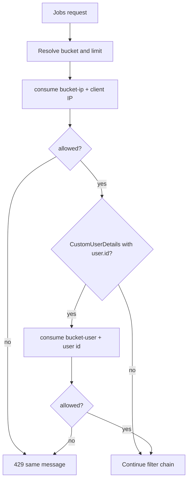

# Jobs Rate Limiting

Jobs applies its own limiter on `/api/v1/jobs` and `/api/v1/jobs/*`. It is separate from auth, AI, job-extraction, user, chat, and internal-API limiters.

## Purpose

Stop a single IP or a stolen JWT from flooding create, search, or write endpoints. Limits are coarse (per minute) and use a **generic** 429 body so clients cannot distinguish “IP exhausted” from “user exhausted”.

## Where it runs

`JobsRateLimitConfig` registers `JobsRateLimitFilter` as a servlet filter (not a Spring Security filter) with order `-80`, after `springSecurityFilterChain` (typically `-100`). JWT has already populated `SecurityContext` when the user bucket is keyed.

URL patterns: `/api/v1/jobs`, `/api/v1/jobs/*`. Other APIs (including `/api/v1/auth/login`) are ignored by this filter.

## Buckets

`JobsRateLimitFilter.bucketFor`:

| HTTP | Path | Bucket | Default limit / 60s (`app.jobs.*`) |
|---|---|---|---|
| POST | `/api/v1/jobs` | `post` | `post-per-minute` = 15 |
| PUT, PATCH, DELETE | any jobs path | `mutate` | `mutate-per-minute` = 30 |
| GET | collection `/api/v1/jobs` **without** query string | `list` | `list-per-minute` = 60 |
| GET | collection **with** any query string | `search` | `search-per-minute` = 20 |
| GET | `/api/v1/jobs/{id}` | `read` | `read-per-minute` = 60 |
| Other methods | jobs path | `other` | limit 0 → not limited |

Important: `GET /api/v1/jobs?page=0` uses **search**, not list, because a query string is present. Search is stricter than a bare list.

The window is constant **60 seconds** in the filter (`WINDOW_SECONDS`).

## IP then user

IP identity: first value in `X-Forwarded-For`, else `RemoteAddr`, else `unknown`.

User identity: `String.valueOf(user.getId())` from `CustomUserDetails` only.

Each consume uses the **same numeric limit**. A caller can be blocked by IP while another user on a different IP still has budget, and a single user rotating IPs still hits the user counter (covered by `JobsRateLimitFilterTest.post_isLimitedPerUser_acrossIps`).

The IP counter is incremented before the user counter. If the user bucket then denies, that request has already consumed one IP token.

## Redis vs memory

`JobsRateLimitServiceImpl.consume`:

1. `limit <= 0` → always allow
2. If `JobsRedisService` is present, `INCR` under namespace `rl-{bucket}` (for example `rl-post-ip`) with TTL 60s
3. If `count > limit`, deny with Redis TTL as `retryAfterSeconds` (or 60 if TTL missing)
4. On `RuntimeException`, log a warning and use in-memory sliding window
5. If Redis beans are absent, memory only

Redis counters are **fixed-window** (TTL set on first increment). Memory is **sliding-window** of hit timestamps. See [REDIS-INFRASTRUCTURE.md](../REDIS-INFRASTRUCTURE.md).

`consumeOrThrow` exists on the interface and throws `RateLimitExceededException`; the filter uses `consume` and writes the response itself.

## Client-visible result

- Status `429`
- Header `Retry-After: <seconds>`
- Body `ApiResponse` with `"Too many requests. Please try again later."`

No remaining-quota headers are implemented.

## Configuration

See [CONFIGURATION.md](../CONFIGURATION.md) for `app.jobs.*-per-minute` and Redis flags. Setting a per-minute property to `0` disables that bucket.

## Implementation map

| Type | Role |
|---|---|
| `JobsRateLimitProperties` | Numeric budgets |
| `JobsRateLimitFilter` | Path/method → bucket, IP/user consume, 429 writer |
| `JobsRateLimitService` / `Impl` | Redis or memory consume |
| `RateLimitResult` | `allowed` + `retryAfterSeconds` |
| `RateLimitExceededException` | Message + retry-after for the global handler |

## Tests

`JobsRateLimitFilterTest` and `JobsRateLimitServiceImplTest` are the specification for bucket choice, dual identity, Redis fallback, and `limit=0`.
