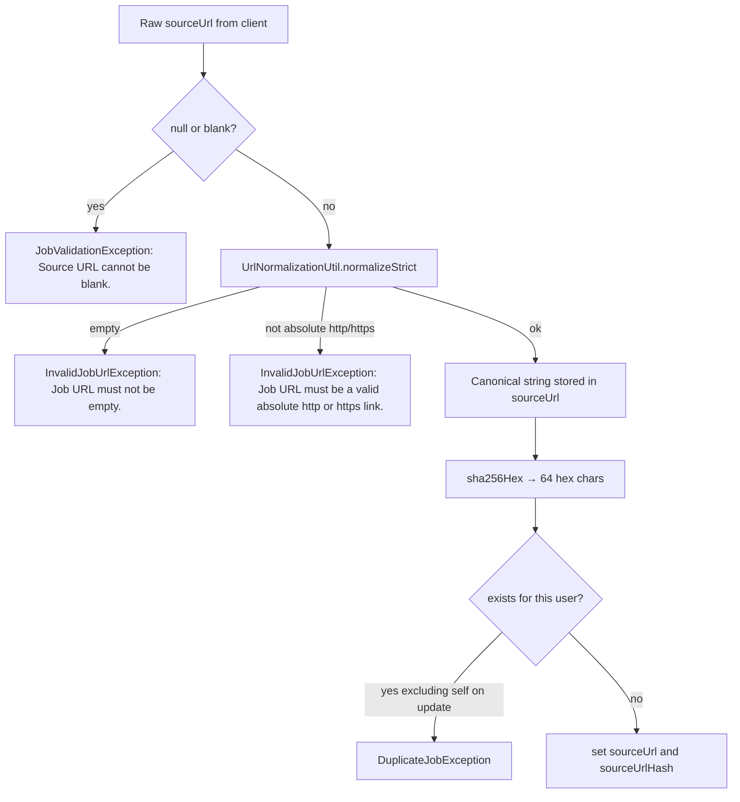

# Source URL and Deduplication

Every saved job has a mandatory **source URL**. The service treats “same posting” as “same canonical URL for this user”, not “same string the user pasted”.

`JobServiceImpl.applySourceUrl` is the only writer of `sourceUrl` and `sourceUrlHash`. `JobMapper` does not copy those fields from DTOs.

## Why canonicalization exists

The same LinkedIn or career-site posting is often copied with:

- `utm_*` and other tracking query parameters
- `www.` vs bare host
- Mixed host casing
- Trailing slash
- Query keys in different order

Without normalization, each variant would insert as a new row. With it, create/update can reject duplicates and job-extraction can skip AI work when the user already saved that posting.

## Pipeline

On **create**, existence is `existsByUserIdAndSourceUrlHash(userId, hash)`.

On **update**, existence is `existsByUserIdAndSourceUrlHashAndIdNot(userId, hash, jobId)` so re-saving the same URL is allowed.

If two requests race past the pre-check, `save` hits `uk_job_user_source_url_hash` and `saveJob` maps that constraint name to the same `DuplicateJobException` message: `"This post was already added to your records."`

A **different user** may store the same hash. Uniqueness is composite `(user_id, source_url_hash)`.

## What `normalizeStrict` does

Implemented in common `UrlNormalizationUtil` (jobs always uses the strict method, not `normalizeLenient`):

- Scheme must be `http` or `https` (case-insensitive); host required
- Scheme and host lowercased
- Leading `www.` removed from the host when the host is longer than `www.`
- Default ports 80/443 omitted
- Path `/` if empty; trailing slash removed when path length > 1
- Query: drop known tracking names (`utm_*`, `fbclid`, `gclid`, `ref`, `token`, `access_token`, and others listed in the util) and names with prefix `utm_`; remaining pairs sorted in a `TreeMap`
- Fragment is not appended in the canonical builder (URI fragment is unused in the reconstructed string)

Rejected examples covered by jobs tests: `javascript:alert(1)`, `data:text/html,hello`, `file:///etc/passwd`.

Example from `JobServiceImplTest`:  
`https://www.amazon.jobs/en/jobs/12345?utm_source=linkedin` → stored `https://amazon.jobs/en/jobs/12345`.

## Hash

`sha256Hex` is SHA-256 of the **canonical** URL bytes (UTF-8), lowercase hex, length 64. MySQL unique index uses this column because `source_url` is `VARCHAR(2000)`.

The hash is **never** returned in `JobResponse` or list summaries.

## API surfaces that run this pipeline

| API | URL handling |
|---|---|
| `POST /api/v1/jobs` | Always (`excludeJobId` null) |
| `PUT /api/v1/jobs/{id}` | Always |
| `PATCH /api/v1/jobs/{id}` | Only if `sourceUrl` is present in JSON |
| `PATCH /api/v1/jobs/{id}/source-url` | Always |

List search does **not** match on `sourceUrl`. Clients can still **sort** by `sourceUrl` (canonical stored value). Sorting by `sourceUrlHash` is forbidden.

## HTTP mapping

| Outcome | Status | Message |
|---|---|---|
| DTO blank / too long | 400 | Bean validation (`Source URL cannot be blank.` / max 2000) |
| Service blank | 400 | `Source URL cannot be blank.` |
| Invalid URL | 400 | Invalid absolute http/https message |
| Duplicate for this user | 409 | `This post was already added to your records.` |

## Related consumers

Job extraction hashes the same way and calls `existsByUserIdAndSourceUrlHash` so a user cannot extract a posting they already saved. Extraction does not insert the jobs row; save is still `POST /api/v1/jobs`.

## Implementation map

| Type | Role |
|---|---|
| `UrlNormalizationUtil` | Canonical form + SHA-256 |
| `JobServiceImpl.applySourceUrl` | Blank check, duplicate check, field assignment |
| `JobServiceImpl.saveJob` | Constraint-name fallback |
| `JobEntity.sourceUrl` / `sourceUrlHash` | Persisted columns |
| `uk_job_user_source_url_hash` | Database uniqueness |
