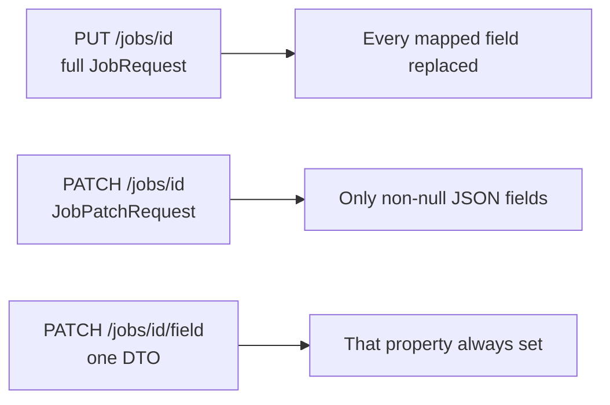

# Update Semantics (PUT, PATCH, Field Routes)

Jobs exposes three write styles after create. Mixing them incorrectly is the usual client bug: **PUT is a full form; PATCH is dirty fields; field routes always write one attribute.**

## Comparison



| | `PUT /{id}` | `PATCH /{id}` | `PATCH /{id}/…` |
|---|---|---|---|
| Body | Full `JobRequest` | Sparse `JobPatchRequest` | Single-field DTO |
| Mandatory title/company/originalDescription/sourceUrl | Required again (`@NotBlank`) | Optional by absence; illegal if sent blank | Title/company/originalDescription/sourceUrl routes require a real value |
| Skills omitted | **Clears** list | **Leaves** list | N/A except skills route |
| Skills `[]` | Clears | Clears | Clears |
| Optional field omitted | Set to `null` (full replace of every mapped scalar) | Unchanged | Not applicable (missing key is `400`) |
| Optional field `""` | Stored as empty string | Stored as empty string | Clears when the DTO allows empty string |
| Source URL | Always re-normalized and uniqueness-checked | Only if `sourceUrl` present | Source-url route always |
| Success message | Job updated successfully. | Job updated successfully. | Field-specific message |

All three require ownership (`404` if not found / not owned) and use the **mutate** rate-limit bucket.

## PUT — full replace

`JobMapper.updateEntityFromRequest` copies **every** mapped scalar from `JobRequest`, including `null` when the client omitted an optional JSON property. A PUT that sends only the mandatory fields therefore **clears** optional metadata (location, salary, description, and so on) to null.

Skills:

```
skills.clear()
if (request.skills != null) addAll
```

Omitting `skills` or sending `null` wipes skills. Tests: `updateJob_omittingSkills_clearsList`, `updateJob_explicitEmptySkills_clearsList`.

Use PUT when the client has the whole form (same shape as create). Do not use PUT to change salary alone unless you resend every mandatory field, every optional field you want to keep, and the intended skills list.

## PATCH — dirty fields

`JobMapper.updateEntityFromPatch` applies a field only when the Java property is **non-null**. JSON omitted properties stay null on the DTO and are skipped.

Before mapping, the service rejects blank (non-null) title, company, and original description so a client cannot clear them with `""`.

Skills:

- omitted → list unchanged (`patchJob_omittingSkills_leavesList`)
- `"skills": ["Go"]` → replace
- `"skills": []` → clear

`sourceUrl` in the patch body triggers `applySourceUrl`. Other optional strings can be set to `""` to clear.

There is no “JSON null means clear” special case beyond empty string / empty array; a missing key means “do not touch”.

## Field routes — one attribute

These paths exist so a UI can update one control without assembling `JobPatchRequest`.

**Cannot be cleared** (blank rejected at bean validation):

- `/title`, `/company`, `/original-description`, `/source-url`

**Cleared with empty string** (`@NotNull` still requires the key):

- `/location`, `/employment-type`, `/work-mode`, `/experience`, `/salary`, `/education`, `/department`, `/industry`, `/source-platform`, `/description`

**Skills:** body must include `skills` (`@NotNull`). Empty array clears. There is no “omit skills to leave unchanged” on this route — it is always a replace of the collection.

Sending a field route **without** the JSON property is `400`, not a no-op.

## Skills summary

| Call | Result |
|---|---|
| POST without skills | Empty list |
| PUT without skills | Empty list |
| PATCH without skills key | Unchanged |
| PATCH `"skills": []` | Empty list |
| PATCH `/skills` `"skills": []` | Empty list |
| PATCH `/skills` omitted `skills` key | 400 (`Skills list is required.`) |

## Descriptions

`originalDescription` is the pasted source of truth and cannot be blank on create, PUT, original-description route, or PATCH-if-present.

`description` is optional cleaned text. Empty string on `/description` or in a general PATCH clears it.

## Client guidance (from implemented behavior)

1. After login, create with `POST` (or save extraction output with the same DTO).
2. For a full editor save, `PUT` and always send `skills` as the intended complete list.
3. For autosave of one field, prefer the field route or a PATCH body that contains **only** that field.
4. To clear optional metadata, send `""` on the field route (or that key on PATCH). To clear skills, send `[]`.
5. Never use PUT to “patch” unless the client resubmits the whole resource, including skills.

OpenAPI tag text on `JobController` states the same contract: PUT = full form; omitting skills clears them; PATCH = dirty fields; PATCH skills `[]` clears; optional field routes accept empty string to clear; foreign ids look like 404.
