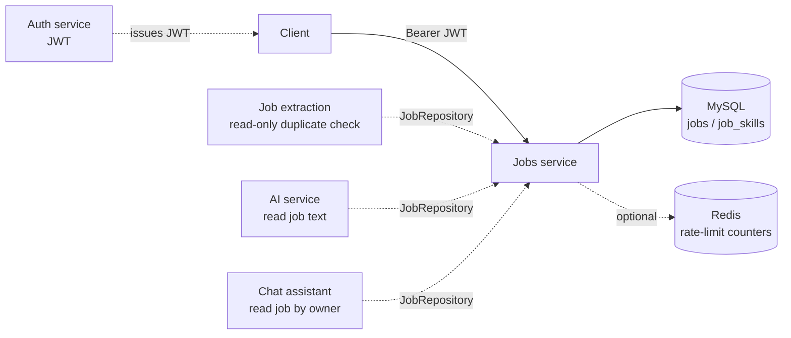

# Jobs Service

The `jobs` service is a **personal job-posting notebook** for a signed-in user. It stores job postings the user chose to save — title, company, pasted description, source URL, skills, and related metadata — and keeps that data private to that user.

It is **not** a public job board, a crawler, or an AI extractor. Extraction of a posting from a URL or pasted text belongs to the separate job-extraction service. After the user reviews extracted fields, they persist the record through this service (`POST /api/v1/jobs`).

This document is the starting point for a developer who has not seen the project. Implementation details live in the linked documents.

## Purpose

A user pastes a job posting (or saves one after extraction) so they can later list, search, edit, and delete their own records. Every job is traceable to a source URL. The same posting cannot be saved twice for the same user, even if the pasted links differ only by tracking parameters, `www.`, host casing, or a trailing slash.

## Responsibilities

The service owns:

- Creating, reading, replacing, partially updating, and deleting saved jobs for the current user
- Field-level PATCH routes so a client can update one attribute without sending a full form
- Paginated listing with optional contains-search and a whitelist of sort fields
- Strict http/https URL normalization, SHA-256 hashing, and per-user duplicate detection
- Per-IP and per-user rate limits on `/api/v1/jobs/**`
- Mapping between HTTP DTOs and the `jobs` / `job_skills` tables

The service does **not** own login, JWT issuance, email verification, AI extraction, or chat sessions. It requires a valid access JWT from the auth service. Other modules may *read* job rows (for extraction duplicate checks, AI context, or chat) but they do not replace this API for persistence.

## Major capabilities

| Capability | Behavior |
|---|---|
| Create | Normalizes the source URL, rejects duplicates for this user, stores the job and optional skills |
| List | Returns a Spring `Page` of summaries for the current user only |
| Search | Case-insensitive contains-match on title, company, location, industry, and source platform. `%` and `_` are treated as literals |
| Get by id | Full job details, including descriptions and the canonical source URL |
| Full replace (`PUT`) | Re-submits the entire form. Omitting `skills` clears the list |
| Partial update (`PATCH`) | Applies only provided fields. Blank title, company, or original description is rejected |
| Field routes | Dedicated PATCH paths for each attribute; empty string clears optional fields; `PATCH .../skills` with `[]` clears skills |
| Delete | Permanently removes the job and its skills collection |
| Duplicate detection | Same canonical URL (hash) cannot exist twice for one user; a different user may save the same posting |

## Service boundaries

Inbound HTTP is only `JobController` under `/api/v1/jobs`. Persistence is `JobEntity` / `JobRepository`. Redis, when enabled, stores rate-limit counters only — never job rows.

## Main components

| Layer | Role |
|---|---|
| `JobController` | HTTP API, paging/sort validation, `ApiResponse` envelope |
| `JobService` / `JobServiceImpl` | Ownership lookups, URL apply/dedupe, transactions |
| `JobMapper` | DTO ↔ entity. Does **not** set `sourceUrl` / `sourceUrlHash` |
| `JobRepository` | User-scoped queries, uniqueness checks, search |
| `JobEntity` + `job_skills` | Persisted model |
| `JobsRateLimitFilter` | Per-IP then per-user budgets by HTTP bucket |
| Jobs Redis module | Optional distributed counters for those budgets |

Supporting types: request DTOs (create/replace, patch, field updates), `JobLimits` / `JobQuerySupport` / `JobSortSupport`, and jobs-specific exceptions.

Shared code the service actually uses: `CurrentUserService`, `UrlNormalizationUtil`, `ApiResponse`, and `GlobalExceptionHandler`.

## Important request and business flows

1. **Create** — JWT → rate limit → bean validation → current user → map entity → normalize URL and hash → duplicate check → save → `201` with `JobResponse`.
2. **List / search** — validate page/size/search/sort → query only `user_id = current user` → map to `JobSummaryResponse` (no descriptions, no source URL).
3. **Any mutation by id** — load with `findByIdAndUserId`. Missing **or foreign** ids become `JobNotFoundException` (`404`). There is no `403` for “someone else’s job”.
4. **Source URL change** (create, PUT, PATCH `sourceUrl`, or `PATCH .../source-url`) — always goes through one method that normalizes, hashes, and checks uniqueness, excluding the job’s own id on update.

See [FLOW.md](FLOW.md) for diagrams of these paths.

## Security responsibilities

Every jobs endpoint requires an authenticated principal. The JWT filter accepts the token only when the user exists, is enabled, and has a verified email. The service then scopes every read and write to that user’s id. Rate limits apply after the security chain so a stolen JWT is counted by user id as well as by IP.

See [SECURITY.md](SECURITY.md).

## Infrastructure

- **MySQL** — `jobs` table and `job_skills` collection table. Unique constraint `uk_job_user_source_url_hash` on `(user_id, source_url_hash)`.
- **Redis** — optional (`app.jobs.redis.enabled`, default `false`). Used only for rate-limit counters. When Redis is off or unreachable, an in-memory sliding window is used on that process.

See [DATABASE.md](DATABASE.md) and [REDIS-INFRASTRUCTURE.md](REDIS-INFRASTRUCTURE.md).

## Documentation map

| Document | Contents |
|---|---|
| [ARCHITECTURE.md](ARCHITECTURE.md) | Layers, components, dependency direction |
| [FLOW.md](FLOW.md) | Create, list/search, update, delete, ownership, URL apply |
| [ENDPOINTS.md](ENDPOINTS.md) | All REST endpoints |
| [SECURITY.md](SECURITY.md) | JWT, ownership isolation, CORS, production Swagger |
| [DATABASE.md](DATABASE.md) | Entities, tables, uniqueness, transactions |
| [REDIS-INFRASTRUCTURE.md](REDIS-INFRASTRUCTURE.md) | Rate-limit keys, TTL, fallback |
| [ERROR-HANDLING.md](ERROR-HANDLING.md) | Exceptions and HTTP mapping |
| [VALIDATION.md](VALIDATION.md) | Bean, query, URL, and business rules |
| [CONFIGURATION.md](CONFIGURATION.md) | Properties that affect jobs |
| [TESTING.md](TESTING.md) | Test layout and what to extend |
| [DEPENDENCIES.md](DEPENDENCIES.md) | Internal and library dependencies |
| [JOBS-SERVICE-SPECIFIC-DOCS/RATE-LIMITING.md](JOBS-SERVICE-SPECIFIC-DOCS/RATE-LIMITING.md) | Buckets, IP+user, Redis vs memory |
| [JOBS-SERVICE-SPECIFIC-DOCS/SOURCE-URL-AND-DEDUPLICATION.md](JOBS-SERVICE-SPECIFIC-DOCS/SOURCE-URL-AND-DEDUPLICATION.md) | Canonical URL, hash, uniqueness |
| [JOBS-SERVICE-SPECIFIC-DOCS/UPDATE-SEMANTICS.md](JOBS-SERVICE-SPECIFIC-DOCS/UPDATE-SEMANTICS.md) | PUT vs PATCH vs field routes |
