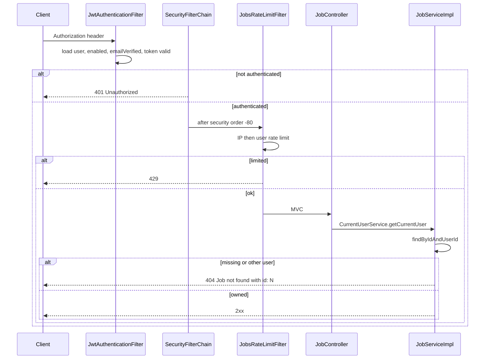

# Jobs Security

Jobs has no separate security configuration class. It sits behind the application-wide Spring Security chain from the auth module and then applies ownership checks and rate limits of its own.

## Authentication

All jobs routes require a Bearer access JWT.

```
Authorization: Bearer <access-jwt>
```

Obtain the token from `POST /api/v1/auth/login`. `JobController` declares `@SecurityRequirement(name = "Bearer Authentication")`.

`JwtAuthenticationFilter` (auth) runs before the jobs rate-limit filter. It only sets the security context when:

1. The `Authorization` header starts with `Bearer `
2. The JWT parses and yields a user id
3. That user exists
4. `user.enabled` is true
5. `user.emailVerified` is true
6. `jwtService.isTokenValid(jwt, user)` succeeds (signature, expiry, token version)

Otherwise the request continues unauthenticated. `SecurityConfig` then rejects it: `.anyRequest().authenticated()` plus `JsonAuthenticationEntryPoint` → **`401`** with `"Unauthorized."`

Garbage tokens (`Bearer not-a-jwt`) take this path; the jobs service is never called. Tests in `JobSecurityTest` lock this in for list, create, put, patch, delete, and a field route.

If a controller somehow ran without a `CustomUserDetails` principal, `CurrentUserService` would throw `InvalidCredentialsException` (`401` `"User is not authenticated."`). That is a second line of defense, not the normal missing-header path.

There is **no** jobs-specific role check. Any authenticated, enabled, email-verified user may call the API and will only see their own rows.

## How a request moves through security



## Authorization and ownership

Authorization is **row ownership**, not roles.

| Operation | Rule |
|---|---|
| List / search | `user_id = currentUser.id` in the query |
| Get / update / patch / delete | `findByIdAndUserId(id, currentUser.id)` |
| Duplicate URL | Unique on `(user_id, source_url_hash)` — another user may save the same posting |

A job id that belongs to someone else is indistinguishable from an unknown id: **`404`** `Job not found with id: {id}`. The API does not return `403` or leak whether the id exists. `JobOwnershipIsolationTest` asserts this for every mutation, including every field PATCH, and that `findById` is never used.

Sort fields are whitelisted. Values such as `user.password`, `user.email`, `sourceUrlHash`, or `salary` are rejected with `400`. That prevents sort injection into association paths.

## Rate limiting and abuse prevention

`JobsRateLimitFilter` applies per-IP **and** per-user limits (60-second window) on jobs URLs only. Limits are documented in [RATE-LIMITING.md](JOBS-SERVICE-SPECIFIC-DOCS/RATE-LIMITING.md).

The filter runs **after** JWT processing so the user bucket keys on database user id, not only source IP. Both denials use the same generic `429` message so the client cannot tell IP vs user budget.

Client IP is `X-Forwarded-For` (first hop) if present, otherwise `RemoteAddr`. If this application is not behind a trusted proxy, clients can spoof `X-Forwarded-For`; that is a deployment concern, not extra validation in jobs code.

## Request origin (CORS)

CORS is configured once in `SecurityConfig` for the whole app:

- Allowed methods include GET, POST, PUT, PATCH, DELETE, OPTIONS
- Allowed headers: `*`
- Exposed headers include `Authorization`, `Content-Type`, `Retry-After`
- Credentials allowed
- Origins come from `cors.allowed-origins` (defaults are local Vite/React hosts). A configured `*` is dropped so credentialed CORS cannot pair with a wildcard

Jobs does not define extra origin rules.

## CSRF and sessions

CSRF is disabled. Sessions are stateless (`SessionCreationPolicy.STATELESS`). Jobs APIs are Bearer-token JSON APIs.

## Credential and secret protection

Jobs does not store passwords or JWTs. It stores job text and URLs.

- `sourceUrlHash` is **not** included in `JobResponse` or `JobSummaryResponse`
- List summaries omit `sourceUrl` and both description fields
- HTML/script in title is stored as plain text; the API does not execute it. Clients must encode on display
- Unsafe URL schemes (`javascript:`, `data:`, `file:`, `vbscript:`) are rejected by `normalizeStrict`
- Redis password, if set, is a connection secret — never logged by jobs Redis code in the reviewed implementation

## Unauthorized and forbidden behavior

| Situation | Status | Message (typical) |
|---|---|---|
| No JWT / invalid JWT / user not enabled or not verified | 401 | `Unauthorized.` |
| Principal unusable in `CurrentUserService` | 401 | `User is not authenticated.` |
| Job missing or owned by another user | 404 | `Job not found with id: {id}` |
| Rate limit | 429 | `Too many requests. Please try again later.` |

Jobs does not use HTTP `403` for ownership. Email verification is enforced at JWT acceptance time (unverified users never authenticate), not as a jobs-specific forbidden response.

## Production considerations (implemented)

- Profiles `prod` and `production` do **not** `permitAll` Swagger paths. `JobProductionSecurityTest` asserts `/v3/api-docs`, `/v3/api-docs/jobs`, and Swagger UI are not publicly `200`.
- `JobsOpenApiConfig` is `@Profile("!prod & !production")`, so the Jobs OpenAPI group is not registered in production.
- Redis for jobs is off by default; enabling it is for multi-instance rate-limit consistency, not for exposing job data.
- Unique constraint `uk_job_user_source_url_hash` is a database backstop against duplicate inserts under concurrency.

## What is not implemented

- No per-job sharing or public links
- No admin override to read another user’s jobs through this API
- No content-security sanitizer for stored HTML
- No IP allowlist
- No request signing
