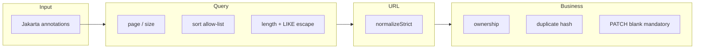

# Jobs Validation

Validation happens in four layers. A request can fail in the first layer and never reach the others.

1. **Input (bean validation)** on DTOs
2. **Query-parameter validation** for list
3. **URL / security-oriented validation** (absolute http/https, no unsafe schemes)
4. **Business validation** (ownership, duplicates, PATCH blank mandatory fields)

There are no custom `ConstraintValidator` classes in the jobs package. Limits that must stay consistent between annotations and query checks live in `JobLimits`.

## Shared numeric limits (`JobLimits`)

| Constant | Value | Used for |
|---|---|---|
| `MAX_PAGE_SIZE` | 50 | List `size` |
| `MAX_PAGE_INDEX` | 10_000 | List `page` |
| `MAX_SEARCH_LENGTH` | 100 | `search` query (trimmed) |
| `MAX_DESCRIPTION_LENGTH` | 50_000 | `originalDescription` and `description` |

## Input validation (DTOs)

`JobController` methods take `@Valid` bodies. Failures are `400` with `field: message` from `GlobalExceptionHandler`.

### `JobRequest` (POST and PUT)

| Field | Constraints |
|---|---|
| `sourceUrl` | `@NotBlank`, `@Size(max = 2000)` |
| `originalDescription` | `@NotBlank`, `@Size(max = 50_000)` |
| `title` | `@NotBlank`, `@Size(max = 255)` |
| `company` | `@NotBlank`, `@Size(max = 255)` |
| `description` | `@Size(max = 50_000)` |
| `location` | `@Size(max = 255)` |
| `employmentType` | `@Size(max = 100)` |
| `workMode` | `@Size(max = 50)` |
| `experience` / `salary` / `department` / `industry` | `@Size(max = 100)` |
| `education` | `@Size(max = 255)` |
| `sourcePlatform` | `@Size(max = 50)` |
| `skills` | each `@Size(max = 255)` |

PUT uses the same DTO, so mandatory fields must be sent again.

### `JobPatchRequest`

Same `@Size` rules, **no** `@NotBlank`. Presence means “update this field”. Blank `title`, `company`, or `originalDescription` is a **business** error in `JobServiceImpl.rejectIfBlank`.

### Field-update DTOs

| DTO | Constraint on the value |
|---|---|
| `UpdateTitleRequest` / `UpdateCompanyRequest` | `@NotBlank` + max 255 |
| `UpdateOriginalDescriptionRequest` | `@NotBlank` + max 50_000 |
| `UpdateSourceUrlRequest` | `@NotBlank` + max 2000 |
| `UpdateSkillsRequest` | `@NotNull` list; each skill max 255 |
| Location, employment type, work mode, experience, salary, education, department, industry, source platform, description | `@NotNull` so the property must be in JSON; empty string is allowed and clears |

## Query validation (list)

`JobQuerySupport` / `JobSortSupport` throw `JobValidationException` (`400`):

| Check | Rule |
|---|---|
| `page` | 0 … 10_000 |
| `size` | 1 … 50 (including rejection of `0` and `Integer.MAX_VALUE`) |
| `search` | trimmed length ≤ 100 |
| `sortBy` | Must be in the allow-list (see [ENDPOINTS.md](ENDPOINTS.md)). Null or unknown → invalid sort field message listing allowed values |
| LIKE injection | `prepareSearch` escapes `\`, `%`, `_` |

`salary`, `sourceUrlHash`, nested paths like `user.password`, and arbitrary SQL fragments are **not** valid `sortBy` values.

`prepareSearch` is also called inside `getAllJobs`, so an oversized search that skipped the controller would still fail.

## URL validation

`UrlNormalizationUtil.normalizeStrict` (common), used only through `applySourceUrl`:

- Null/blank → `InvalidJobUrlException` `"Job URL must not be empty."` from the util, **or** `JobValidationException` `"Source URL cannot be blank."` if the service checks blank first
- Not absolute http/https, unparseable URI, missing host → `"Job URL must be a valid absolute http or https link."`
- `javascript:`, `data:`, `file:`, `vbscript:` fail that same strict check

Tracking query parameters are stripped as part of canonicalization, not as a separate validator. See [SOURCE-URL-AND-DEDUPLICATION.md](JOBS-SERVICE-SPECIFIC-DOCS/SOURCE-URL-AND-DEDUPLICATION.md).

## Business validation

| Rule | Result |
|---|---|
| Job must belong to current user | `JobNotFoundException` (looks like existence check) |
| Canonical URL unique per user | `DuplicateJobException` |
| PATCH cannot set title/company/originalDescription to blank | `JobValidationException` `"{Field} cannot be blank."` |
| Source URL cannot be blank when applying | `JobValidationException` |

Uniqueness is checked in the repository **and** by the database constraint.

There is **no** implemented maximum number of jobs per user, **no** maximum skills list length (only per-item size), and **no** enum validation for employment type or work mode — those are free-text strings.

## Security-related validation

- JWT / enabled / email-verified: auth filter (not jobs DTOs)
- Sort whitelist: prevents ordering by `user.*` or `sourceUrlHash`
- Search wildcard escaping: prevents `%` matching all rows
- URL scheme: prevents storing non-http(s) links

HTML in fields is **not** stripped. Tests assert a `<script>` title is stored as text.

## Categories at a glance

