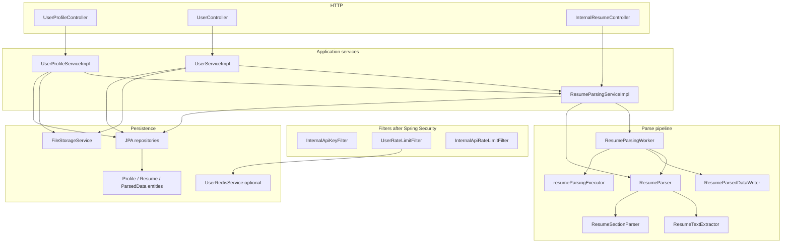
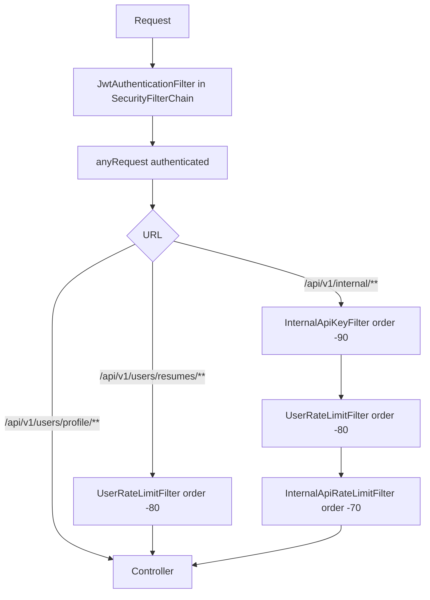

# Architecture

This document describes how the `user` service is structured inside the Copilot application. Class names appear only when they help a new developer find the right layer.

## Placement

The service is a package in a single Spring Boot app. HTTP requests reach it through the shared security filter chain, then through controllers in `com.developer.copilot.user.controller`. Persistence uses the shared JPA setup and MySQL database. File bytes go through the shared `FileStorageService`. Identity comes from the JWT principal (`CurrentUserService`).

Nothing in this package starts its own web server or database.

## Layers

Dependency direction is inward: controllers call services; services call repositories, storage, and the parse pipeline. Controllers do not talk to JPA or MinIO. Repositories do not call HTTP.

## HTTP surface

Three controllers, three URL prefixes:

| Controller | Prefix | Audience |
|---|---|---|
| `UserProfileController` | `/api/v1/users/profile` | SPA / user JWT |
| `UserController` | `/api/v1/users` (resume paths) | SPA / user JWT |
| `InternalResumeController` | `/api/v1/internal/resumes` | Other services: JWT **and** internal API key |

JSON endpoints wrap payloads in the shared `ApiResponse` envelope (`success`, `message`, `data`, `timestamp`). Resume **download** is the exception: it returns `application/pdf` bytes with a `Content-Disposition` attachment header.

OpenAPI groups (`User API` and `Internal Service API`) are registered only when the active profile is not `prod` or `production`.

## Application services

### Profile (`UserProfileServiceImpl`)

Resolves the current auth user, then the `UserProfile` row. Mutations that can race with child-count caps or resume deletion take a **pessimistic write lock** on the profile (`findByUserForUpdate`).

Create is refused if a profile already exists (`409`). GET assembles nested children from five repositories (not from JPA `OneToMany` collections on the entity). PUT writes the three scalar fields from the request body as-is, including `null`. DELETE removes children, resume files, parsed rows, then the profile.

### Resumes (`UserServiceImpl`)

Requires a profile. Upload validates the multipart file, stores it under `users/{userId}/resumes`, rejects a duplicate checksum, and marks the first active resume as high-priority. After a successful flush it asks `ResumeParsingService` to create a `PENDING` parse row and schedule background work **after commit**.

Delete hard-deletes the resume row (so the checksum unique constraint can be reused), deletes parsed data first, promotes another primary if needed, and removes the object from storage **after commit**.

### Parsed resumes (`ResumeParsingServiceImpl`)

Used in two ways:

- **HTTP:** `InternalResumeController` calls `getParsedResume(resumeId)` (`null` id = high-priority resume).
- **In-process:** other modules can inject `ResumeParsingService` directly. That is the same contract as the internal HTTP API.

`getParsedResume` is intentionally **not** transactional. A cache miss can take several seconds; the result is persisted in a separate transaction so a write failure does not fail a caller that already has the parsed payload.

## Parse pipeline

Parsing is split so `@Async` and `@Transactional` always go through Spring proxies (a self-call on the service would run inline and skip both).

| Component | Role |
|---|---|
| `ResumeParser` | Downloads PDF bytes, retries extraction up to `resume.parsing.max-attempts`, returns a completed or failed record **without** saving. |
| `ResumeTextExtractor` | PDFBox load, page cap, text strip, normalize, truncate. |
| `ResumeSectionParser` | Heuristic headings and contact fields. |
| `ResumeSectionsCodec` | Section map ↔ JSON for `sections_json`. |
| `ResumeContextTextRenderer` | Builds `contextText` for AI prompts from a **completed** record. |
| `ResumeParsingWorker` | `@Async` on `resumeParsingExecutor`: background parse-and-persist, and async persist of on-demand results. |
| `ResumeParsedDataWriter` | `REQUIRES_NEW` insert/update of the parsed row. |

The executor is a `ThreadPoolTaskExecutor`: core 2, max 4, queue 50, `AbortPolicy`. If the queue is full, background work stays `PENDING`; an on-demand read fails with a busy/timeout parse exception (`422`).

## Persistence and mapping

Entities extend the auth `BaseEntity` (`createdAt` / `updatedAt` via JPA auditing). There is **no** bidirectional `OneToMany` from `UserProfile` to children; each child table has a `user_profile_id` foreign key and its own repository.

Mappers (`UserProfileMapper`, `ResumeMapper`, `ResumeParsedDataMapper`) are plain Spring components. Profile responses copy `fullName` and `email` from the related `User`.

## Cross-cutting components

| Area | What the user service uses |
|---|---|
| Current user | `CurrentUserService` reads `CustomUserDetails` from the security context. Missing/invalid principal → `401` with `"User is not authenticated."` |
| Storage | `FileStorageService` (MinIO client). Upload folder is `users/{userId}/resumes`. When a JWT user is on the thread, keys outside that prefix are rejected. |
| Redis | `UserRedisService` exists only when `app.user.redis.enabled=true`. Used solely as rate-limit counters. |
| Rate limiting | `UserRateLimitFilter` on resume upload/delete and internal parse GETs. Internal paths also hit `InternalApiRateLimitFilter` (common module). |
| Errors | Service exceptions are mapped in `GlobalExceptionHandler` (common). Filters that reject a request write `ApiResponse` themselves and never reach the controller. |
| Metrics | `UserMetrics` logs counters (`uploadSuccess`, `parseFailed`, `minioDeleteFailure`, on-demand latency). Not Actuator. |
| After-commit | `AfterCommitActions` runs MinIO deletes (and parse scheduling uses transaction synchronization) so object-store side effects follow a successful DB commit. |

## Filter order on the way in

Spring Security's chain (order `-100`) authenticates the JWT. Extra servlet filters are **path-scoped**; they do not run on every URL.

On resume URLs, only `POST` collection (upload) and `DELETE` item consume the user budget. List, download, and `PATCH` high-priority match the filter pattern but use bucket `other` (limit `0`). Profile routes are not registered on the user rate-limit filter at all.

## Configuration beans owned by this package

- `ResumeProperties` / `UserProfileProperties` — registered from `JpaConfig`.
- `ResumeMultipartConfig` — servlet multipart max file/request size follows `resume.max-file-size-mb` (plus 512 KB request headroom) so Spring Boot's 1 MB default cannot reject a valid PDF first.
- `ResumeParsingAsyncConfig` — parse executor.
- `UserRedisConfig` — Redis beans only when enabled.
- `UserRateLimitConfig` — filter registration.
- `UserOpenApiConfig` / `InternalOpenApiConfig` — Swagger groups, non-production only.

## Boundaries with other packages

The user service **depends on**:

- `auth` for `User`, JWT filter behavior, and `CustomUserDetails`.
- `common` for storage, current user, internal API key, common internal rate limits, `ApiResponse`, and `GlobalExceptionHandler`.

Other services **depend on** `ResumeParsingService` (in-process) or the internal HTTP API. They do not write `user_profiles` or `resumes` themselves.

This package does not implement CORS, JWT issuance, or the MinIO client factory; those stay in `auth` and `common`.
