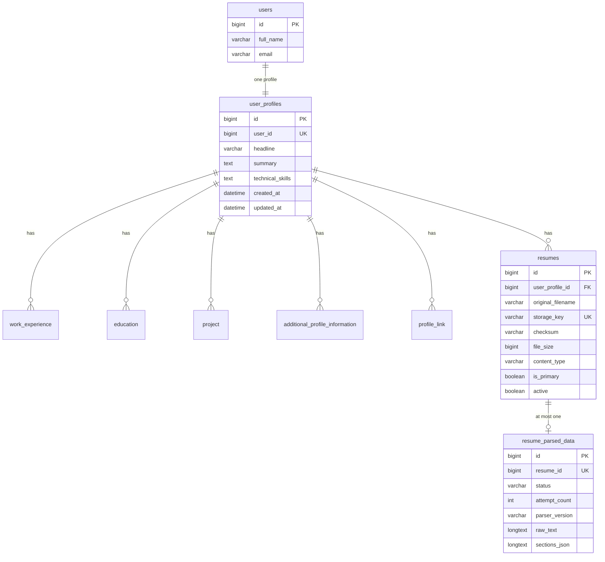

# Database

The `user` service stores career data and resume metadata in **MySQL** through Spring Data JPA. PDF bytes are **not** in the database; they live in object storage and are referenced by `resumes.storage_key`.

The auth `users` table is owned by the `auth` package. This service only holds a foreign key to it.

## Entity-relationship overview

Child tables (`work_experience`, `education`, `project`, `additional_profile_information`, `profile_link`) each have `id`, `user_profile_id` (required FK), their payload columns, and auditing timestamps. They are **not** mapped as JPA collections on `UserProfile`; services query them through dedicated repositories.

All user-owned entities extend `BaseEntity` (`created_at` not updatable, `updated_at` via JPA auditing).

## `user_profiles`

**Purpose:** One career folder per auth user.

| Column | Notes |
|---|---|
| `id` | Identity PK |
| `user_id` | Required, **unique** — enforces one profile per user |
| `headline` | max 300 |
| `summary` | TEXT |
| `technical_skills` | TEXT |

**Lifecycle:** Created by `POST /profile`. Updated in place by PUT (nulls allowed). Deleted by `DELETE /profile`, which first deletes children and resumes in Java (not JPA cascade on the entity).

**Locking:** `findByUserForUpdate` uses `PESSIMISTIC_WRITE` for operations that must not race (resume upload/delete/primary, profile update/delete, adding children, deleting work experience).

## Child tables

Each child is a simple many-to-one to `user_profiles`. There is no uniqueness on titles or URLs. Caps are **application-level** (`countByUserProfile` vs `user.profile.max-child-items`), not database CHECK constraints.

| Entity | Table | Required payload |
|---|---|---|
| `WorkExperience` | `work_experience` | `company_name`, `job_title`, `start_year` |
| `Education` | `education` | `institution_name`, `field`, `start_year` |
| `Project` | `project` | `project_title` |
| `AdditionalProfileInformation` | `additional_profile_information` | `type` |
| `ProfileLink` | `profile_link` | `url` |

`end_year` on experience and education is nullable (ongoing roles/studies). Year range and URL scheme are validated in the DTO layer, not as DB constraints.

**Lifecycle:** Insert on POST, update all mapped fields on PUT, delete row on DELETE. Parent profile delete bulk-deletes remaining children.

Lookups always use `findByIdAndUserProfile` so ids are not globally addressable.

## `resumes`

**Purpose:** Metadata for one stored PDF owned by a profile.

| Column / field | Notes |
|---|---|
| `original_filename` | Sanitized allowlist at upload; max 255 |
| `storage_key` | Unique object key, typically `users/{userId}/resumes/{uuid}.pdf` |
| `checksum` | SHA-256 hex, length 64 |
| `file_size` | Bytes |
| `content_type` | Stored as `application/pdf` from storage |
| `is_primary` / `highPriority` | Boolean, default false. Java field name `highPriority`, column `is_primary` |
| `active` | Default true. **User delete hard-deletes the row.** The flag remains for queries that filter `active = true` |

**Uniqueness:**

- `uk_resume_profile_checksum` on `(user_profile_id, checksum)` — same PDF cannot be stored twice for one profile while the row exists.
- `storage_key` unique globally.

Because the checksum unique key does **not** include `active`, a soft-delete would still block re-upload. That is why delete is a hard delete.

**Lifecycle:**

- Insert on successful upload. First active resume for the profile is primary.
- List/download/delete/primary only see `active = true`.
- Delete: remove `resume_parsed_data` first (FK), then the resume row, then the object after commit.
- Profile delete: all resumes for the profile (including any inactive, if present) are loaded with `findByUserProfile` and removed.

Hibernate `ddl-auto` in the example config is `update`; production schema management is outside this package.

## `resume_parsed_data`

**Purpose:** Cached extraction for one resume so the PDF is not parsed on every internal read.

| Column | Notes |
|---|---|
| `resume_id` | Unique — at most one parsed row per resume |
| `status` | Enum string: `PENDING`, `COMPLETED`, `FAILED` |
| `attempt_count` | Attempts consumed; max from `resume.parsing.max-attempts` |
| `last_error` | max 1000, set on failure |
| `parser_version` | Stamped from config; mismatch triggers re-parse on read |
| `parsed_at` | Set on success or terminal failure |
| `page_count`, `character_count`, `truncated` | Extraction stats |
| `raw_text`, `sections_json` | LONGTEXT |
| Contact fields | `candidate_name`, `email`, `phone`, `location`, `linkedin_url`, `github_url` |

**Lifecycle:**

- `PENDING` inserted during upload (`initializeAndScheduleParsing`) if none exists.
- Background worker or on-demand parse updates the same row to `COMPLETED` or `FAILED`.
- `FAILED` is terminal for that `parser_version` (no further retry until version changes).
- Deleted with the resume (explicit `deleteByResume` / `deleteByResumeIn` before resume delete).

Persistence of parse results uses `Propagation.REQUIRES_NEW` so it does not share the upload or HTTP-read transaction.

## Important queries

| Need | How it is done |
|---|---|
| Current profile | `findByUser` / `existsByUser` |
| Locked profile | `findByUserForUpdate` |
| Active resumes | `findByUserProfileAndActiveTrue` |
| Duplicate PDF | `findByChecksumAndUserProfileAndActiveTrue` |
| High-priority resume | `findByHighPriorityTrueAndUserProfileAndActiveTrue` |
| Promote after delete | `findByUserProfileAndActiveTrueOrderByCreatedAtDesc`, take first |
| Clear primary | Bulk `UPDATE Resume SET highPriority = false WHERE profile AND active` |
| Child count cap | `countByUserProfile` |

## Transactions

- Profile and resume **writes** are `@Transactional` on the service methods.
- Resume list/download are `readOnly`.
- `getParsedResume` is **not** transactional (long PDFBox work).
- `ResumeParsedDataWriter.persist` is `REQUIRES_NEW`.
- MinIO deletes after resume or profile delete are registered with `AfterCommitActions` so a rolled-back DB transaction does not delete objects, and a later MinIO failure does not roll back an already-committed delete.

Upload compensates **inside** the transaction: if `saveAndFlush` or parse init throws, the newly uploaded object is deleted immediately (not after commit) so the bucket does not keep an unreferenced file.

`DataIntegrityViolationException` on resume insert (checksum race) is caught in `UserServiceImpl` and converted to `409 Duplicate resume`. Uncaught integrity violations elsewhere become `409` `"The request conflicts with existing data. Please retry."` from `GlobalExceptionHandler`.
