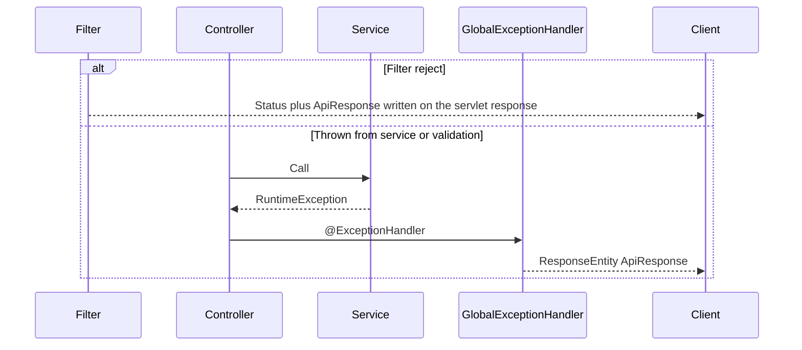

# Error handling

User-service failures become HTTP responses in one of three ways:

1. **Filters** write `ApiResponse` JSON and stop the chain (auth entry point, internal key, rate limits).
2. **Controllers / services** throw exceptions that `GlobalExceptionHandler` maps (`com.developer.copilot.common.exception`).
3. **Unhandled** `Exception` → `500` `"Something went wrong."` (logged at ERROR).

The user package has no `@RestControllerAdvice` of its own.

## Envelope

Success and error JSON share `ApiResponse`:

| Field | Error value |
|---|---|
| `success` | `false` |
| `message` | Client-safe string |
| `data` | `null` |
| `timestamp` | Server `LocalDateTime` (no offset) |

Resume **download** is binary on success. On failure it still uses this JSON envelope (for example `404` resume or file not found).

## How an exception becomes a response



Rate-limit **filters** do not throw `RateLimitExceededException`; they write `429` themselves. The handler mapping for `com.developer.copilot.user.ratelimit.exception.RateLimitExceededException` exists if something throws that type (same message and `Retry-After` behavior).

## User-service exceptions

| Exception | HTTP | Typical message |
|---|---|---|
| `UserProfileNotFoundException` | 404 | `User profile not found.` |
| `DuplicateUserProfileException` | 409 | `A profile already exists for this user.` |
| `WorkExperienceNotFoundException` | 404 | `Work experience not found.` |
| `EducationNotFoundException` | 404 | `Education record not found.` |
| `ProjectNotFoundException` | 404 | `Project not found.` |
| `AdditionalProfileInformationNotFoundException` | 404 | `Additional profile information not found.` |
| `ProfileLinkNotFoundException` | 404 | `Profile link not found.` |
| `ProfileItemLimitExceededException` | 400 | `Maximum of {n} {name} records allowed.` |
| `ResumeNotFoundException` | 404 | `Resume not found.` |
| `DuplicateResumeException` | 409 | `Duplicate resume detected.` |
| `ResumeLimitExceededException` | 400 | `Maximum resume limit reached : {n}` |
| `InvalidResumeException` | 400 | Empty / not PDF / oversize / filename too long (message from caller) |
| `ResumeParsingException` | 422 | Pending, failed `lastError`, timeout, busy, protected PDF, no text, etc. |

Foreign ids use the same not-found exceptions as missing ids (no separate forbidden type).

## Shared exceptions used by this service

| Exception | HTTP | When |
|---|---|---|
| `InvalidCredentialsException` | 401 | `CurrentUserService` with no `CustomUserDetails` — `"User is not authenticated."` |
| `InvalidFileException` | 400 | Storage-layer PDF/path checks — message from storage |
| `StorageObjectNotFoundException` | 404 | `"File not found."` (handler overrides the exception message) |
| `StorageException` | 500 | `"A file storage error occurred. Please try again later."` (ERROR log with cause) |
| `DataIntegrityViolationException` | 409 | `"The request conflicts with existing data. Please retry."` unless already mapped in `UserServiceImpl` to duplicate resume |
| `MaxUploadSizeExceededException` | 400 | `"Maximum file size is {n} MB."` using `ResumeProperties` (fallback 5 if the bean is absent) |
| `MultipartException` | 400 | `"Invalid multipart request."` (unless it is max-size) |

## Validation and HTTP-protocol errors

These apply to user JSON endpoints like any other module:

| Cause | HTTP | Message |
|---|---|---|
| `@Valid` field errors | 400 | `field: defaultMessage` joined with `", "` |
| `ConstraintViolationException` | 400 | Violation messages joined |
| Unreadable / missing JSON | 400 | `Request body is missing or malformed JSON.` |
| Wrong media type | 415 | `Unsupported media type.` |
| Wrong HTTP method | 405 | `Method not allowed.` |
| Missing request parameter | 400 | `Required request parameter is missing.` |
| Type mismatch on path/query | 400 | `Invalid request parameter.` (unless the parameter name is `jobId`) |

`IllegalArgumentException` is **not** a user-service API; only a small allowlist of prefixes maps to 400. Anything else is 500 `"Something went wrong."`

## Security and rate-limit responses (filters)

| Situation | HTTP | Message | Extra |
|---|---|---|---|
| No/invalid JWT, unverified, disabled | 401 | `Unauthorized.` | Security entry point |
| Internal key missing/wrong/fail-closed | 401 | `Invalid or missing internal service key.` | Key filter |
| User upload/delete/parse budget | 429 | `Too many requests. Please try again later.` | `Retry-After` |
| Common internal hallway | 429 | Same | `Retry-After` |

Handler-based user `RateLimitExceededException` also sets `Retry-After` from `retryAfterSeconds`.

## Parse errors (`422`)

`ResumeParsingException` is used both as a **client retry signal** (`PENDING`, timeout, busy) and as a **terminal extract failure** (password-protected, image-only, too many pages, no extractable text). The status is always `422 Unprocessable Entity`. The message is the exception text, or `lastError` from a `FAILED` row (truncated to 1000 characters when stored).

On-demand parse persists a `FAILED` record (best effort) before throwing.

## Infrastructure failures

| Failure | Behavior |
|---|---|
| MinIO upload/download/exists error | `StorageException` → 500 generic storage message |
| MinIO missing object on download | 404 `"File not found."` |
| MinIO delete after successful DB commit | Caught in `AfterCommitActions`; request already `200`; `UserMetrics.recordMinioDeleteFailure` |
| Parse executor rejection | Background: stay `PENDING`. On-demand: `422` `"Resume parsing is busy. Please retry shortly."` |
| On-demand timeout | `422` `"Resume parsing timed out."` |
| Redis rate-limit error | Fallback to memory; not an HTTP error by itself |

## Example mappings

Duplicate resume:

```json
{
  "success": false,
  "message": "Duplicate resume detected.",
  "data": null,
  "timestamp": "2026-09-07T12:00:00"
}
```

Parse still running:

```json
{
  "success": false,
  "message": "Resume parsing is still in progress. Please retry shortly.",
  "data": null,
  "timestamp": "2026-09-07T12:00:00"
}
```

Headline too long (Bean Validation):

```json
{
  "success": false,
  "message": "headline: Headline must not exceed 300 characters.",
  "data": null,
  "timestamp": "2026-09-07T12:00:00"
}
```

(Actual field-error formatting is `field + ": " + defaultMessage` from `MethodArgumentNotValidException`.)
