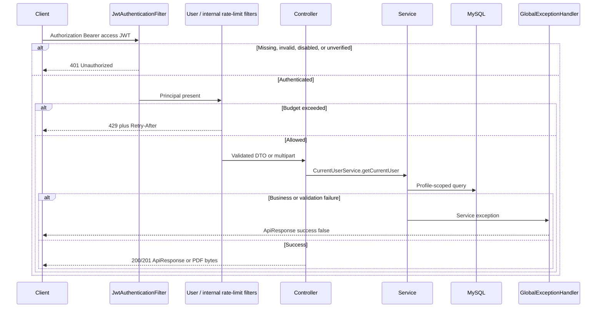
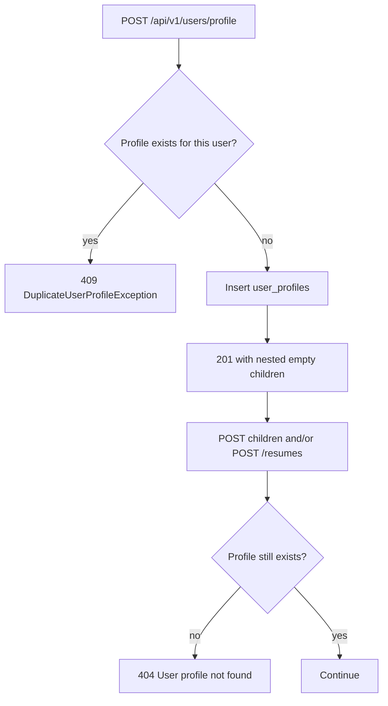
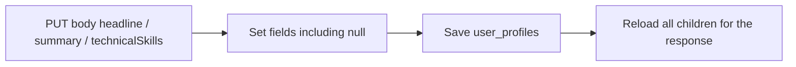
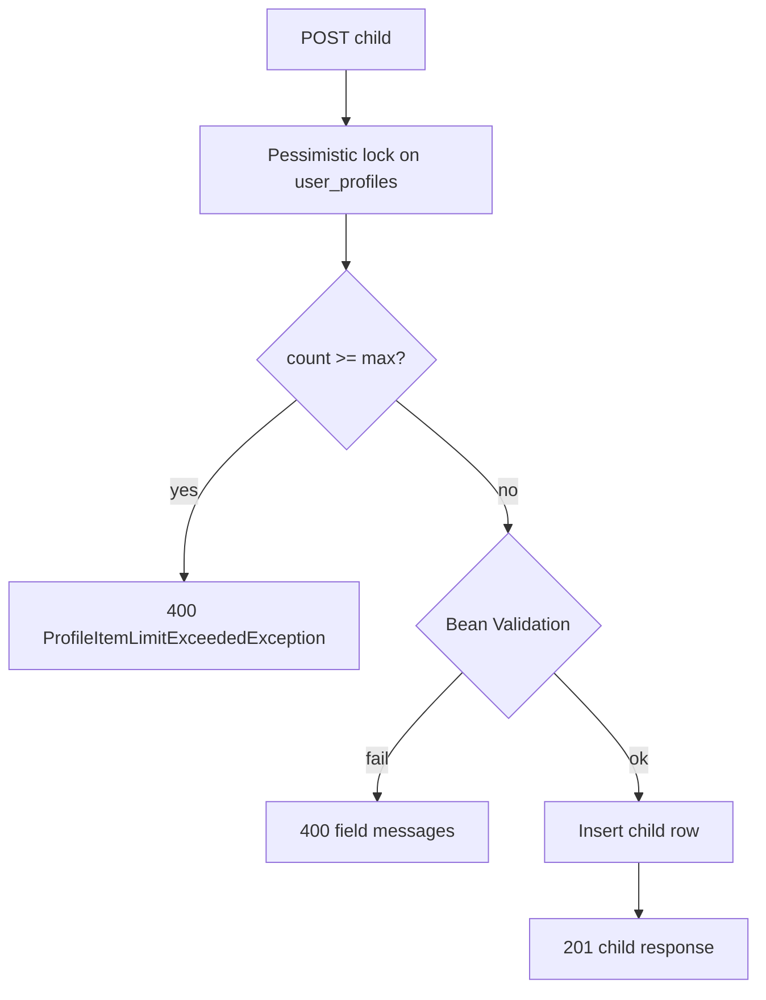
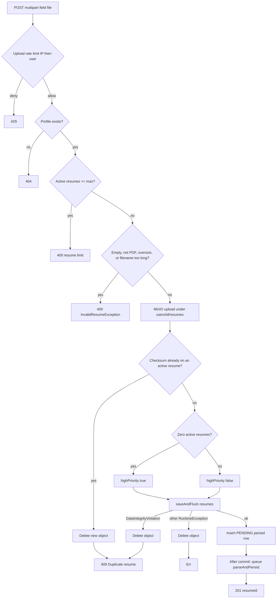
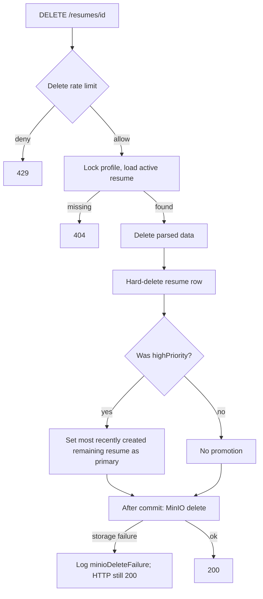
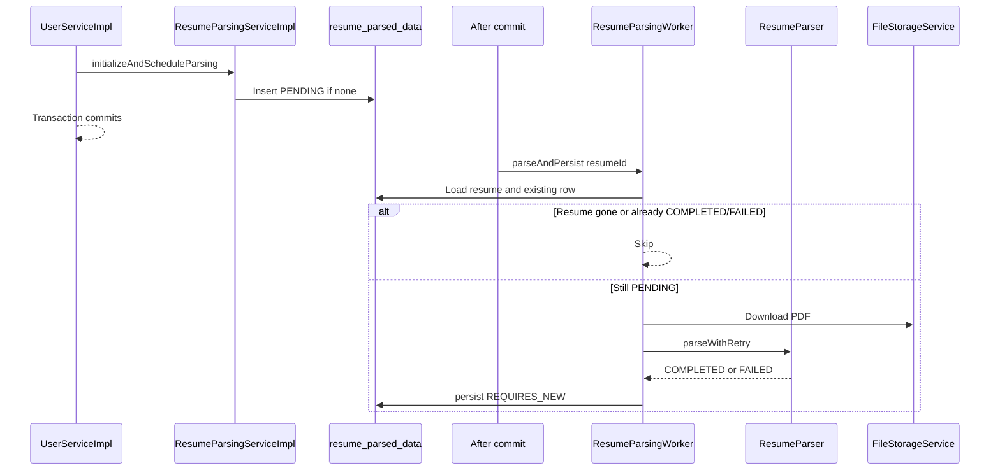
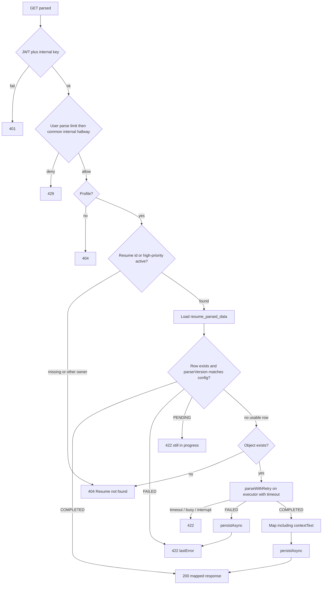

# Flows

This document covers the workflows that are non-trivial in the current `user` service. Trivial GET-by-id after a profile lookup is omitted. Every diagram matches the implementation.

Related deep dives: [RESUME-PARSING.md](USER-SERVICE-SPECIFIC-DOCS/RESUME-PARSING.md), [RESUME-STORAGE-AND-LIFECYCLE.md](USER-SERVICE-SPECIFIC-DOCS/RESUME-STORAGE-AND-LIFECYCLE.md), [PROFILE-AND-CHILD-COLLECTIONS.md](USER-SERVICE-SPECIFIC-DOCS/PROFILE-AND-CHILD-COLLECTIONS.md), [RATE-LIMITING.md](USER-SERVICE-SPECIFIC-DOCS/RATE-LIMITING.md).

## 1. Typical authenticated request

All `/api/v1/users/**` and `/api/v1/internal/resumes/**` routes require authentication. The JWT filter only populates the security context when the token is valid **and** the user row is enabled and email-verified. Otherwise the chain continues unauthenticated and Spring Security returns `401` with `"Unauthorized."`

Internal parse requests also pass `InternalApiKeyFilter` (after JWT, before rate limits). A missing or wrong key is `401` with `"Invalid or missing internal service key."` and is **not** counted toward rate limits.

## 2. Create profile, then use the rest of the API

Resume upload and every child collection require an existing profile. Creating a second profile is `409`.

`fullName` and `email` in the response come from the auth `User`, not from the request body. All three profile fields are optional.

## 3. Replace profile scalars (PUT)

PUT is a full replace of `headline`, `summary`, and `technicalSkills`. Jackson binds missing JSON keys to `null`, and the service writes those values onto the entity. Child collections are **not** in this body and are unchanged.

There is no PATCH for these three fields.

## 4. Add a child row with a cap

Each collection (experiences, educations, projects, additional-info, links) has its own table and a max of `user.profile.max-child-items` (default 20). Add operations lock the profile row so two concurrent POSTs cannot both pass the count check.

Updates and deletes load the child with `findByIdAndUserProfile`. A row that exists but belongs to another user is `404` with the collection's not-found message.

## 5. Resume upload

Upload is the most involved public write. It requires a profile, holds a write lock, and never leaves an orphan object if the database insert fails.

List and upload responses do not include parse status. The client learns parse state only through the internal API (or in-process `ResumeParsingService`).

## 6. Delete resume and promote primary

Delete is a hard delete. The unique checksum constraint is on `(user_profile_id, checksum)` without an `active` flag, so a soft-delete would block re-upload of the same PDF.

If the deleted resume was the last one, nothing is promoted.

## 7. Set high-priority resume

`PATCH /api/v1/users/resumes/{resumeId}/high-priority` has an empty body. There is no query flag to unset primary.

The service clears `highPriority` on every active resume for the profile, then sets the selected row to `true`. It is not rate-limited.

## 8. Background parse after upload

If the executor queue is full (`AbortPolicy`), the worker is not submitted and the row stays `PENDING`. An internal GET then either waits (`422` still in progress) or, if there is no matching-version row, may parse on demand.

## 9. Internal parsed-resume read

Callers send the **user's** JWT (ownership) and the internal service key (calling service). `resumeId == null` means the high-priority active resume.

On-demand persistence is best-effort: the HTTP response is built first; a full persist queue logs a warning and does not fail the request.

A stored row whose `parserVersion` does not match `resume.parsing.parser-version` is treated as unusable and is re-parsed.

## 10. Delete profile

DELETE profile is a cascade owned by this service, not by JPA `cascade = ALL` on the profile entity.

Order: load all resumes → delete their parsed rows → collect storage keys → delete resume rows → delete every child collection → delete the profile → after commit, delete each stored PDF. Auth `users` is untouched.

Storage delete failures are logged (`minioDeleteFailure`); the API still returns `200` after a successful database commit.
