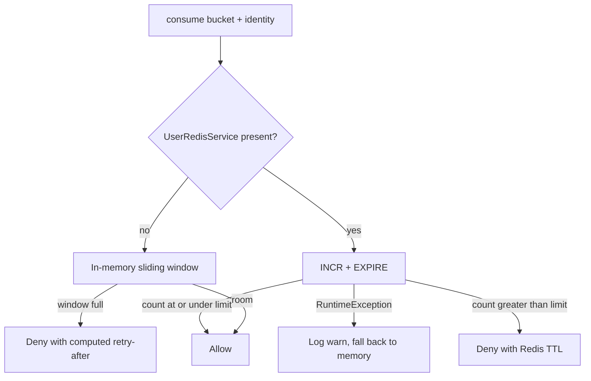

# Redis and related infrastructure

The `user` service uses Redis **only as optional rate-limit counters**. It does not cache profiles, resumes, or parsed text in Redis. Parsed resume data lives in MySQL (`resume_parsed_data`). PDF bytes live in MinIO.

When Redis is disabled or unreachable, the same limits still run in **process memory** so a single instance and the test suite remain protected.

## Why Redis exists here

`POST /api/v1/users/resumes`, `DELETE /api/v1/users/resumes/{id}`, and internal parsed-resume GETs are expensive (storage, PDFBox). The user rate-limit filter increments a counter per IP and per authenticated user id in a 60-second window.

Without Redis, each application instance has its own `ConcurrentHashMap` windows. That is enough for local development. Several ECS tasks would each allow a full budget, so production multi-instance deployments should set `app.user.redis.enabled=true`.

Internal parse URLs also pass the **common** hallway limiter, which has its own optional Redis (`app.common.redis`). That is a different connection and key prefix.

## Beans and when they are created

`UserRedisConfig` always registers `UserRedisProperties`. The connection factory, `StringRedisTemplate`, `UserRedisRepository`, `UserRedisKeyBuilder`, and `UserRedisService` are created **only** when `app.user.redis.enabled=true`.

Boot's Data Redis auto-configuration is not used as a required localhost:6379 dependency for this service. If the flag is false, no user Redis client is built.

`UserRateLimitServiceImpl` receives `UserRedisService` through `ObjectProvider.getIfAvailable()`. If the bean is absent, every `consume` call uses memory.

## What is stored

| Item | Stored? |
|---|---|
| Rate-limit increment keys | Yes, when enabled |
| Profile / resume / parse payloads | No |
| Sessions | No (JWT is stateless) |

Each Redis value is an integer counter. TTL is the rate-limit window (60 seconds). The first increment of a key also `EXPIRE`s it.

## Key structure

`UserRedisKeyBuilder` builds:

```text
{prefix}:{namespace}:{identity}
```

- `prefix` — `app.user.redis.key-prefix`, default `user`.
- `namespace` — `rl-` plus the filter bucket, e.g. `rl-upload-ip`, `rl-upload-user`, `rl-delete-ip`, `rl-parse-user`.
- `identity` — client IP or numeric user id.

Sanitizing: trim, lowercase, replace `:` with `_` so IPv6 cannot collide with the delimiter. Blank identity becomes `unknown`.

Examples:

```text
user:rl-upload-ip:203.0.113.10
user:rl-upload-user:42
user:rl-parse-user:42
```

## Increment and TTL

`UserRedisRepository.increment`:

1. `INCR key`
2. If the new value is `1` and TTL is positive, `EXPIRE key` for that duration.

`ttlSeconds` reads remaining TTL for `Retry-After` when the counter exceeds the limit. Negative/missing TTL is treated as `0` and the filter then uses the full window as retry-after.

This is a **fixed window** in Redis (counter + expire), not a sliding window. The in-memory fallback **is** a sliding window of timestamps.

## Failure behavior



A Redis outage does **not** fail the HTTP request open. It degrades to per-instance memory limits and logs `"User Redis rate-limit failed; using in-memory fallback"`.

If the parse persist/work queue is full, that is the **executor**, not Redis. See [RESUME-PARSING.md](USER-SERVICE-SPECIFIC-DOCS/RESUME-PARSING.md).

## Configuration (`app.user.redis`)

| Property | Default | Purpose |
|---|---|---|
| `enabled` | `false` | Build Redis beans and use them for user rate limits |
| `host` | `localhost` | Standalone Redis |
| `port` | `6379` | |
| `password` | unset | Set only if the server requires AUTH |
| `database` | `0` | Logical DB index |
| `timeout-ms` | `2000` | Lettuce command timeout |
| `key-prefix` | `user` | Isolates keys from auth/jobs Redis on a shared instance |

These properties are defined on `UserRedisProperties`. They are **not** listed in `application.properties.example` today; defaults apply until you add them.

Lettuce `validateConnection` is `false` on the factory. Command timeout is `timeout-ms`.

## Common Redis (internal hallway)

Internal resume GETs also consume counters via `CommonRateLimitService` / `app.common.redis` (prefix default `common`, enabled default `false`). Same pattern: optional Redis, memory fallback, `Retry-After`.

That infrastructure is owned by `com.developer.copilot.common`. The user service does not configure it, but internal parse traffic is subject to it. See [RATE-LIMITING.md](USER-SERVICE-SPECIFIC-DOCS/RATE-LIMITING.md).

## Other infrastructure (not Redis)

| System | Role |
|---|---|
| MySQL | Source of truth for profiles, resumes, parsed records |
| MinIO / S3-compatible | PDF objects |
| `resumeParsingExecutor` | Bounded async pool for PDFBox |

Do not confuse user Redis with `app.auth.redis` or other module prefixes. They are separate connection factories and key spaces.
