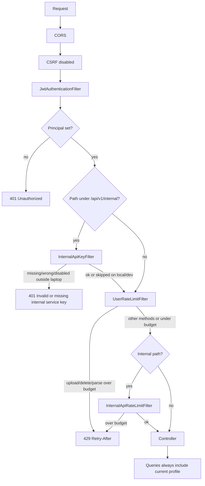

# Security

This document describes the security behavior that actually applies to the `user` service. Protections implemented only in other services are mentioned only where a `user` request depends on them.

## What a request must prove

Every `user` endpoint is behind Spring Security's `anyRequest().authenticated()` rule. Public auth URLs (`/api/v1/auth/...`) do not include this package.

The JWT filter (`JwtAuthenticationFilter` in `auth`) accepts a token only when:

1. Header `Authorization` starts with `Bearer `.
2. The token parses and the subject is a user id.
3. That user exists, `enabled == true`, and `emailVerified == true`.
4. The token is valid for that user (signature, expiry, token version).

If any check fails, the security context stays empty and the entry point returns:

```json
{ "success": false, "message": "Unauthorized.", "data": null, "timestamp": "..." }
```

HTTP status `401`. Controllers are not invoked. Tests cover missing header, garbage Bearer token, unverified email, and disabled user on both public profile/resume routes and internal parse routes.

There is **no** role check on these controllers. An authenticated `USER` or `ADMIN` with a verified email can call them; authorization is **ownership** (see below), not `ROLE_ADMIN`.

## Request path through security



Session policy is **stateless**. CSRF is disabled because the API is token-based, not cookie-session based.

## Internal service key

`InternalResumeController` is documented with both Bearer and `InternalApiKey` schemes. The key is **not** a substitute for the JWT.

| Property | Default / behavior |
|---|---|
| Header | `X-Internal-Api-Key` (`internal.api.header-name`) |
| Prefix | `/api/v1/internal` |
| Enabled | `internal.api.enabled` default `true` |
| Rotation | `internal.api.previous-key` accepted during rotation |
| Comparison | Constant-time `MessageDigest.isEqual` on UTF-8 bytes |
| Failure message | Always `"Invalid or missing internal service key."` — missing, invalid, unconfigured, and fail-closed disabled all look the same to the client |

`internal.api.enabled=false` skips the check **only** on Spring profiles `local` or `dev`. Any other profile rejects the request (fail closed). Startup (`InternalApiStartupValidator`) refuses a short, blank, or placeholder key outside those laptop profiles (minimum 32 characters).

Ownership cannot be spoofed with the key: `getParsedResume` loads the resume with `findByIdAndUserProfileAndActiveTrue` for the JWT user.

## Ownership and IDOR

Every repository lookup used by this service includes the current `UserProfile`:

- Resumes: `findByIdAndUserProfileAndActiveTrue`
- Children: `findByIdAndUserProfile`
- Internal parse by id: same resume query

A client cannot read or mutate another user's profile items by guessing ids. The API returns the same `404` messages as a truly missing row (`"Resume not found."`, `"Work experience not found."`, and so on). There is no `403 Forbidden` mapping for these cases.

## Credentials and secrets this service relies on

The user package does not issue tokens. It relies on:

- `app.jwt.secret` (auth) — access JWT HMAC. Not logged by this service.
- `internal.api.key` / `previous-key` — service-to-service. Never logged; failures log reason codes (`missing`, `invalid`, `unconfigured`, `disabled`) without the secret.
- `storage.access-key` / `storage.secret-key` — MinIO. Startup rejects default `minioadmin` on non-loopback endpoints outside `local`/`dev`.
- `app.user.redis.password` — optional Redis. Only used when user Redis is enabled.

Do not put these values in documentation or client apps. The SPA must never send `X-Internal-Api-Key`.

## Token and session behavior (as it affects user APIs)

- Access JWT is required on every call. Refresh is an auth endpoint, not a user endpoint.
- Disabled or unverified users cannot authenticate even with a syntactically valid JWT.
- `CurrentUserService` throws `InvalidCredentialsException` (`401` `"User is not authenticated."`) if a controller somehow runs without `CustomUserDetails`. The usual unauthenticated path is the entry point's `"Unauthorized."` instead.

## Request origin (CORS)

Configured in `SecurityConfig` / `CorsProperties`, applied to `/**` including user URLs:

- Allowed methods: `GET`, `POST`, `PUT`, `PATCH`, `DELETE`, `OPTIONS`.
- Allowed headers: `*`.
- Exposed: `Authorization`, `Content-Type`, `Retry-After`.
- `allowCredentials=true`.
- Origins from `cors.allowed-origins` (defaults are localhost Vite/React ports). A configured `*` is dropped so credentialed CORS cannot be paired with a wildcard.

CORS is not an authorization check. A disallowed origin fails the browser CORS handshake; a non-browser client can still call the API with a JWT.

## Request limits and abuse prevention

Documented in depth in [RATE-LIMITING.md](USER-SERVICE-SPECIFIC-DOCS/RATE-LIMITING.md). Summary:

| Control | Applies to |
|---|---|
| User filter: 8 uploads / minute / IP **and** / user | `POST /api/v1/users/resumes` |
| User filter: 8 deletes / minute | `DELETE /api/v1/users/resumes/{id}` |
| User filter: 20 parse reads / minute | `GET .../internal/resumes/parsed` and `GET .../{id}/parsed` |
| Common hallway: 60 / minute / service key, 30 / minute / JWT user | All `/api/v1/internal/**` |
| Resume count cap | 10 active PDFs per profile |
| Child cap | 20 rows per collection |
| Multipart size | Servlet cap aligned to `resume.max-file-size-mb` |
| Parse executor | Queue 50, abort extra work |

Client IP for user limits: first hop of `X-Forwarded-For` if present, else `remoteAddr`. Trust that header only behind a proxy that overwrites it.

Redis is optional; in-memory sliding windows are used when Redis is off or throws. In-memory limits are **per JVM**, not cluster-wide.

## Security-related validation

- PDF: content type, `%PDF` magic bytes (service and storage layer), `.pdf` suffix in storage validation.
- Filenames: download `Content-Disposition` allowlist prevents header injection (CR/LF, quotes).
- URLs on projects, additional-info, and links: `http`/`https` only; `javascript:`, `data:`, `file:` rejected.
- Storage paths: no `..`, no unsafe characters; when a JWT user is present, folder/key must be under `users/{thatUserId}/`.
- Parse workers download without a request JWT, so the ownership prefix check is skipped on that thread (the `storageKey` was stored at upload time under the owner's prefix).

## Sensitive information

- Public resume list returns filename, size, and high-priority flag — not parsed text.
- Internal parse responses include `rawText`, emails, phones, and prompt-ready `contextText`. Treat as PII; do not expose to the SPA.
- Duplicate-resume and not-found messages do not include checksums or storage keys in the JSON body.
- `GlobalExceptionHandler` maps storage infrastructure failures to `"A file storage error occurred. Please try again later."` rather than MinIO internals.
- Unhandled exceptions become `500` `"Something went wrong."`

## Production considerations that are implemented

- Swagger `/v3/api-docs/**` and `/swagger-ui/**` are `permitAll` only when the profile is **not** `prod`/`production`. Tests assert those URLs are not public under `prod`.
- OpenAPI beans for User and Internal groups are `@Profile("!prod & !production")`.
- Internal API key must be enabled and strong outside `local`/`dev`.
- Remote MinIO must not use `minioadmin`; `storage.auto-create-bucket` must be `false` outside laptop profiles (bucket pre-created).
- User Redis is off by default so a laptop boot does not require Redis; turn it on for multi-instance rate limits.

## What is not implemented

- No per-endpoint `hasRole` rules on user controllers.
- No 2FA or step-up auth for profile delete.
- No encryption-at-rest in this package (relies on MySQL/MinIO deployment).
- No virus scanning of PDFs.
- Profile and child write APIs are not rate-limited by `UserRateLimitFilter`.
