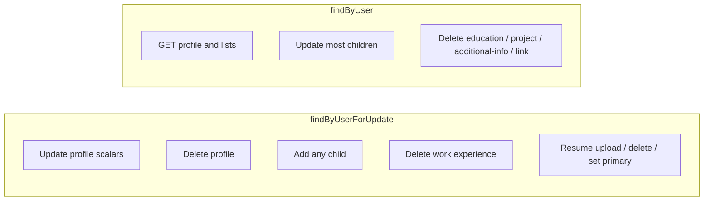

# Profile and child collections

The career profile is a **separate row** from the auth account. Login data (`username`, password, email verification) stays on `users`. This service stores what the product treats as a résumé folder: headline, summary, skills, and five child lists.

Resume PDFs are attached to the profile but are documented in [RESUME-STORAGE-AND-LIFECYCLE.md](RESUME-STORAGE-AND-LIFECYCLE.md).

## One profile per user

`user_profiles.user_id` is unique. `POST /api/v1/users/profile` calls `existsByUser` and throws `DuplicateUserProfileException` (`409`) if a row is already there.

There is no admin API in this package to create a profile for someone else. `CurrentUserService.getCurrentUser()` is the only owner.

If two concurrent creates both pass `existsByUser`, the unique constraint on `user_id` can still fail; that surfaces as a generic `409` data-integrity message from the global handler unless mapped elsewhere.

## What is stored on the profile row

| Field | Source |
|---|---|
| `headline`, `summary`, `technicalSkills` | Request body; all optional |
| `fullName`, `email` on **responses** | `profile.getUser()` — not writable here |

GET/POST/PUT assemble children with five separate repository `findByUserProfile` calls. `UserProfile` has no `OneToMany` lists, so there is no lazy-collection surprise and no cascade-from-entity delete.

## PUT replace semantics

`PUT /api/v1/users/profile` is **not** a merge.

`UserProfileServiceImpl.updateProfile` assigns:

```text
headline = request.headline
summary = request.summary
technicalSkills = request.technicalSkills
```

`UserProfileRequest` fields are Java `String` with no `Optional`. A missing JSON key deserializes to `null` and **clears** the column. Send the fields you want to keep.

Children are ignored even if a client sends them; they are not properties of `UserProfileRequest`.

There is no PATCH for these three fields.

## Child collections

Five independent resources, each with list + create + update + delete:

| Collection | Path | Create required fields |
|---|---|---|
| Work experience | `/experiences` | company, title, start year |
| Education | `/educations` | institution, field, start year |
| Projects | `/projects` | title |
| Additional information | `/additional-info` | type |
| Profile links | `/links` | url (http/https) |

Lists are not paginated and have no sort parameter; order is whatever the database returns from `findByUserProfile`.

GET `/profile` nests all five lists on one payload so the SPA can render a single folder.

### Cap

`user.profile.max-child-items` (default **20**) applies **per collection**, not across all children combined. Twenty experiences plus twenty projects is allowed; twenty-one experiences is not.

`enforceChildLimit` runs only on **add**. Updates do not count toward a new slot. The error names the collection (`"work experience"`, `"education"`, `"project"`, `"additional information"`, `"profile link"`).

### Ownership

`findByIdAndUserProfile(id, profile)` — a valid id on another user's profile is `404` with that collection's not-found message.

### Years and URLs

Experience and education: `endYear` optional; if both years are set, end ≥ start; years in 1900–2100.

Optional links (`projectLink`, additional `link`) and required profile `url` must be `http://` or `https://`. See [VALIDATION.md](../VALIDATION.md).

## Locking



Add operations lock so two POSTs cannot both read `count = 19` and insert. Resume operations lock for the same reason (cap and primary).

Update/delete of education, projects, additional-info, and links use the unlocked `resolveProfile()`. Those paths still scope by profile id, so they cannot edit another user; they can theoretically race with a concurrent profile delete.

Delete work experience uses the lock (`resolveProfileForUpdate`); that is how the code is written, not a separate business rule.

## Delete profile

Not a JPA `CascadeType.ALL` on `UserProfile`. The service:

1. Locks the profile.
2. Deletes resumes (parsed data, rows, after-commit MinIO).
3. `deleteAll` on each child repository's `findByUserProfile` list.
4. Deletes the profile row.

The auth user can create a new empty profile afterwards (`POST` succeeds again). Resume checksums are gone with the hard-deleted rows, so the same PDFs can be uploaded to the new profile.

## Identity vs career data

Deleting the profile does **not** disable login, unverified-email flags, or JWTs. Those remain `auth` concerns. Conversely, deleting the auth user is not implemented in this package; there is no user-service hook documented here for account teardown.
