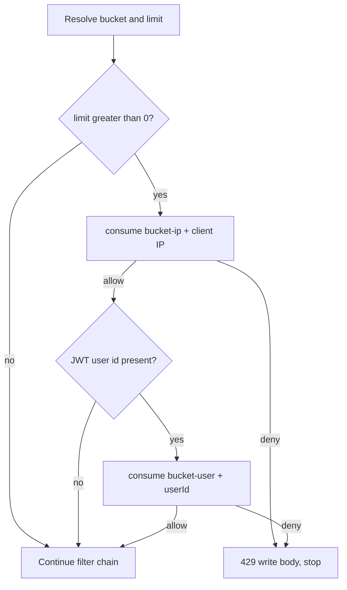

# Rate limiting

The `user` service applies **extra** request budgets on expensive resume and parse paths. Profile CRUD is not limited by these filters.

Two independent filter families can apply to the same internal parse GET:

1. **User** limiter — upload / delete / parse buckets (`UserRateLimitFilter`).
2. **Common hallway** limiter — all `/api/v1/internal/**` (`InternalApiRateLimitFilter`).

Both run **after** JWT authentication (and after the internal API key on internal URLs) so a stolen token is counted as that **user id**, not only as an IP.

## Where the filter runs

`UserRateLimitConfig` registers URL patterns:

- `/api/v1/users/resumes`
- `/api/v1/users/resumes/*`
- `/api/v1/internal/resumes`
- `/api/v1/internal/resumes/*`

Order `-80` (after Spring Security `-100` and internal key `-90`).

Matching the pattern is not enough to consume a token. `bucketFor` maps method + path:

| Method + path | Bucket | Default limit / minute |
|---|---|---|
| `POST /api/v1/users/resumes` | `upload` | `app.user.upload-per-minute` = 8 |
| `DELETE /api/v1/users/resumes/{id}` | `delete` | `app.user.delete-per-minute` = 8 |
| `GET /api/v1/internal/resumes/parsed` | `parse` | `app.user.parse-per-minute` = 20 |
| `GET /api/v1/internal/resumes/{id}/parsed` | `parse` | same |
| `GET` list/download, `PATCH` high-priority, other | `other` | limit `0` → **not counted** |

Delete matching requires a single path segment after `/resumes/` (the numeric id). `PATCH .../high-priority` has an extra segment, so it is `other`.

## Consume order (user filter)

Window is **60 seconds** (hardcoded).

Both IP and user budgets must allow the request. A user who rotates IPs still hits the per-user counter. A NAT sharing an IP hits the per-IP counter even with different accounts.

Unauthenticated requests should not reach this filter with a principal (security already returned 401). If they did, only the IP bucket would apply.

## Client IP

1. `X-Forwarded-For` — substring before the first comma, trimmed.
2. Else `request.getRemoteAddr()`, or `unknown`.

Only a trusted reverse proxy should set `X-Forwarded-For`. The filter does not validate that.

## Response

Written on the servlet response (controller not called):

- Status `429`
- Header `Retry-After: <seconds>`
- Body `ApiResponse` with `"Too many requests. Please try again later."`

`Retry-After` comes from remaining Redis TTL or, in memory, time until the oldest hit leaves the sliding window (at least 1 second).

CORS exposes `Retry-After` so browsers can read it.

## Redis vs memory

`UserRateLimitServiceImpl`:

- If `UserRedisService` exists, `INCR` a key `user:rl-{bucket}:{identity}` with TTL = window (fixed window).
- On Redis `RuntimeException`, log and use the in-memory sliding window.
- If Redis is disabled, memory only.

Memory keys are `bucket:identity` inside a `ConcurrentHashMap`. They are **not** shared across application instances.

Details: [REDIS-INFRASTRUCTURE.md](../REDIS-INFRASTRUCTURE.md).

## Common hallway (internal parse)

Order `-70`, after the user parse limiter.

| Counter | Property | Default | Identity |
|---|---|---|---|
| Per calling service | `app.common.internal-key-per-minute` | 60 | Constant `"service"` (not the raw key value) |
| Per JWT user | `app.common.internal-user-per-minute` | 30 | User id |

Internal parse therefore has **four** possible 429s: user parse-IP, user parse-user, common key, common user. All share the same client message.

The hallway limiter does not use the API key string as the Redis identity (avoids putting the secret in a key). All callers sharing the configured key share the `"service"` budget.

401s from a missing internal key happen at order `-90` and are **not** counted.

Optional `app.common.redis` mirrors the user Redis pattern for these counters.

## What is not limited here

- `POST/PUT/DELETE /api/v1/users/profile` and all child collections
- Resume list, download, set high-priority
- Auth login/register (auth package's own filter, auth paths only)

Application caps (10 resumes, 20 children) are **not** rate limits; they are business validation.

## Configuration

See [CONFIGURATION.md](../CONFIGURATION.md). Setting a user limit property to `0` disables that bucket in the user filter (`limitFor` returns 0 → pass-through).

## Tests that lock this behavior

`UserRateLimitFilterTest` — per-IP upload, per-user upload across IPs, parse GET, delete, high-priority not limited, list not limited, registration patterns.

`UserRateLimitServiceImplTest` — block after limit, identity isolation, zero limit, Redis path, Redis fallback.
