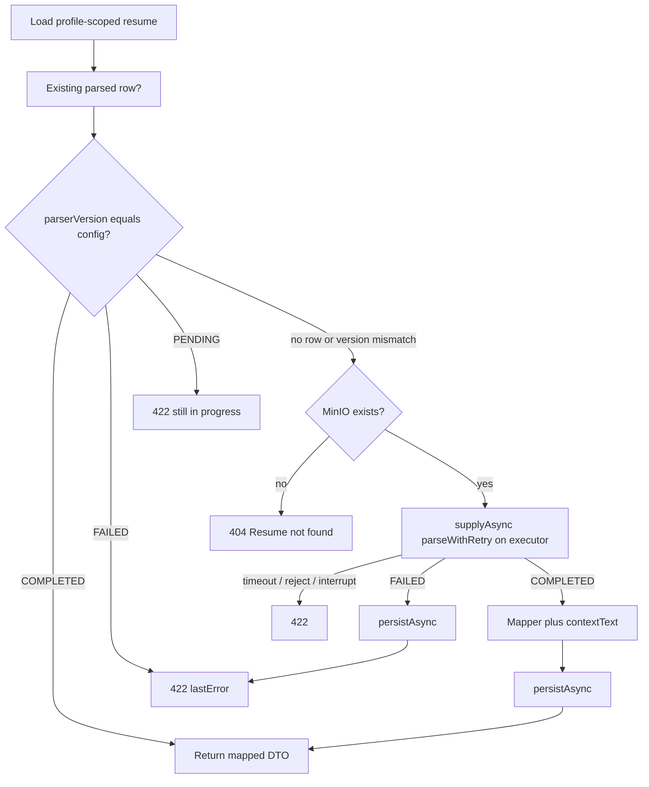

# Resume parsing

The `user` service turns an uploaded PDF into structured text so other Copilot modules can put a candidate resume into an AI prompt without reading MinIO themselves. Parsing is **not** an LLM call. It is PDFBox text extraction plus heading/contact heuristics.

Public resume APIs never return parse status. Only `ResumeParsingService` (in-process) and `GET /api/v1/internal/resumes/**` expose it.

## Lifecycle statuses

`ResumeParsingStatus` on `resume_parsed_data`:

| Status | Meaning |
|---|---|
| `PENDING` | Row exists; extraction has not produced a usable result yet. |
| `COMPLETED` | Text, sections, and contact fields stored. |
| `FAILED` | Terminal for this `parserVersion`. `max-attempts` were used. No automatic retry. |

Internal HTTP returns `200` only for `COMPLETED`. `PENDING` and `FAILED` are `422` (`ResumeParsingException`).

## Two entry points

### Background (after upload)

`UserServiceImpl` saves the resume, then `initializeAndScheduleParsing`:

1. Insert a `PENDING` row if none exists (`parserVersion` from config, `attemptCount` 0).
2. Register `parseAndPersist(resumeId)` to run **after the upload transaction commits** (or immediately if there is no synchronization, e.g. some tests).

`ResumeParsingWorker.parseAndPersist` (`@Async` on `resumeParsingExecutor`):

- Skip if the resume row is gone (user already deleted it).
- Skip if the parsed row is already `COMPLETED` or `FAILED` (an on-demand read may have finished first).
- Otherwise `ResumeParser.parseWithRetry`, then persist.

If the executor rejects the task (`AbortPolicy` when the queue of 50 is full), the row stays `PENDING`. The upload still returns `201`.

### On-demand (internal GET)

`getParsedResume` is **not** `@Transactional`.

Timeout is `resume.parsing.timeout-seconds` (default 15, floored at 1). The HTTP thread blocks on `CompletableFuture.get`. Persistence of the result is a **separate** async call so a full persist queue does not fail a caller that already has the in-memory record.

Version mismatch (config bumped, e.g. `v1` → `v2`) treats any existing row as unusable and re-parses.

## `ResumeParser.parseWithRetry`

Does not persist. Updates the existing entity in memory or starts from `newPendingRecord`.

For attempt `1..maxAttempts` (default 3):

1. Download bytes from `storageKey`.
2. `ResumeTextExtractor.extract`.
3. `ResumeSectionParser.parse`.
4. Copy success fields; `status = COMPLETED`; clear `lastError`.

Any exception on an attempt is logged and retried. After the last failure: `FAILED`, `lastError` truncated to 1000 characters, `parsedAt` set. `UserMetrics` records completed vs failed.

## Text extraction (PDFBox)

`ResumeTextExtractor`:

- Rejects empty input.
- `Loader.loadPDF` with a temp-file stream cache.
- Rejects password-protected files (`InvalidPasswordException`).
- Rejects documents whose current access permission does not allow text extraction.
- Rejects `pageCount > resume.parsing.max-pages` (default 30).
- `PDFTextStripper` with `sortByPosition`.
- Normalizes `\r\n`, NBSP, control characters, and large vertical gaps.
- Rejects blank text (scanned/image-only PDFs are not OCR'd).
- Truncates to `max-text-length` (default 200_000) and sets `truncated`.

## Section and contact heuristics

Resumes are not a schema. `ResumeSectionParser` treats a line as a heading only when it is short (≤ 60 chars, ≤ 6 words after cleanup) and matches a known alias on `ResumeSection`.

Canonical sections (render order): `CONTACT`, `SUMMARY`, `SKILLS`, `EXPERIENCE`, `PROJECTS`, `EDUCATION`, `CERTIFICATIONS`, `ACHIEVEMENTS`, `PUBLICATIONS`, `LANGUAGES`, `INTERESTS`, `ADDITIONAL`.

Compound headings such as `EDUCATION & CERTIFICATIONS` resolve to the **first** known part.

Lines before the first heading are the header block (`CONTACT`). From that block (then the full text as fallback) the parser pulls:

- Email, phone (10–15 digits so dates are less likely to match), LinkedIn, GitHub (regex).
- Labelled fields (`Email:`, `Name:`, …).
- Name guess: short line without digits/`@`/http.
- Location guess: short comma-separated line.

Stored `sections_json` is a JSON object keyed by enum **name** (`SUMMARY`, not the display title). Decode failures on read become an empty map so `rawText` can still be used (`ResumeSectionsCodec.fromJson`).

## Prompt text (`contextText`)

`ResumeContextTextRenderer` runs only when status is `COMPLETED`. It prints a `CANDIDATE RESUME PROFILE` banner, contact fields, then each non-empty section under its display name. Duplicate contact lines in the header block are stripped. If no sections exist, it falls back to a `RESUME CONTENT` block of `rawText`. PENDING/FAILED render as `null`.

That string is what internal callers drop into AI prompts.

## Persistence isolation

`ResumeParsedDataWriter.persist` uses `REQUIRES_NEW` and `saveAndFlush` so a unique `resume_id` race surfaces immediately. The worker retries once as an update if `DataIntegrityViolationException` fires.

If the resume was deleted before persist, the writer skips.

## Thread pool

| Setting | Value |
|---|---|
| Bean name | `resumeParsingExecutor` |
| Core / max / queue | 2 / 4 / 50 |
| Rejection | `AbortPolicy` → `TaskRejectedException` |
| Shutdown | Wait up to 30s |

PDFBox never runs on the upload request thread (background path). On-demand parse **does** occupy a pool thread while the HTTP thread waits.

## Configuration recap

See [CONFIGURATION.md](../CONFIGURATION.md) for `resume.parsing.*`. Changing `parser-version` is the supported way to invalidate old rows without a manual SQL wipe.

## What parsing does not do

- No OCR for scans.
- No LLM structuring.
- No public GET of parse status for the SPA.
- No automatic retry after `FAILED` unless `parser-version` changes or the row is gone.
