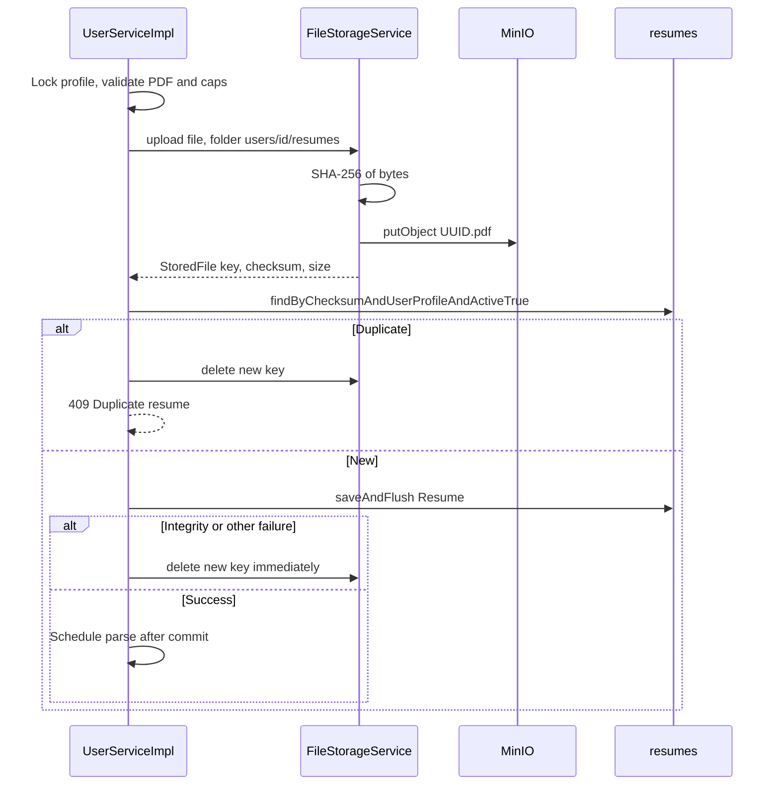

# Resume storage and lifecycle

This document describes how PDF files move between the client, MinIO, and the `resumes` table. Parse rows are covered in [RESUME-PARSING.md](RESUME-PARSING.md).

## Why object storage

Resume PDFs are large binary objects. MySQL stores **metadata** (`original_filename`, `checksum`, `file_size`, `storage_key`, primary flag). Bytes live in the configured bucket (`storage.bucket-name`, example `copilot-resumes`).

The shared `FileStorageService` is the only MinIO client the user service calls.

## Object key layout

Upload folder from `UserServiceImpl`:

```text
users/{authUserId}/resumes
```

Storage generates:

```text
users/{authUserId}/resumes/{uuid}.pdf
```

`storage_key` is unique. UUID keys avoid using the original filename in the bucket (path injection, collisions).

When a JWT user is on the thread, `FileStorageServiceImpl` rejects folders/keys that are not under `users/{thatUserId}/`. Parse worker threads have no JWT; they download by the key already stored at upload time.

Path validation also rejects `..`, `//`, and characters other than letters, digits, `-`, `_`, `.`.

## Upload sequence (storage-focused)



Compensation on failure is **synchronous** (still inside the upload transaction): the object is deleted so MinIO does not keep an unreferenced PDF. After-commit deletes are used only when the **database row is already committed** (user delete / profile delete).

## Checksums and duplicates

Checksum is SHA-256 hex of the file bytes (`ChecksumUtil`), 64 characters.

Duplicate detection:

1. Application query on **active** resumes for this profile.
2. Database unique constraint `uk_resume_profile_checksum` on `(user_profile_id, checksum)` for **all** rows.

A concurrent double-upload can pass (1) and fail (2). `DataIntegrityViolationException` is translated to the same `409` `"Duplicate resume detected."` and the object is deleted.

Because the unique key does not include `active`, **delete is a hard delete**. That is how a user can upload the same PDF again.

## PDF acceptance

Two layers:

1. **Service:** `Content-Type` equals `application/pdf` (ignore case) **and** `PdfValidationUtil.hasPdfMagicBytes` (`%PDF`).
2. **Storage:** content type contains `pdf`, original name ends with `.pdf` if present, magic bytes again.

Either layer can reject a disguised file. Empty files fail in the service first.

Size: `resume.max-file-size-mb` (default 5). Servlet multipart max matches that value so Boot's 1 MB default cannot 400 a valid 2 MB PDF before the service runs.

Cap: `resume.max-resume-count` (default 10) on **active** rows, under a profile write lock.

## Filenames

At upload, `originalFilename` is passed through `ResumeFilenameUtil.sanitizeForDownload`. Unsafe names become `resume.pdf` in the database.

On download, the controller sanitizes again when building `Content-Disposition`, so a stored value cannot inject headers even if older rows predate sanitization.

Allowlist: `[A-Za-z0-9._-]+`, max 255. Spaces, Unicode, paths, quotes, and CR/LF are not allowed.

## High-priority (primary) resume

Column `is_primary`, Java field `highPriority`.

| Event | Behavior |
|---|---|
| First active resume uploaded | `highPriority = true` |
| Later uploads | `false` |
| `PATCH .../high-priority` | `clearHighPriorityForProfile` then set selected row `true` |
| Delete of the primary | Remaining active resumes ordered by `createdAt` desc; first becomes primary |
| Delete of the last resume | Nothing to promote |
| Internal GET without id | `findByHighPriorityTrueAndUserProfileAndActiveTrue` |

There is no API to leave a profile with zero primaries while resumes still exist, except the brief window of a failed promote (not expected if at least one row remains). There is no flag to *unset* primary without selecting another.

`active` defaults to true. User delete does not flip it; it removes the row. List/download/parse queries still filter `active = true`.

## Download

`GET /api/v1/users/resumes/{id}` streams MinIO bytes as `application/pdf`. Missing object → `StorageObjectNotFoundException` → `404` `"File not found."`

## Delete resume

Order inside the transaction:

1. Lock profile, load active resume.
2. `deleteParsedDataFor` (FK to `resume_id`).
3. `resumeRepository.delete` (hard delete).
4. Maybe promote primary.
5. After commit: `fileStorageService.delete(storageKey)`.

If step 5 throws, the HTTP response is still success (`AfterCommitActions` catches and logs). Operators can detect `user metric=minioDeleteFailure`.

## Delete profile

All resumes for the profile (`findByUserProfile`, not only active) have parsed data deleted, keys collected, rows deleted, then after commit each key is removed. Child tables are cleared in the same transaction. Auth `users` is not deleted.

## Startup

`StorageStartupValidator` runs at boot: credential/auto-create policy, then `initializeStorage` (bucket exists or create). User requests are not the first time the bucket is checked.

Connect/read/write timeouts on the MinIO HTTP client are 10s / 30s / 30s (`StorageConfig`).
