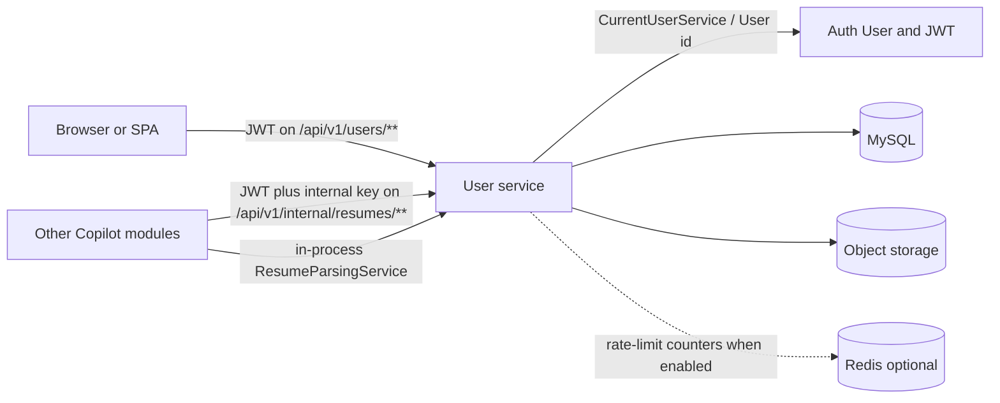

# User Service

This is the starting document for the `user` service. Read it first, then follow the links at the bottom for architecture, APIs, security, data, and the service-specific topics that go deeper than this overview.

The `user` service lives in `com.developer.copilot.user`. It is not a separate deployable. It is one package inside the Copilot Spring Boot application, next to `auth`, `jobs`, and the other modules.

## Purpose

The `user` service is the career folder for an authenticated account. It stores the structured profile a person types in, the PDF resumes they upload, and a parsed text representation of those PDFs for other backend modules (AI, job matching, and similar callers).

It does **not** create login accounts, issue JWTs, or verify email. Those belong to the `auth` service. A user must already exist, be enabled, and have a verified email before any `user` endpoint will accept the request.

## Responsibilities

- Own **one career profile per auth user**, with headline, summary, and technical skills.
- Own **child collections** on that profile: work experience, education, projects, additional information, and profile links.
- Store **PDF resumes** in object storage, keep metadata in MySQL, and enforce per-user caps and duplicate detection.
- Mark **one high-priority resume** per profile (the first upload is primary; the user can switch it later).
- **Parse resumes in the background** after upload, and serve completed parse results to other services over an internal HTTP API.
- Rate-limit resume upload, resume delete, and internal parse reads.

## What this service is not

- It is not the identity store. `fullName` and `email` on profile responses are copied from the `auth` `User` row; they are not edited here.
- It is not a public parse API. Parsed resume payloads include PII (`rawText`, contact details, `contextText`) and are restricted to service-to-service callers.
- It does not paginate profile children. GET profile returns every child row nested in one response.
- Profile CRUD itself is not rate-limited. Only resume upload/delete and internal parsed-resume reads are.

## Major capabilities

| Capability | Behavior in this codebase |
|---|---|
| Profile | Create once. GET returns nested children. PUT replaces `headline`, `summary`, and `technicalSkills` (JSON `null` or an omitted key clears the stored value). DELETE removes the profile, children, resume rows, parsed data, and stored PDF objects. The auth user remains. |
| Child collections | Independent CRUD under `/api/v1/users/profile/...`. Maximum **20 items per collection** (`user.profile.max-child-items`). Each item is scoped to the current user's profile. |
| Resumes | PDF only, default max **5 MB** and **10** active resumes. First upload becomes high-priority. List/upload responses do **not** include parse status. Download returns the raw PDF, not the JSON envelope. |
| Parsing | After upload, a `PENDING` parse row is created and work is queued after commit. Internal GET returns `COMPLETED` data, or `422` while `PENDING` / after `FAILED`. A cache miss (or a stale parser version) parses on demand with a timeout. |
| Internal access | `GET /api/v1/internal/resumes/**` requires the user's JWT **and** `X-Internal-Api-Key`. Ownership is always the JWT user; a resume id cannot be used to read another person's file. |

## Service boundaries

The service may read from `com.developer.copilot.common` (current user, file storage, internal API key, shared error envelope) and from `com.developer.copilot.auth.entity.User`. It does not implement those modules.

## Main components

- **Controllers:** `UserProfileController` (`/api/v1/users/profile`), `UserController` (`/api/v1/users/resumes`), `InternalResumeController` (`/api/v1/internal/resumes`).
- **Services:** `UserProfileServiceImpl`, `UserServiceImpl`, `ResumeParsingServiceImpl`.
- **Persistence:** JPA entities and repositories for profile, children, resumes, and parsed data.
- **Storage:** shared `FileStorageService` (MinIO / S3-compatible) under `users/{userId}/resumes/`.
- **Parsing pipeline:** PDFBox text extraction, heuristic section/contact parsing, background worker, dedicated thread pool.
- **Security and abuse controls:** JWT (auth filter), internal API key (common filter), user rate-limit filter, plus the common hallway limit on all `/api/v1/internal/**`.

## Important flows

1. **Create profile, then add children.** Resume upload requires an existing profile (`404` otherwise).
2. **Upload PDF.** Validate type/size/filename, store the object, reject duplicate SHA-256 checksums, persist metadata, schedule parse after commit.
3. **Switch or delete the primary resume.** Delete hard-removes the row so the same PDF can be uploaded again. Deleting the primary promotes the most recently created remaining resume.
4. **Internal parsed-resume read.** Resolve the caller's high-priority resume (or a specific id they own). Return stored `COMPLETED` data, wait on `PENDING`, or parse on demand when there is nothing usable yet.

Details and diagrams: [FLOW.md](FLOW.md).

## Security responsibilities

- Every public and internal user endpoint requires a Bearer JWT. The user must be **enabled** and **email-verified** or the request is `401 Unauthorized.`
- Child and resume lookups always include the current profile. A valid id that belongs to someone else is treated as not found (`404`).
- Internal parse endpoints additionally require `X-Internal-Api-Key`. The key identifies the calling service; the JWT still identifies whose data is returned.
- Resume upload/delete and internal parse reads are limited per IP and per user. Internal paths also pass the common internal hallway limiter.
- Stored filenames are sanitized for `Content-Disposition`. Object keys are UUID-based and rejected if they do not sit under the authenticated user's prefix when a JWT is present.

Details: [SECURITY.md](SECURITY.md).

## Infrastructure

| Store | Role for this service |
|---|---|
| **MySQL** | Profile, children, resume metadata, parsed resume records. |
| **MinIO / S3-compatible** | PDF bytes. Metadata points at a `storageKey`. Deletes run after the database transaction commits. |
| **Redis (optional)** | Rate-limit counters only. Off by default (`app.user.redis.enabled=false`). Not a profile or resume cache. |
| **In-process thread pool** | `resumeParsingExecutor` (core 2, max 4, queue 50). PDF extraction never runs on Tomcat request threads for the background path. |

## Documentation map

| Document | Contents |
|---|---|
| [ARCHITECTURE.md](ARCHITECTURE.md) | Layers, components, and dependency direction. |
| [FLOW.md](FLOW.md) | Request, profile, resume, parse, and delete workflows. |
| [ENDPOINTS.md](ENDPOINTS.md) | Every REST endpoint this service exposes. |
| [SECURITY.md](SECURITY.md) | JWT, internal key, CORS, ownership, rate limits, PII. |
| [DATABASE.md](DATABASE.md) | Tables, relationships, uniqueness, transactions. |
| [REDIS-INFRASTRUCTURE.md](REDIS-INFRASTRUCTURE.md) | User Redis and the common Redis used on internal paths. |
| [ERROR-HANDLING.md](ERROR-HANDLING.md) | Exceptions, HTTP mappings, response envelope. |
| [VALIDATION.md](VALIDATION.md) | DTO, file, URL, business, and parse validation. |
| [CONFIGURATION.md](CONFIGURATION.md) | Properties this service actually reads. |
| [TESTING.md](TESTING.md) | Test layout and what is covered. |
| [DEPENDENCIES.md](DEPENDENCIES.md) | Why the important libraries and modules are used. |

Service-specific (deeper than the standard set):

| Document | Why it exists |
|---|---|
| [RESUME-PARSING.md](USER-SERVICE-SPECIFIC-DOCS/RESUME-PARSING.md) | Background vs on-demand parse, statuses, PDFBox, heuristics. |
| [RESUME-STORAGE-AND-LIFECYCLE.md](USER-SERVICE-SPECIFIC-DOCS/RESUME-STORAGE-AND-LIFECYCLE.md) | Upload, checksums, primary resume, hard delete, MinIO. |
| [PROFILE-AND-CHILD-COLLECTIONS.md](USER-SERVICE-SPECIFIC-DOCS/PROFILE-AND-CHILD-COLLECTIONS.md) | One profile per user, PUT replace semantics, child caps, locking. |
| [RATE-LIMITING.md](USER-SERVICE-SPECIFIC-DOCS/RATE-LIMITING.md) | User upload/delete/parse budgets plus the internal hallway limit. |
