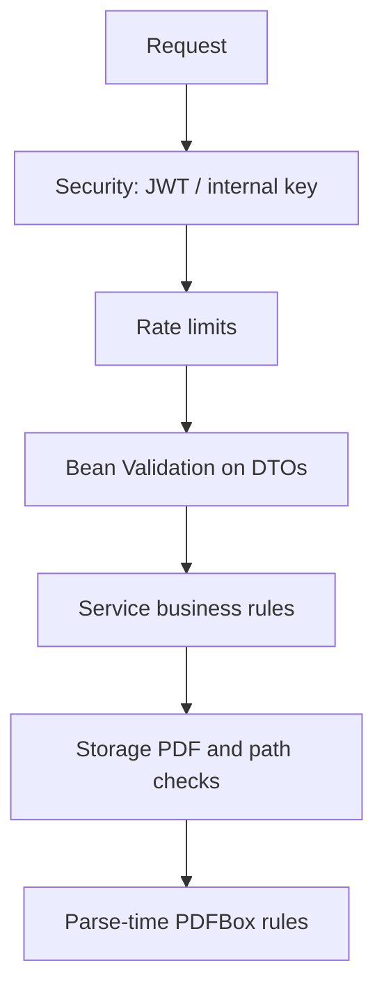

# Validation

Validation in the `user` service happens in four layers. A request can fail in more than one layer; the first failure that runs wins (filters before controllers, Bean Validation before service logic).

## 1. Input validation (DTOs)

Controllers use `@Valid` on JSON bodies. `UserController` is `@Validated` but resume upload is a `MultipartFile` parameter, not a Bean-validated DTO.

### Profile scalars (`UserProfileRequest`)

Used by POST and PUT `/profile`. All fields optional.

| Field | Rule |
|---|---|
| `headline` | `@Size` max 300 |
| `summary` | max 5000 |
| `technicalSkills` | max 3000 |

PUT does **not** distinguish omitted keys from JSON `null`; both become Java `null` and clear the column. That is replace semantics, not a validation error.

### Work experience and education

Shared year rules:

- `startYear` required, `@Min(1900)` `@Max(2100)`
- `endYear` optional; same min/max when present
- `@AssertTrue isEndYearValid`: if both years are non-null, `endYear >= startYear`  
  Message: `"End year must be greater than or equal to start year."`

Experience also requires `companyName` and `jobTitle` (max 200). Description max 5000.

Education requires `institutionName` and `field` (max 300). `scoreOrGrade` max 50.

### Projects, additional info, links (`@HttpOrHttpsUrl`)

Custom validator `HttpOrHttpsUrlValidator`:

- `null` or blank → **valid** (optional fields).
- After strip: reject if lowercase starts with `javascript:`, `data:`, or `file:`.
- Accept only if lowercase starts with `https://` or `http://`.

`ProfileLinkRequest.url` is `@NotBlank` **and** `@HttpOrHttpsUrl`, so blank is rejected by `@NotBlank` before the URL rule matters. Project `projectLink` and additional-info `link` may be omitted.

Length caps: titles/types as on the entities; URL fields max 500.

## 2. Business validation (services)

These run after the DTO is valid (or after multipart binding for uploads).

| Rule | Failure |
|---|---|
| One profile per user | `409` duplicate profile |
| Profile must exist for children and resumes | `404` |
| Child `countByUserProfile >= maxChildItems` | `400` cap message |
| Child id + current profile | `404` collection not-found |
| Active resume count ≥ `maxResumeCount` | `400` `"Maximum resume limit reached : {n}"` |
| Duplicate SHA-256 among active resumes, or unique-constraint race | `409` `"Duplicate resume detected."` |
| Resume id + profile + active | `404` `"Resume not found."` |
| Internal parse: no high-priority resume | `404` `"Resume not found."` |
| Stored object missing on parse | `404` `"Resume not found."` (not a storage 404 in this path) |

Pessimistic profile locks on add-child and resume upload/delete reduce cap and checksum races; remaining integrity violations still map to `409`.

## 3. File and filename validation (upload / download)

`UserServiceImpl.uploadResume`:

| Check | Message |
|---|---|
| `file.isEmpty()` | `Resume cannot be empty.` |
| Content-Type not `application/pdf` **or** magic bytes not `%PDF` | `Only PDF files are allowed.` |
| Size > `maxFileSizeMb * 1024 * 1024` | `Maximum file size is {n} MB.` |
| Original filename length > 255 | `Original filename must not exceed 255 characters.` |

Servlet multipart max is set to the same megabyte cap (`ResumeMultipartConfig`). Oversized bodies that never reach the service become `400` with the same max-size sentence via `MaxUploadSizeExceededException`.

`FileStorageServiceImpl` repeats PDF checks (empty, content-type contains `pdf`, filename ends with `.pdf`, magic bytes) and validates folder/key characters. With a JWT user on the thread, the path must be under `users/{userId}/`. Failures are `InvalidFileException` (`400`).

Download names: `ResumeFilenameUtil.sanitizeForDownload` — only `[A-Za-z0-9._-]+`, length ≤ 255, no CR/LF/quotes. Otherwise `resume.pdf`. Stored `originalFilename` is sanitized at upload as well.

## 4. Parse-time validation (`ResumeTextExtractor`)

Thrown as `ResumeParsingException` (`422`):

| Condition | Message (pattern) |
|---|---|
| Empty bytes | Resume file is empty and cannot be parsed. |
| Password protected | Resume is password protected and cannot be parsed. |
| Extract permission denied | Resume is protected and does not allow text extraction. |
| Pages > `resume.parsing.max-pages` (default 30) | Resume exceeds the maximum of {n} pages. |
| Blank extracted text | Scanned or image-only PDFs are not supported. |
| Unreadable PDF | Resume could not be read as a valid PDF document. |

Text longer than `resume.parsing.max-text-length` (default 200_000) is **truncated**, not rejected (`truncated = true`).

On-demand orchestration also throws `422` for timeout, busy executor, interrupt, and in-progress `PENDING`.

`ResumeSectionParser` is heuristic: it does not throw on unrecognized resumes. No headings means the whole text is treated as a contact/header block.

## 5. Security validation (not Bean Validation)

- JWT: enabled + email verified (filter).
- Internal key: present and matching (constant-time).
- Rate-limit counters (see [RATE-LIMITING.md](USER-SERVICE-SPECIFIC-DOCS/RATE-LIMITING.md)).
- Parser version: a completed/failed/pending row with a **different** `parserVersion` is ignored and the PDF is parsed again.

## Categories at a glance

| Category | Examples |
|---|---|
| Input | `@Size`, `@NotBlank`, year min/max, `@AssertTrue` end year, `@HttpOrHttpsUrl` |
| Business | Duplicate profile, child cap, resume cap, checksum duplicate, existence/ownership |
| File | PDF type, magic bytes, size, filename length, storage path |
| Parse | Pages, encryption, empty text, timeout, PENDING/FAILED |
| Security | JWT, internal key, rate limits, Content-Disposition allowlist |

There are no class-level custom validators beyond `HttpOrHttpsUrl` and the `@AssertTrue` methods on experience/education requests.
